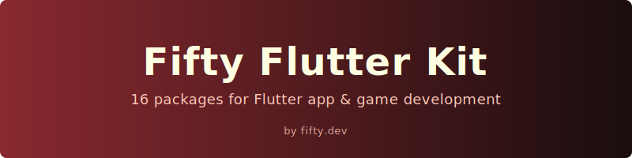
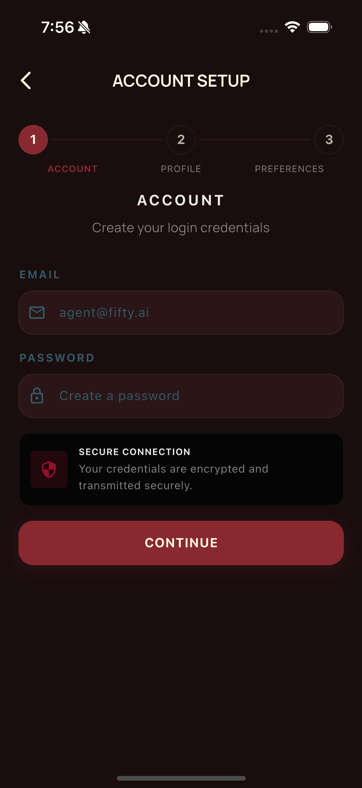
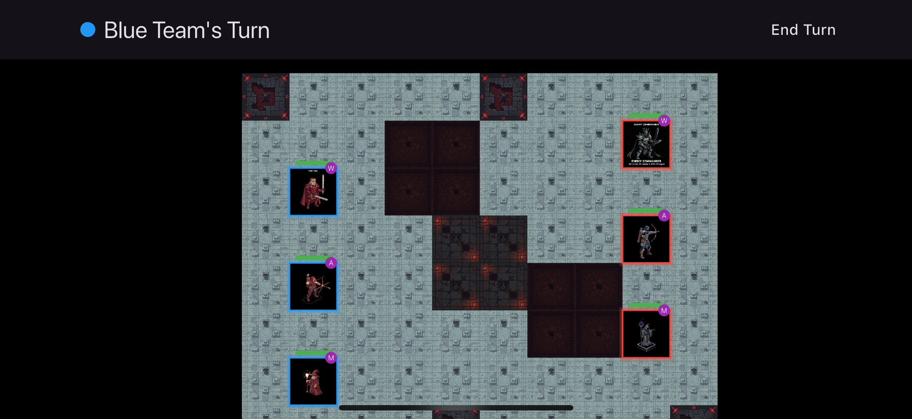
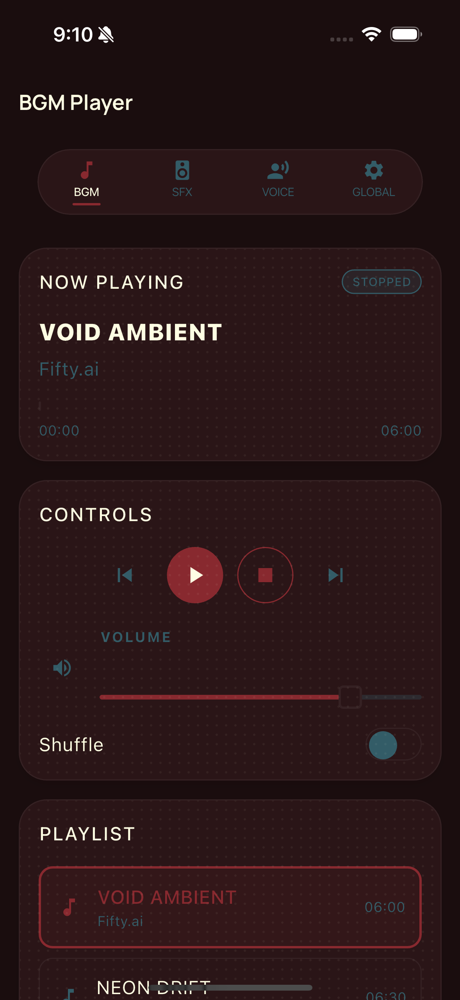
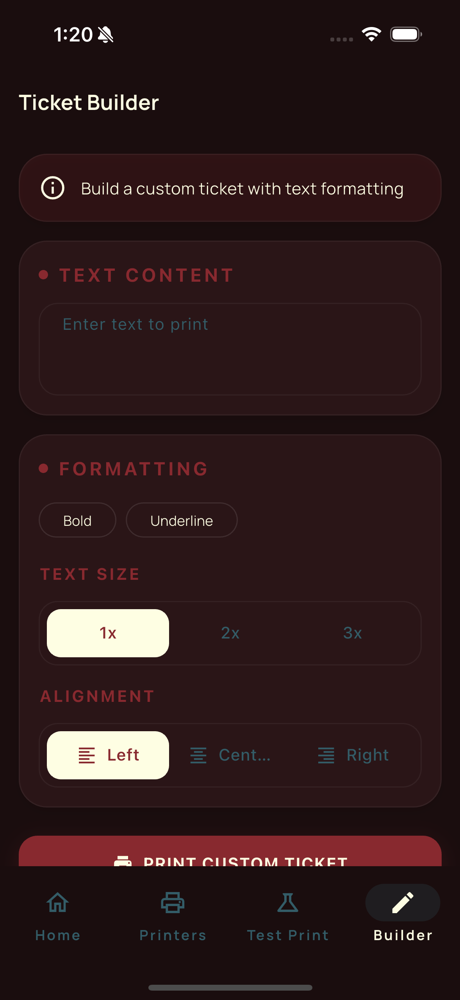

<div align="center">
  
  <br><br>

  [](LICENSE)
  [](https://pub.dev/publishers/fifty.dev/packages)
  [](packages/)
  [](https://dart.dev)
  [](https://flutter.dev)

</div>

# Fifty Flutter Kit

**A comprehensive Flutter/Dart toolkit: design tokens, theming, UI components, forms, caching, storage, connectivity, real-time sockets, printing, audio, speech, narrative, world rendering, skill trees, and achievements.**

This toolkit is born from close to a decade of building Flutter and Dart applications professionally. It is a curated collection of the packages and patterns I reach for most often -- not everything I know, but the essentials, battle-tested across real projects and refined over the years. Rather than keeping these as scattered internal utilities and tribal knowledge, I wrote them down as properly published, reusable packages and open-sourced them for the Flutter community.

**By [Fifty.dev](https://github.com/fiftynotai)**

---

## Showcase

<div align="center">
<table>
<tr>
<td align="center"><br><sub>Demo App</sub></td>
<td align="center"><br><sub>Multi-Step Forms</sub></td>
<td align="center"><br><sub>Skill Trees</sub></td>
<td align="center"><br><sub>World Engine</sub></td>
</tr>
<tr>
<td align="center"><br><sub>Audio Engine</sub></td>
<td align="center"><br><sub>Achievements</sub></td>
<td align="center"><br><sub>Printing</sub></td>
<td align="center"><br><sub>Connectivity</sub></td>
</tr>
</table>
</div>

---

## Packages

All packages are published on [pub.dev](https://pub.dev/publishers/fifty.dev/packages) and work independently or together.

### Foundation

The design system core. All visual decisions flow from here.

| Package | Version | Description |
|---------|---------|-------------|
| [fifty_tokens](packages/fifty_tokens/) | [](https://pub.dev/packages/fifty_tokens) | Design tokens — colors, typography, spacing, motion |
| [fifty_theme](packages/fifty_theme/) | [](https://pub.dev/packages/fifty_theme) | Flutter theming — converts tokens into ThemeData |
| [fifty_ui](packages/fifty_ui/) | [](https://pub.dev/packages/fifty_ui) | Component library — buttons, cards, inputs, effects |

### App Development

Production infrastructure for Flutter applications.

| Package | Version | Description |
|---------|---------|-------------|
| [fifty_forms](packages/fifty_forms/) | [](https://pub.dev/packages/fifty_forms) | Form building with validation, multi-step wizards, drafts |
| [fifty_utils](packages/fifty_utils/) | [](https://pub.dev/packages/fifty_utils) | DateTime, Color, responsive utilities, async state |
| [fifty_cache](packages/fifty_cache/) | [](https://pub.dev/packages/fifty_cache) | TTL-based HTTP response caching |
| [fifty_storage](packages/fifty_storage/) | [](https://pub.dev/packages/fifty_storage) | Secure token storage and preferences |
| [fifty_connectivity](packages/fifty_connectivity/) | [](https://pub.dev/packages/fifty_connectivity) | Network monitoring with reachability probing |
| [fifty_socket](packages/fifty_socket/) | [](https://pub.dev/packages/fifty_socket) | Phoenix WebSocket with auto-reconnect |
| [fifty_printing_engine](packages/fifty_printing_engine/) | [](https://pub.dev/packages/fifty_printing_engine) | Multi-printer ESC/POS with Bluetooth and WiFi |

### Game Development

Engines and systems for Flutter-based games and interactive experiences.

| Package | Version | Description |
|---------|---------|-------------|
| [fifty_audio_engine](packages/fifty_audio_engine/) | [](https://pub.dev/packages/fifty_audio_engine) | Reactive audio — BGM, SFX, Voice channels |
| [fifty_speech_engine](packages/fifty_speech_engine/) | [](https://pub.dev/packages/fifty_speech_engine) | Text-to-speech and speech-to-text |
| [fifty_narrative_engine](packages/fifty_narrative_engine/) | [](https://pub.dev/packages/fifty_narrative_engine) | Narrative processing for dialogue and stories |
| [fifty_world_engine](packages/fifty_world_engine/) | [](https://pub.dev/packages/fifty_world_engine) | Flame-based grid world rendering |
| [fifty_skill_tree](packages/fifty_skill_tree/) | [](https://pub.dev/packages/fifty_skill_tree) | Interactive skill tree widget |
| [fifty_achievement_engine](packages/fifty_achievement_engine/) | [](https://pub.dev/packages/fifty_achievement_engine) | Achievement system with condition-based unlocks |

> Source code for each package is in [packages/](packages/).

---

## Quick Start

### Design System

```dart
import 'package:fifty_tokens/fifty_tokens.dart';
import 'package:fifty_theme/fifty_theme.dart';
import 'package:fifty_ui/fifty_ui.dart';

// Apply the design system
MaterialApp(
  theme: FiftyTheme.light(),
  darkTheme: FiftyTheme.dark(),
);

// Use tokens directly
final primary = FiftyColors.primary;
final padding = FiftySpacing.md;

// Use components
FiftyButton(
  label: 'Get Started',
  onPressed: () {},
);
```

### Audio Engine

```dart
import 'package:fifty_audio_engine/fifty_audio_engine.dart';

// Initialize once in main()
await FiftyAudioEngine.instance.initialize([
  'assets/bgm/menu.mp3',
  'assets/bgm/level1.mp3',
]);

// Background music
FiftyAudioEngine.instance.bgm.play('assets/bgm/menu.mp3');

// Low-latency sound effects
FiftyAudioEngine.instance.sfx.play('assets/sfx/click.wav');
```

> See each package README for complete API documentation, or browse the [full Quick Start guide](docs/QUICK_START.md) for all domains.

---

## Architecture

```mermaid
graph LR
    subgraph Foundation
        tokens[fifty_tokens] --> theme[fifty_theme] --> ui[fifty_ui]
    end
    subgraph App Development
        forms[fifty_forms]
        cache[fifty_cache]
        storage[fifty_storage]
        connectivity[fifty_connectivity]
        socket[fifty_socket]
        printing[fifty_printing_engine]
    end
    subgraph Game Development
        audio[fifty_audio_engine]
        speech[fifty_speech_engine]
        narrative[fifty_narrative_engine]
        world[fifty_world_engine]
        skill_tree[fifty_skill_tree]
        achievements[fifty_achievement_engine]
    end
    utils[fifty_utils]
    ui --> forms
    ui --> skill_tree
    ui --> achievements
    utils -.-> App Development
    utils -.-> Game Development
```

> Full architecture documentation and dependency graph: [docs/ARCHITECTURE.md](docs/ARCHITECTURE.md)

---

## Templates

| Template | Description | Pattern |
|----------|-------------|---------|
| [mvvm_actions](templates/mvvm_actions/) | Production app scaffold with auth, caching, connectivity, theming | MVVM + Actions |

Templates use the ecosystem packages as dependencies. Fork as a starting point — don't import.

| App | Description |
|-----|-------------|
| [fifty_demo](apps/fifty_demo/) | Interactive demo showcasing all packages |

---

## Installation

```bash
dart pub add fifty_tokens fifty_theme fifty_ui
```

Or add to `pubspec.yaml`:

```yaml
dependencies:
  fifty_tokens: ^1.0.3
  fifty_theme: ^1.0.1
  fifty_ui: ^0.6.2
```

<details>
<summary>For contributors (path dependencies)</summary>

```yaml
dependencies:
  fifty_tokens:
    path: ../fifty_tokens
```

</details>

---

<details>
<summary><strong>Development</strong></summary>

```bash
# Run tests for all packages
flutter test packages/*/test/

# Run tests for a specific package
cd packages/fifty_utils && flutter test

# Generate coverage report
flutter test --coverage
genhtml coverage/lcov.info -o coverage/html
```

</details>

---

## Contributing

Contributions welcome! See [CONTRIBUTING.md](docs/CONTRIBUTING.md) for setup, code style, and PR guidelines.

---

## License

MIT License — see [LICENSE](LICENSE) for details.

---

<div align="center">
  <strong>Built with <a href="design_system/fifty_design_system.md">Fifty Design Language</a></strong>
  <br><br>
  <a href="https://pub.dev/publishers/fifty.dev/packages">pub.dev</a> &middot;
  <a href="https://github.com/fiftynotai">GitHub</a> &middot;
  <a href="docs/ARCHITECTURE.md">Architecture</a> &middot;
  <a href="docs/QUICK_START.md">Quick Start</a>
</div>
