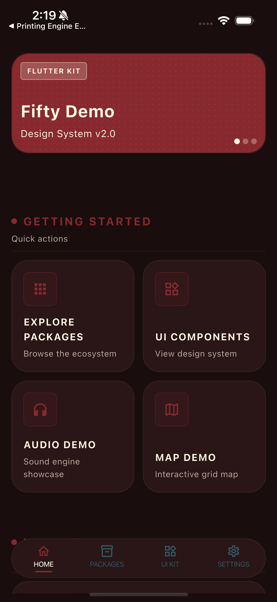
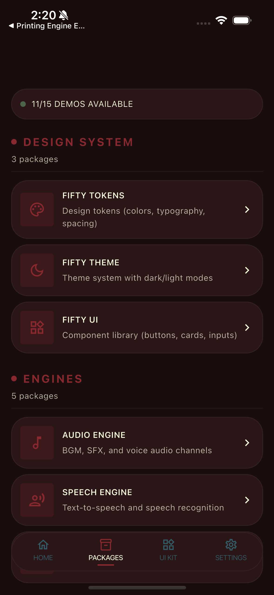
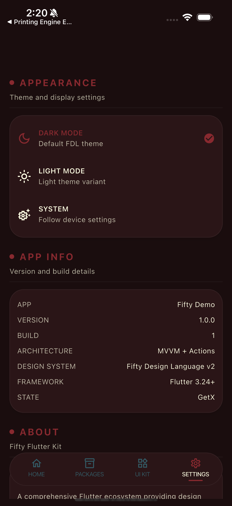

# Fifty Demo

Composite demo application showcasing the full Fifty Flutter Kit stack working together. Part of [Fifty Flutter Kit](https://github.com/fiftynotai/fifty_flutter_kit).

| Home | Packages | UI Kit | Settings |
|:----:|:--------:|:------:|:--------:|
|  |  |  |  |

---

## Features

- **Ecosystem Dashboard** - Real-time status of all integrated packages with navigation to each demo
- **UI Component Showcase** - Full catalog of FDL components (buttons, inputs, display, feedback) across 4 sections
- **Audio Demo** - BGM, SFX, and Voice channel management with per-channel volume control
- **Speech Demo** - Text-to-Speech and Speech-to-Text integration
- **Dialogue Demo** - Sentence queue processing with TTS playback and auto-advance
- **Map Demo** - Grid-based interactive map with entity placement and audio coordination
- **Achievement Demo** - Achievement tracking with unlock popups and event triggers
- **Skill Tree Demo** - Skill branches, unlocking, and point management
- **Printing Demo** - Multi-printer ESC/POS printing demonstration
- **Forms Demo** - Form validation and input handling
- **Settings** - Theme toggle (dark/light/system), app info, and configuration
- **Theme Support** - Full light and dark mode using FDL theme tokens across all pages

---

## Getting Started

```bash
# From the monorepo root
cd apps/fifty_demo

# Get dependencies
flutter pub get

# Deploy to a connected device or simulator
flutter run -d <device-id>
```

---

## Quick Start

1. Launch the app to see the Home tab with quick actions and what's new
2. Navigate to Packages to browse all 11 engine demos organized by category (Design System, Engines, Features, Maps, Forms)
3. Tap any package card to launch its interactive demo
4. Switch to UI Kit to explore the full FDL component library (buttons, inputs, display, feedback)
5. Use Settings to toggle between dark and light themes

---

## Architecture

**Pattern:** MVVM + Actions (Fifty Flutter Kit architecture)

```
lib/
  app/              # Root GetMaterialApp with bottom navigation
  core/
    bindings/       # App-wide dependency injection
    config/         # Asset paths and engine configuration
    errors/         # Custom exceptions
    navigation/     # Route constants
    presentation/   # Error/loading handling
  features/
    home/           # Landing page with quick actions
    packages/       # Package hub with demo navigation
    ui_showcase/    # FDL component library (4 sections)
    settings/       # Theme toggle and app info
    audio_demo/     # Audio engine demo
    speech_demo/    # Speech engine demo
    sentences_demo/ # Sentences engine demo
    map_demo/       # World engine demo
    achievement_demo/ # Achievement engine demo
    skill_tree_demo/  # Skill tree demo
    printing_demo/    # Printing engine demo
    forms_demo/       # Forms demo
  shared/
    services/       # Integration services (audio, speech, sentences, map)
    widgets/        # Shared widgets (scaffold, section header, status indicator)
```

### Core Components

| Component | Description |
|-----------|-------------|
| State Management | GetX for reactive state, dependency injection, and routing |
| Integration Services | Wrappers around Fifty engines for simplified access |
| Feature Bindings | Lazy-loaded dependency registration per feature module |

---

## Platform Support

| Platform | Support | Notes |
|----------|---------|-------|
| Android  | Yes     |       |
| iOS      | Yes     |       |
| macOS    | Yes     |       |
| Linux    | Yes     |       |
| Windows  | Yes     |       |
| Web      | Partial | Audio limitations |

---

## Fifty Design Language Integration

Fifty Demo is the integration showcase for Fifty Flutter Kit. It demonstrates how all packages work together in a single cohesive application.

### Fifty Flutter Kit Packages

| Package | Purpose |
|---------|---------|
| `fifty_tokens` | Design tokens (colors, typography, spacing) |
| `fifty_theme` | Theme system (dark/light mode) |
| `fifty_ui` | UI components (buttons, cards, inputs, nav bar) |
| `fifty_audio_engine` | Audio management (BGM, SFX, Voice channels) |
| `fifty_speech_engine` | Text-to-Speech and Speech-to-Text |
| `fifty_sentences_engine` | Dialogue and sentence queue processing |
| `fifty_world_engine` | Interactive grid map rendering |
| `fifty_printing_engine` | Multi-printer ESC/POS printing |
| `fifty_skill_tree` | RPG-style skill progression |
| `fifty_achievement_engine` | Achievement tracking and display |
| `fifty_forms` | Form validation and input handling |
| `fifty_connectivity` | Network connectivity monitoring |
| `fifty_storage` | Persistent storage abstraction |

### Third-Party Dependencies

| Package | Purpose |
|---------|---------|
| `get` | State management, routing, dependency injection |
| `loader_overlay` | Global loading overlay |
| `audioplayers` | Audio playback backend |
| `url_launcher` | External URL handling |

---

## Version

**Current:** 1.0.0

---

## License

MIT License - see [LICENSE](../../LICENSE) for details.

Part of [Fifty Flutter Kit](https://github.com/fiftynotai/fifty_flutter_kit).
