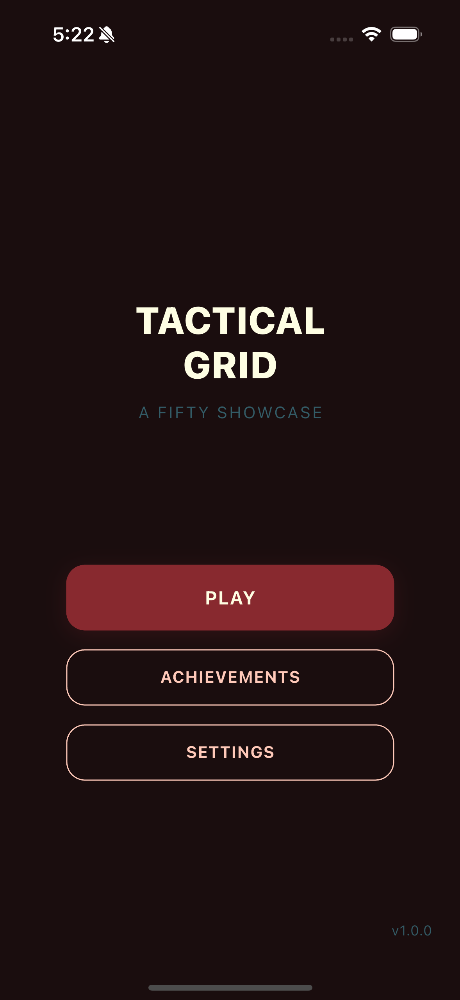
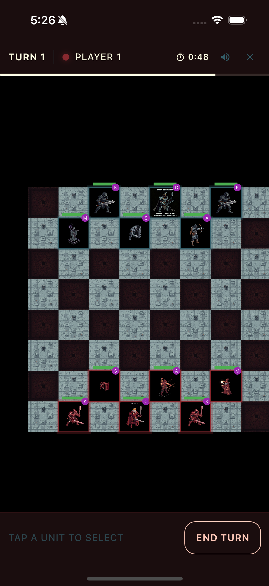
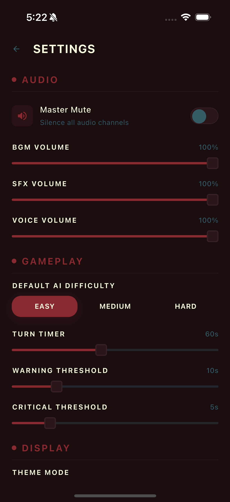
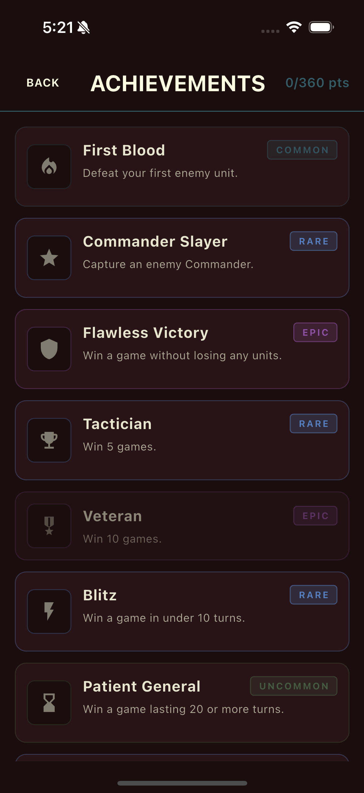

# Tactical Grid

Turn-based tactical combat on a grid — a showcase application for the full Fifty Flutter Kit stack. Part of [Fifty Flutter Kit](https://github.com/fiftynotai/fifty_flutter_kit).

| Menu | Battle | Settings | Achievements |
|:----:|:------:|:--------:|:------------:|
|  |  |  |  |

---

## Features

- **Local 1v1** - Two players share one device, taking alternating turns
- **VS AI** - Play against an AI opponent with three difficulty levels:
  - **Easy** - Random valid moves, no tactical awareness
  - **Medium** - Prioritizes attacking, targets low-HP enemies, moves toward threats
  - **Hard** - Score-based evaluation considering damage, safety, abilities, and commander protection
- **6 Unit Types** - Commander, Knight, Shield, Archer, Mage, and Scout, each with distinct stats, movement patterns, and special abilities
- **8x8 Board** - Six custom tile textures (dark, light, objective, obstacle, powerup, trap) rendered via `fifty_map_engine`
- **Full Audio Suite** - 4 BGM tracks, 16 sound effects, 19 voice lines with BGM ducking and per-channel volume control
- **10 Achievements** - Combat, Strategy, and Mastery categories from Common to Legendary rarity, tracked via `fifty_achievement_engine`
- **Turn Timer** - Configurable countdown per turn (default 60s) with warning at 10s, critical at 5s, audio cues, and auto-skip on timeout
- **Settings** - Master mute toggle, BGM/SFX/Voice volume sliders, default AI difficulty, turn timer configuration, dark/light theme toggle, and reset to defaults
- **Theme Support** - Full light and dark mode using `Theme.of(context).colorScheme` tokens across all pages

### Unit Roster

| Unit | HP | ATK | Movement | Ability |
|------|:---:|:---:|----------|---------|
| Commander | 5 | 2 | 1 tile, any direction | **Rally:** +1 ATK to adjacent allies (3-turn cooldown) |
| Knight | 3 | 3 | L-shape (chess knight) | **Charge:** passive +2 damage if moved this turn |
| Shield | 4 | 1 | 1 tile, any direction | **Block:** 50% damage reduction on next hit (2-turn cooldown) |
| Archer | 2 | 2 | 2 tiles, orthogonal | **Shoot:** ranged attack at distance 3 (2-turn cooldown) |
| Mage | 2 | 2 | 2 tiles, diagonal | **Fireball:** 1 damage to 3x3 area (3-turn cooldown) |
| Scout | 2 | 1 | 3 tiles, any direction | **Reveal:** show traps in 2-tile radius (2-turn cooldown) |

### Win Condition

Capture (defeat) the enemy Commander to win the match.

---

## Getting Started

```bash
# From the monorepo root
cd apps/tactical_grid

# Get dependencies
flutter pub get

# Deploy to a connected device or simulator
flutter run -d <device-id>
```

---

## Quick Start

1. Launch the app and select a game mode from the main menu (Local 1v1 or VS AI)
2. If VS AI, choose a difficulty level (Easy, Medium, or Hard)
3. Deploy your six units on the 8x8 board and take turns moving and attacking
4. Use each unit's special ability strategically to gain the upper hand
5. Capture the enemy Commander to win the match

---

## Architecture

**Pattern:** MVVM + Actions (Fifty Flutter Kit architecture)

```
lib/
  features/
    battle/       # Game logic, AI, animations, audio, HUD
    settings/     # Settings MVVM module with persistence
    achievements/ # Achievement definitions and tracking
    menu/         # Main menu with game mode selection
```

### Core Components

| Component | Description |
|-----------|-------------|
| State Management | GetX for reactive state, dependency injection, and routing |
| Routing | Centralized `RouteManager` with 4 routes (menu, battle, settings, achievements) |
| Persistence | GetStorage for settings and achievement data |

### Assets

- 12 unit sprites (player and enemy variants for all 6 unit types)
- 6 tile textures (dark, light, objective, obstacle, powerup, trap)
- 4 BGM tracks, 16 SFX sounds, 19 voice lines

---

## Platform Support

| Platform | Support | Notes |
|----------|---------|-------|
| Android  | Yes     |       |
| iOS      | Yes     |       |
| macOS    | Yes     | Desktop support via Flutter |
| Linux    | Yes     | Desktop support via Flutter |
| Windows  | Yes     | Desktop support via Flutter |

---

## Fifty Design Language Integration

Tactical Grid is the showcase application for the entire Fifty Flutter Kit. Six packages converge here to demonstrate the full FDL pipeline in a production app.

```
fifty_tokens -> fifty_theme -> fifty_ui
                                  |
fifty_audio_engine -> tactical_grid <- fifty_achievement_engine
                                  |
                       fifty_map_engine
```

### Fifty Flutter Kit Packages

| Package | Purpose |
|---------|---------|
| `fifty_tokens` | Design tokens (colors, spacing, typography) |
| `fifty_theme` | Theme system (dark/light mode) |
| `fifty_ui` | UI components (FiftyButton, FiftyCard) |
| `fifty_audio_engine` | Audio management (BGM, SFX, Voice) |
| `fifty_achievement_engine` | Achievement tracking and display |
| `fifty_map_engine` | Flame-based board rendering |

### Third-Party Dependencies

| Package | Purpose |
|---------|---------|
| `get` | State management, routing, dependency injection |
| `get_storage` | Local persistence |
| `loader_overlay` | Loading overlays |

---

## Version

**Current:** 1.0.0

---

## License

MIT License - see [LICENSE](../../LICENSE) for details.

Part of [Fifty Flutter Kit](https://github.com/fiftynotai/fifty_flutter_kit).
