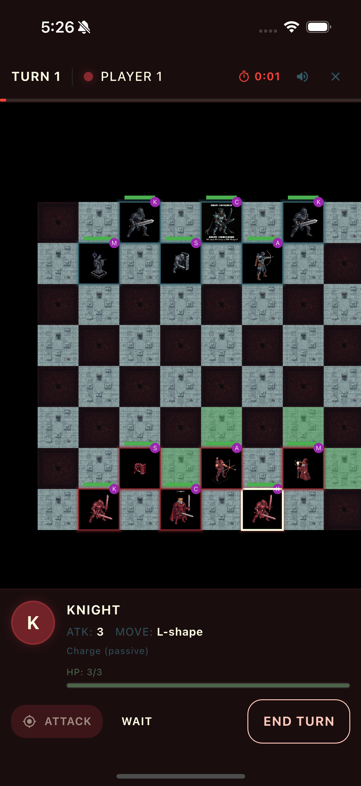
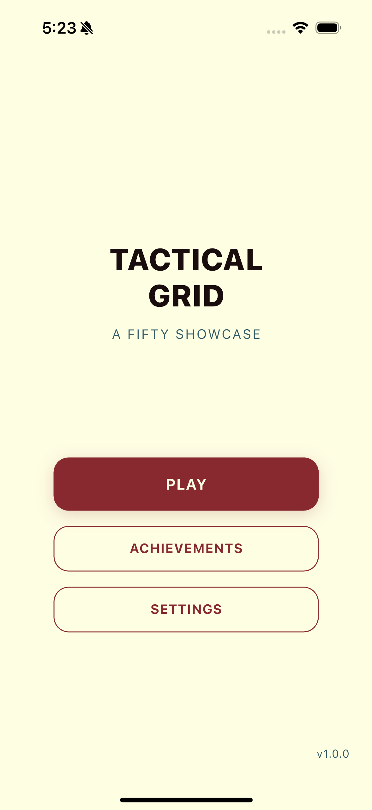
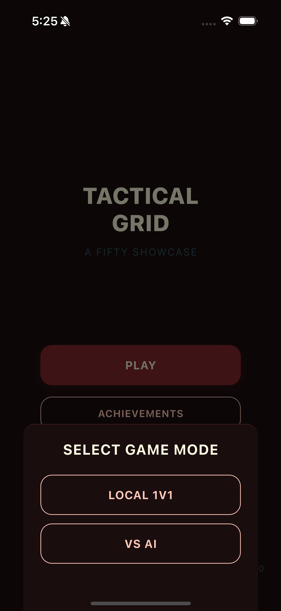
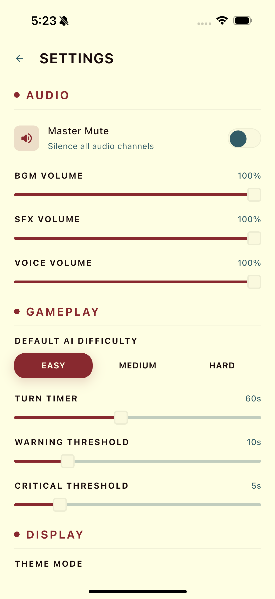
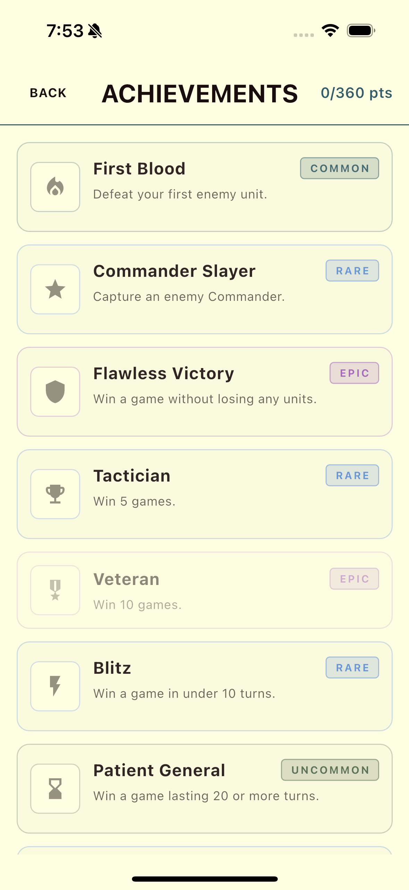

# Tactical Grid

**Turn-based tactical combat on a hex-free grid** — A Fifty Showcase App

<p align="center">
  
</p>

Tactical Grid is a polished turn-based strategy game built with Flutter as part of the **Fifty Flutter Kit** ecosystem. Deploy six distinct unit types on an 8x8 board, outmaneuver your opponent, and capture their Commander to claim victory. Play locally against a friend or challenge the AI across three difficulty levels.

---

## Features

### Game Modes

- **Local 1v1** — Two players share one device, taking alternating turns
- **VS AI** — Play against an AI opponent with three difficulty levels:
  - **Easy** — Random valid moves, no tactical awareness
  - **Medium** — Prioritizes attacking, targets low-HP enemies, moves toward threats
  - **Hard** — Score-based evaluation considering damage, safety, abilities, and commander protection

### Unit Roster

| Unit | HP | ATK | Movement | Ability |
|------|:---:|:---:|----------|---------|
| Commander | 5 | 2 | 1 tile, any direction | **Rally:** +1 ATK to adjacent allies (3-turn cooldown) |
| Knight | 3 | 3 | L-shape (chess knight) | **Charge:** passive +2 damage if moved this turn |
| Shield | 4 | 1 | 1 tile, any direction | **Block:** 50% damage reduction on next hit (2-turn cooldown) |
| Archer | 2 | 2 | 2 tiles, orthogonal | **Shoot:** ranged attack at distance 3 (2-turn cooldown) |
| Mage | 2 | 2 | 2 tiles, diagonal | **Fireball:** 1 damage to 3x3 area (3-turn cooldown) |
| Scout | 2 | 1 | 3 tiles, any direction | **Reveal:** show traps in 2-tile radius (2-turn cooldown) |

### Win Condition

Capture (defeat) the enemy **Commander** to win the match.

### Board

8x8 grid with six custom tile textures (dark, light, objective, obstacle, powerup, trap), rendered using `fifty_map_engine` — a Flame-based isometric engine.

### Audio

Full audio suite powered by `fifty_audio_engine`:

- **4 BGM tracks** — Menu theme, battle theme, victory fanfare, defeat theme
- **16 sound effects** — Sword slash, arrow shot, fireball cast, shield block, footsteps, hit, and more
- **19 voice lines** — Announcer lines for match start, unit captures, ability usage, commander warnings, victory, and defeat
- BGM ducking during voice announcements
- Per-channel volume control (BGM, SFX, Voice) with master mute

### Achievements

10 achievements tracked via `fifty_achievement_engine` across Combat, Strategy, and Mastery categories — from Common to Legendary rarity. Examples include First Blood, Commander Slayer, Flawless Victory, Tactician, and Blitz.

### Settings

A full settings page with persistent preferences:

- **Audio** — Master mute toggle, BGM / SFX / Voice volume sliders
- **Gameplay** — Default AI difficulty, turn timer duration, warning and critical thresholds
- **Display** — Dark / light theme toggle
- Reset to Defaults

### Turn Timer

Configurable countdown per turn (default 60 seconds). Warning at 10s, critical at 5s with audio cues. Auto-skips on timeout.

### Theme Support

Full light and dark mode support using `Theme.of(context).colorScheme` tokens across all pages.

---

## Screenshots

### Menu

<table>
  <tr>
    <td align="center"><strong>Dark</strong></td>
    <td align="center"><strong>Light</strong></td>
    <td align="center"><strong>Game Mode Select</strong></td>
  </tr>
  <tr>
    <td></td>
    <td></td>
    <td></td>
  </tr>
</table>

### Battle

<table>
  <tr>
    <td align="center"><strong>Gameplay</strong></td>
    <td align="center"><strong>Unit Selected</strong></td>
  </tr>
  <tr>
    <td></td>
    <td></td>
  </tr>
</table>

### Settings

<table>
  <tr>
    <td align="center"><strong>Dark</strong></td>
    <td align="center"><strong>Light</strong></td>
  </tr>
  <tr>
    <td></td>
    <td></td>
  </tr>
</table>

### Achievements

<table>
  <tr>
    <td align="center"><strong>Dark</strong></td>
    <td align="center"><strong>Light</strong></td>
  </tr>
  <tr>
    <td></td>
    <td></td>
  </tr>
</table>

---

## Architecture

**Pattern:** MVVM + Actions (Fifty Flutter Kit architecture)

```
lib/
  features/
    battle/       # Game logic, AI, animations, audio, HUD
    settings/     # Settings MVVM module with persistence
    achievements/ # Achievement definitions and tracking
    menu/         # Main menu with game mode selection
```

- **State Management:** GetX
- **Routing:** Centralized `RouteManager` with 4 routes (menu, battle, settings, achievements)

---

## Tech Stack

### Fifty Flutter Kit Packages

| Package | Purpose |
|---------|---------|
| `fifty_tokens` | Design tokens (colors, spacing, typography) |
| `fifty_theme` | Theme system |
| `fifty_ui` | UI components (FiftyButton, etc.) |
| `fifty_achievement_engine` | Achievement system |
| `fifty_audio_engine` | Audio management (BGM, SFX, Voice) |
| `fifty_map_engine` | Flame-based map and board rendering |

### Third-Party

| Package | Purpose |
|---------|---------|
| `get` | State management, routing, dependency injection |
| `get_storage` | Local persistence |
| `audioplayers` | Audio playback |
| `loader_overlay` | Loading overlays |

---

## Assets

- 12 unit sprites (player and enemy variants for all 6 unit types)
- 6 tile textures (dark, light, objective, obstacle, powerup, trap)
- 4 BGM tracks, 16 SFX sounds, 19 voice lines

---

## Getting Started

```bash
# From the monorepo root
cd apps/tactical_grid

# Get dependencies
flutter pub get

# Run on a connected device or simulator
flutter run -d <device-id>
```

---

## Tests

382 tests across 18 test files.

```bash
cd apps/tactical_grid
flutter test
```

---

## Credits

- **Development** — [Fifty.ai](https://fifty.ai)
- **Sprite Generation** — [Higgsfield FLUX.2 Pro](https://higgsfield.ai)
