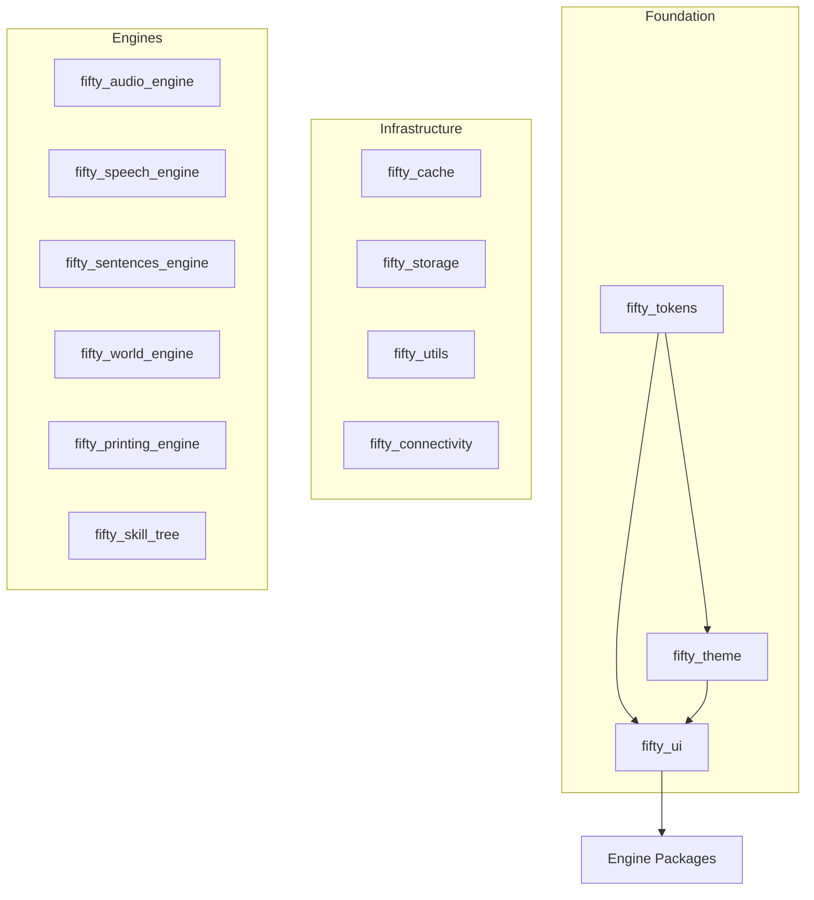

# FIFTY.DEV // DESIGN SYSTEM

**Version:** 2.0.0 | **Classification:** SOPHISTICATED MODERN

**Maintainer:** Mohamed Elamin (System Architect)

**Philosophy:** *Refined Warmth* | *Dual Mode Elegance*

---

## SECTION 1 — BRAND DIRECTION

### Identity

fifty.dev exists at the intersection of **Sophisticated Design** and **Modern Functionality**. We embrace refined warmth over cold minimalism, organic tones over harsh contrasts. We build thoughtful ecosystems that feel approachable yet professional.

### Vision

> *"Crafting experiences that feel both refined and human."*

### Core Traits

* **Dual Mode Native:** Cream light mode and deep burgundy-black dark mode.
* **Organic Warmth:** Natural, earthy palette with softer visual treatment.
* **Refined Structure:** Clean layouts with purposeful whitespace.
* **Sophisticated Simplicity:** Professional elegance without pretension.

---

## SECTION 2 — COLOR SYSTEM

The palette evokes warmth, sophistication, and natural elegance.

| Role | Variable Name | Hex Code | Usage |
|------|---------------|----------|-------|
| **Primary** | `burgundy` | `#88292f` | Primary actions, buttons, accents |
| **Primary Hover** | `primary-hover` | `#6e2126` | Hover states, pressed states |
| **Secondary** | `slate-grey` | `#335c67` | Secondary buttons, supporting text |
| **Success/Toggle** | `hunter-green` | `#4b644a` | Toggles, success states, checkboxes |
| **Light Background** | `light-yellow` / `cream` | `#fefee3` | Light mode background canvas |
| **Dark Background** | `background-dark` | `#1a0d0e` | Dark mode background canvas |
| **Surface Light** | `surface-light` | `#ffffff` | Light mode cards, elevated surfaces |
| **Surface Dark** | `surface-dark` | `#2a1517` | Dark mode cards, elevated surfaces |
| **Accent** | `powder-blush` | `#ffc9b9` | Highlights, badges, warm accents |

### Color Usage Guidelines

* **Primary (Burgundy):** Use for primary CTAs, active navigation, key interactive elements.
* **Secondary (Slate Grey):** Use for secondary actions, body text in light mode, supporting UI.
* **Success (Hunter Green):** Reserved for positive states, toggles, form validation success.
* **Accent (Powder Blush):** Use sparingly for highlights, badges, and warm accent touches.

---

## SECTION 3 — TYPOGRAPHY SYSTEM

We use a unified type system with **Manrope** for all text, creating cohesion across display and body content.

| Role | Font Family | Weight | Usage |
|------|-------------|--------|-------|
| **Display / Headlines** | **Manrope** | Extrabold (800) | Hero text, page titles, feature headlines |
| **Subheads** | **Manrope** | Bold (700) | Section headings, card titles |
| **Body Copy** | **Manrope** | Regular (400) | Paragraphs, descriptions, general content |
| **UI Elements** | **Manrope** | Medium (500) | Buttons, labels, navigation items |
| **Captions** | **Manrope** | Regular (400) | Small text, metadata, helper text |

### Type Scale

* **Display XL:** 48px / 3rem (Line height 1.1)
* **Display L:** 36px / 2.25rem (Line height 1.2)
* **Heading:** 24px / 1.5rem (Line height 1.3)
* **Subheading:** 20px / 1.25rem (Line height 1.4)
* **Body:** 16px / 1rem (Line height 1.5)
* **Small:** 14px / 0.875rem (Line height 1.5)
* **Caption:** 12px / 0.75rem (Line height 1.4)

---

## SECTION 4 — GRID & SPACING ARCHITECTURE

### Spacing System

Content uses a consistent spacing scale based on 4px increments.

* **Base Unit:** 4px
* **Spacing Scale:** 4, 8, 12, 16, 20, 24, 32, 40, 48, 64, 80, 96px
* **Component Padding:** 16px (compact) / 24px (standard) / 32px (spacious)
* **Section Margins:** 48px - 96px depending on content density

### Border Radius

| Size | Value | Usage |
|------|-------|-------|
| **Default** | 0.5rem (8px) | Buttons, inputs, small cards |
| **Large** | 0.75rem (12px) | Cards, modals |
| **XL** | 1rem (16px) | Large containers, sections |
| **2XL** | 1.5rem (24px) | Hero sections, feature cards |
| **Full** | 9999px | Pills, badges, avatars |

### Surfaces & Depth

| Level | Light Mode | Dark Mode | Effect |
|-------|------------|-----------|--------|
| **Base** | `#fefee3` | `#1a0d0e` | Page background |
| **Surface** | `#ffffff` | `#2a1517` | Cards, elevated content |
| **Overlay** | `rgba(255,255,255,0.8)` | `rgba(42,21,23,0.8)` | Backdrop blur (blur-md) |

### Borders

* **Light Mode:** `rgba(0,0,0,0.05)` - subtle, nearly invisible
* **Dark Mode:** `rgba(255,255,255,0.05)` - subtle, nearly invisible
* **Stroke Width:** 1px for subtle definition

---

## SECTION 5 — MOTION PHYSICS

The brand is **Smooth**. It feels refined and responsive.

### Timing

* **Instant:** 0ms (State changes)
* **Fast:** 150ms (Micro-interactions)
* **Default:** 200ms (Standard transitions)
* **Emphasis:** 300ms (Reveals, expansions)
* **Orchestrated:** 400-600ms (Staggered entry)

### Easing

* **Default:** `ease-out` - Natural deceleration
* **Enter:** `ease-out` - Elements arriving
* **Exit:** `ease-in` - Elements leaving
* **Bounce:** `cubic-bezier(0.68, -0.55, 0.265, 1.55)` - Playful emphasis

### Transitions

* **Preferred:** Opacity fades, subtle scale transforms, smooth slides
* **Press Feedback:** Scale to 0.98 on press, return on release
* **Hover States:** Subtle color shifts, shadow elevation
* **Loading States:** Subtle pulsing, skeleton loaders, progress indicators

### Effects

* **Backdrop Blur:** `blur-md` (12px) for overlays, `blur-lg` (24px) for modals
* **Shadows:** Soft, layered shadows for depth
  * `shadow-sm`: 0 1px 2px rgba(0,0,0,0.05)
  * `shadow-md`: 0 4px 6px rgba(0,0,0,0.1)
  * `shadow-lg`: 0 10px 15px rgba(0,0,0,0.1)

---

## SECTION 6 — COMPONENT PHILOSOPHY

### Design Principles

UI elements should feel refined, approachable, and purposeful.

* **Buttons:** Rounded corners (default 8px, pill for emphasis). Subtle shadow on hover.
* **Inputs:** Clean borders, generous padding, clear focus states with primary color.
* **Cards:** Soft shadows, subtle borders, comfortable padding.

### Interactive States

| State | Light Mode | Dark Mode |
|-------|------------|-----------|
| **Default** | Surface with subtle border | Surface with subtle border |
| **Hover** | Elevated shadow, subtle background shift | Elevated shadow, subtle background shift |
| **Active/Pressed** | Scale 0.98, deeper color | Scale 0.98, deeper color |
| **Focus** | Primary color ring (2px) | Primary color ring (2px) |
| **Disabled** | 50% opacity | 50% opacity |

### Component Inventory (28 Components)

The fifty_ui package provides 28 production-ready components implementing the FDL design language.

#### Buttons

| Component | Description |
|-----------|-------------|
| `FiftyButton` | Primary action trigger with variants (primary, secondary, ghost, danger) |
| `FiftyIconButton` | Icon-only action button |

#### Inputs

| Component | Description |
|-----------|-------------|
| `FiftyTextField` | Clean text input with focus states |
| `FiftySwitch` | Binary toggle control |
| `FiftySlider` | Range selection control |
| `FiftyDropdown` | Selection menu |
| `FiftyCheckbox` | Multi-select control (hunter-green active state) |
| `FiftyRadio` | Single-select control |

#### Controls

| Component | Description |
|-----------|-------------|
| `FiftySegmentedControl` | Pill-style segmented selector |

#### Display

| Component | Description |
|-----------|-------------|
| `FiftyCard` | Elevated container with soft shadow |
| `FiftyBadge` | Status indicator (powder-blush accent) |
| `FiftyChip` | Compact label/tag |
| `FiftyDivider` | Visual separator |
| `FiftyDataSlate` | Key-value data display |
| `FiftyAvatar` | User/entity representation |
| `FiftyProgressBar` | Progress indicator |
| `FiftyLoadingIndicator` | Smooth loading animation |
| `FiftyCodeBlock` | Syntax-highlighted code display |

#### Feedback

| Component | Description |
|-----------|-------------|
| `FiftySnackbar` | Transient notification |
| `FiftyDialog` | Modal interaction with backdrop blur |
| `FiftyTooltip` | Contextual hint |

#### Layout

| Component | Description |
|-----------|-------------|
| `FiftyHero` | Dramatic headline display |
| `FiftyHeroSection` | Hero with subtitle |

#### Navigation

| Component | Description |
|-----------|-------------|
| `FiftyNavBar` | Floating navigation bar with backdrop blur |

#### Effects

| Component | Description |
|-----------|-------------|
| `KineticEffect` | Motion physics wrapper |
| `GlitchEffect` | Chromatic aberration animation |
| `GlowContainer` | Pulse/glow effect |
| `HalftonePainter` | Texture pattern generator |
| `HalftoneOverlay` | Pattern overlay widget |

---

## SECTION 7 — ECOSYSTEM ARCHITECTURE

The code structure mirrors the visual brand structure.

### Visual Map



### Package Inventory (13 Packages)

| Layer | Package | Purpose |
|-------|---------|---------|
| Foundation | `fifty_tokens` | Design tokens (colors, spacing, typography) |
| Foundation | `fifty_theme` | Theme system (light/dark modes) |
| Foundation | `fifty_ui` | Component library (28 components) |
| Infrastructure | `fifty_cache` | HTTP response caching |
| Infrastructure | `fifty_storage` | Secure local storage |
| Infrastructure | `fifty_utils` | Utilities and ApiResponse |
| Infrastructure | `fifty_connectivity` | Network monitoring |
| Engine | `fifty_audio_engine` | Audio playback system |
| Engine | `fifty_speech_engine` | Text-to-speech |
| Engine | `fifty_sentences_engine` | Sentence processing |
| Engine | `fifty_world_engine` | Map integration |
| Engine | `fifty_printing_engine` | Print services |
| Engine | `fifty_skill_tree` | RPG skill tree UI |

### Layer Definitions

* **Foundation:** The DNA. Design tokens, theming, and UI components that all other packages consume.
* **Infrastructure:** Core utilities and services. Caching, storage, network monitoring.
* **Engines:** Domain-specific functionality. Audio, speech, maps, printing, gamification.

---

## SECTION 8 — BRAND USAGE RULES

### Logo System

* **Wordmark:** `fifty.dev` (Manrope Bold, lowercase)
* **Monogram:** The "50" mark, clean and refined.
* **Favicon:** Simplified monogram for small sizes.

### Visual Artifacts

* **Gradients:** Subtle gradients for depth (burgundy to darker burgundy).
* **Patterns:** Minimal geometric patterns for backgrounds.
* **Photography:** Warm, natural lighting. Avoid harsh contrasts.

### Tone of Voice

**Clear. Professional. Approachable.**

* Write in plain language that respects the reader.
* Be helpful without being condescending.
* Be confident without being aggressive.

**Examples:**
* *Instead of:* "Click here to learn more" -> *Use:* "Learn more"
* *Instead of:* "ERROR: Invalid input" -> *Use:* "Please enter a valid email"
* *Instead of:* "Submit" -> *Use:* "Continue" or action-specific label

---

## SECTION 9 — CONTENT & SOCIAL SYSTEM

### Content Pillars

1. **Engineering Insights:** Technical deep-dives and learnings.
2. **Design Process:** Behind-the-scenes of building the system.
3. **Product Updates:** New features, improvements, releases.

### Visual Templates

* **Background:** Light cream (`#fefee3`) or deep burgundy (`#1a0d0e`) based on context.
* **Typography:** Bold Manrope headlines with ample whitespace.
* **Accent:** Burgundy highlights for emphasis.

### Caption Guidelines

* Lead with value or insight.
* Keep it concise and scannable.
* Use line breaks for readability.
* End with a clear call-to-action when appropriate.

---

## SECTION 10 — PORTFOLIO / WEBSITE SYSTEM

### Layout Philosophy

* **Navigation:** Clean, floating navigation with backdrop blur effect.
* **Hero Section:** Large typography, subtle animations, clear value proposition.
* **Projects:** Card-based grid with hover effects and clear hierarchy.

### Project Presentation

Show work with context and depth:

* **Overview:** What it is and why it matters.
* **Process:** Key decisions and challenges.
* **Outcome:** Results and impact.
* **Visuals:** High-quality screenshots with device mockups.

### Page Structure

* **Above the fold:** Hero with clear value proposition.
* **Content sections:** Alternating layouts for visual interest.
* **Footer:** Compact, essential links and contact.

---

## SECTION 11 — DOCUMENTATION STANDARDS

### README Template

```markdown
# Package Name

Brief description of what this package does.

## Installation

```bash
flutter pub add package_name
```

## Usage

```dart
// Basic usage example
```

## Features

- Feature one
- Feature two
- Feature three

## API Reference

See the API documentation for details.
```

### Documentation Style

* Support both light and dark mode.
* Use syntax highlighting for all code blocks.
* Include practical, runnable examples.
* Use callouts for important notes and warnings.
* Keep explanations concise but complete.

---

## SECTION 12 — MAINTENANCE CHECKLIST

### Governance

* **Tokens First:** Never hardcode color or spacing values. Use design tokens.
* **Theme Aware:** All components must support both light and dark modes.
* **Accessibility:** Ensure sufficient color contrast and touch targets.

### Quality Gates

* **Visual Review:** Does it match the design system specifications?
* **Mode Test:** Does it look good in both light and dark mode?
* **Motion Test:** Are transitions smooth and purposeful?
* **Accessibility Test:** Does it meet WCAG AA standards?

### Maintenance Schedule

* **Quarterly:** Review and update color palette if needed.
* **Bi-annually:** Audit component library for consistency.
* **Annually:** Full design system review and refinement.

### Closing Directive

> **"Design with intention. Build with care. Create experiences that feel both refined and human."**
