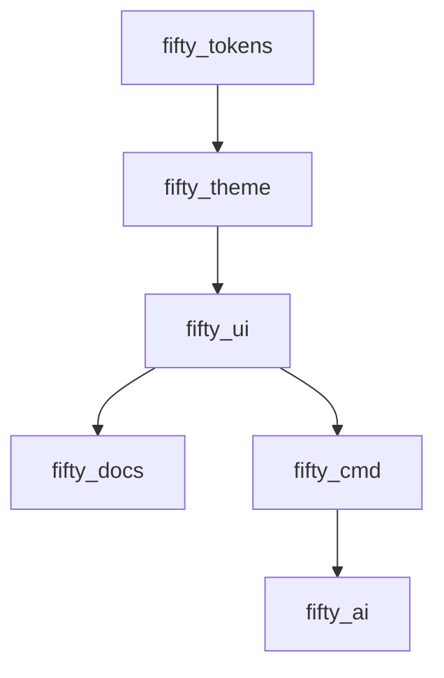

# 🧬 FIFTY.DEV // SYSTEM PROTOCOL (FDL)

**Version:** 1.1.0 · **Classification:** KINETIC BRUTALISM

**Maintainer:** Mohamed Elamin (System Architect)

**Philosophy:** *Structured Chaos (Base)* · *Manga Aesthetics (Overlay)*

---

## SECTION 1 — BRAND DIRECTION

### Identity

fifty.dev exists at the strict intersection of **Systems Architecture** and **Manga Aesthetics**. It rejects polished corporate minimalism in favor of grit, structure, and kinetic energy. We do not build "apps"; we construct ecosystems.

### Vision

> *"I don't code features. I engineer logic flow."*

### Core Traits

* **Dark Mode Native:** OLED-friendly, terminal-inspired environments.
* **Aggressive Structure:** High density, bento-grid layouts.
* **Kinetic:** Nothing fades in; it slides, wipes, or compiles.
* **Dual Persona:** The Engineer (Logic) + The Otaku (Chaos).

---

## SECTION 2 — COLOR SYSTEM

The palette evokes a "Mecha Cockpit" or "Server Room" environment.

| Role | Variable Name | Hex Code | Usage |
| --- | --- | --- | --- |
| **Background** | `VOID_BLACK` | `#050505` | The infinite canvas. Never pure black. |
| **Primary Accent** | `CRIMSON_PULSE` | `#960E29` | The heartbeat. Buttons, active states, errors. |
| **Surface** | `GUNMETAL` | `#1A1A1A` | Cards, bento containers, code blocks. |
| **Text Primary** | `TERMINAL_WHITE` | `#EAEAEA` | High legibility, reduced eye strain. |
| **Text Secondary** | `HYPER_CHROME` | `#888888` | Metadata, borders, hardware details. |
| **System Status** | `IGRIS_GREEN` | `#00FF41` | Exclusive to IGRIS terminal outputs. |

---

## SECTION 3 — TYPOGRAPHY SYSTEM

We use a binary type system to represent **Hype (Visuals)** vs. **Logic (Code)**.

| Role | Font Family | Weight | Case |
| --- | --- | --- | --- |
| **Headlines / Hero** | **Monument Extended** | Ultrabold (800) | ALL CAPS |
| **Subheads** | **Monument Extended** | Regular (400) | ALL CAPS |
| **Body Copy** | **JetBrains Mono** | Regular (400) | Sentence |
| **UI / Code** | **JetBrains Mono** | Medium (500) | Sentence |

### Type Scale (Golden Ratio)

* **Display XL:** 64px (Tight Tracking `-2%`)
* **Display L:** 48px
* **Heading:** 32px
* **Body:** 16px (Height `1.5`)
* **Mono Small:** 12px (Opacity `0.7`)

---

## SECTION 4 — GRID & SPACING ARCHITECTURE

### The Bento Grid

Content must never float in empty space. It is contained in modular units.

* **Base Unit:** 4px
* **Gaps:** Tight (`8px` or `12px`) to create density.
* **Container Radius:** `12px` (Standard) or `24px` (Smooth).
* **Stroke:** `1px` solid `HYPER_CHROME` at `10%` opacity.

### Surfaces & Depth

| Level | Color | Texture Overlay |
| --- | --- | --- |
| **Base** | `#050505` | Noise / Grain (3% Opacity) |
| **Card** | `#1A1A1A` | Halftone Dots (5% Opacity) |
| **Overlay** | `#1A1A1A` | Glassmorphism (Blur 20px) |

---

## SECTION 5 — MOTION PHYSICS

The brand is **Kinetic**. It feels heavy but fast.

### Timing (The "Snap" Feel)

* **Instant:** `0ms` (Logic changes)
* **Fast:** `150ms` (Hover states)
* **Compiling:** `300ms` (Panel reveals)
* **System Load:** `800ms` (Staggered entry)

### Transitions

* **NO FADES.** Use **Slides, Wipes, and Reveals**.
* *Concept:* A shutter closing, a manga page turning, a blast door opening.
* **Loading:** Never use a spinner. Use text sequences:
```bash
> INITIALIZING...
> LOADING ASSETS...
> DONE.

```


---

## SECTION 6 — COMPONENT PHILOSOPHY

### The "Cartridge" Concept

UI elements should feel like physical data cartridges inserted into a slot.

* **Buttons:** Sharp edges or pill shapes. On hover, text turns `CRIMSON` and snaps to cursor.
* **Inputs:** Look like terminal command lines (`_` blinking cursor).
* **Cards:** Interactive. Hovering triggers a "scanline" effect.

### IGRIS Interface

* Always a dedicated overlay or terminal window.
* Visuals: Monospaced, `IGRIS_GREEN`, blinking block cursor `█`.

---

## SECTION 7 — ECOSYSTEM ARCHITECTURE

The code structure mirrors the visual brand structure.

**Visual Map:**



* **Foundation:** `fifty_tokens` (The DNA)
* **Experience:** `fifty_ui` (The Body)
* **Intelligence:** `fifty_ai` (The Mind/IGRIS)

---

## SECTION 8 — BRAND USAGE RULES

### Logo System

* **Wordmark:** `fifty.dev` (JetBrains Mono, lowercase)
* **Monogram:** The "50" Glitch Circuit Glyph.
* **Icon:** `>_` or `//` representing the terminal root.

### Visual Artifacts

* **Halftones:** Manga screentones used as background texture.
* **Glitch:** Chromatic aberration (RGB split) used sparingly on hover.
* **Code:** Actual code snippets used as decorative elements.

### Tone of Voice

**Direct. Technical. Confident.**

* *Instead of:* "Contact Me" -> *Use:* `OPEN CONNECTION`
* *Instead of:* "My Work" -> *Use:* `DEPLOYMENTS`
* *Instead of:* "About" -> *Use:* `CORE IDENTITY`

---

## SECTION 9 — CONTENT & SOCIAL SYSTEM

### Content Pillars

1. **System Logs:** Behind-the-scenes of building packages.
2. **Audio Artifacts:** Music production snippets.
3. **IGRIS Dialogues:** Conversations with your AI agent.

### Visual Templates

* **Background:** `VOID_BLACK` with Crimson grid lines.
* **Typography:** Massive `Monument Extended` headlines.
* **Footer:** `[ SYSTEM: ONLINE ]` status indicator.

### Caption Formula

```
[TIMESTAMP] :: [TOPIC]
> Input: The challenge or thought.
> Process: How I solved it.
> Output: The result.

```

---

## SECTION 10 — PORTFOLIO / WEBSITE SYSTEM

### The "Command Center" Layout

* **Navigation:** Floating "Dynamic Island" at bottom center.
* **Hero Section:** Interactive Flame Engine particle system (Crimson particles).
* **Projects:** Displayed as a "Select Screen" in a video game.

### Project Case Studies

Don't just show screenshots. Show the **Layers**.

* Explode the view: Database Layer -> Logic Layer -> UI Layer.

---

## SECTION 11 — DOCUMENTATION STANDARDS

### README Template

```markdown
# [PACKAGE_NAME]
> Status: STABLE | Version: 1.0.0

## // OVERVIEW
Technical description of the logic.

## // INSTALLATION
dart pub add package_name

```

### Doc Style

* Dark mode only.
* Code blocks must have syntax highlighting (Crimson/Green/White).
* Use "Warning" blocks styled as system alerts.

---

## SECTION 12 — MAINTENANCE CHECKLIST

### Governance

* **Tokens First:** Never hardcode a hex value. Always use `FiftyColors.crimsonPulse`.
* **Motion Check:** Does it slide? If it fades, rewrite it.
* **Tone Check:** Is it too friendly? Make it more technical.

### Annual Review

* Update the "Glitch" effects.
* Refine the IGRIS logic model.
* Audit package dependencies.

### Closing Directive

> **"The interface is the machine. Make it feel alive."**