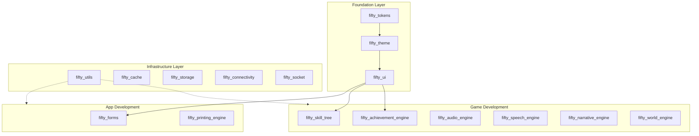
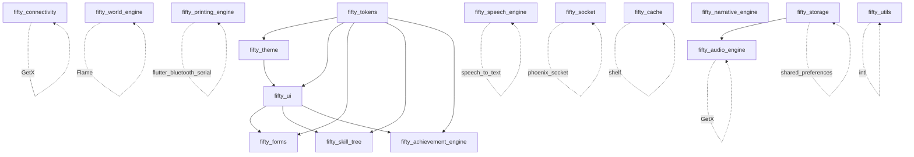

# Architecture

Fifty Flutter Kit architecture reference. For a quick overview, see the [root README](../README.md#architecture).

---

## Ecosystem Overview

The Fifty Flutter Kit is organized into a **3-layer architecture**. Each layer builds on the one below it, with clear boundaries between foundation, infrastructure, and application concerns.

- **Foundation** establishes the design language -- tokens, theming, and UI components.
- **Infrastructure** provides standalone services -- caching, storage, connectivity, sockets, and utilities.
- **App Development and Game Development** consume both layers to deliver domain-specific functionality.



---

## Layer Definitions

### Foundation Layer (3 packages)

The design system pipeline. Each package feeds into the next.

| Package | Purpose | Key Exports |
|---------|---------|-------------|
| `fifty_tokens` | Design tokens -- colors, typography, spacing, motion, shadows, gradients, radii, breakpoints | `FiftyColors`, `FiftyTypography`, `FiftySpacing`, `FiftyMotion` |
| `fifty_theme` | Converts tokens into Material `ThemeData` | `FiftyTheme.light()`, `FiftyTheme.dark()` |
| `fifty_ui` | FDL v2 styled Flutter components | `FiftyButton`, `FiftyCard`, `FiftyInput` |

### Infrastructure Layer (5 packages)

Standalone services with no cross-dependencies within the layer.

| Package | Purpose | Key Exports |
|---------|---------|-------------|
| `fifty_utils` | Pure Dart/Flutter utilities -- DateTime, Duration, Color extensions, responsive breakpoints, async state | `ApiResponse`, `apiFetch()`, `ResponsiveUtils`, `HexColor` |
| `fifty_cache` | TTL-based HTTP response caching with pluggable stores | `CacheManager`, `CachePolicy`, `CacheStore` |
| `fifty_storage` | Secure token storage and preferences management | `SecureStorage`, `PreferencesManager` |
| `fifty_connectivity` | Network connectivity monitoring with reachability probing | `ReachabilityService`, `ConnectionViewModel`, `ConnectionOverlay` |
| `fifty_socket` | Phoenix WebSocket client with auto-reconnect and channel management | `SocketService`, `SocketConfig` |

### App Development Layer (2 packages)

Production application tools that consume the Foundation layer.

| Package | Purpose | Key Exports |
|---------|---------|-------------|
| `fifty_forms` | Form building with validation, multi-step wizards, draft persistence | `FiftyFormController`, `FiftyTextField`, `FiftyMultiStepForm`, `DraftManager` |
| `fifty_printing_engine` | Multi-printer ESC/POS printing via Bluetooth and WiFi | `PrinterDiscovery`, `PrinterConnection`, `ReceiptBuilder` |

### Game Development Layer (6 packages)

Game engine components for Flutter-based games and interactive experiences.

| Package | Purpose | Key Exports |
|---------|---------|-------------|
| `fifty_audio_engine` | Modular reactive audio -- BGM, SFX, Voice channels | `FiftyAudioEngine`, `BgmChannel`, `SfxChannel`, `VoiceChannel` |
| `fifty_speech_engine` | Text-to-speech and speech-to-text | `SpeechEngine`, `TtsService`, `SttService` |
| `fifty_narrative_engine` | Narrative processing for in-game dialogue and events | `NarrativeEngine`, `NarrativeInterpreter`, `NarrativeQueue` |
| `fifty_world_engine` | Flame-based interactive grid world rendering | `WorldEngine`, `TileMap`, `EntityManager` |
| `fifty_skill_tree` | Interactive skill tree widget with unlock conditions | `SkillTreeController`, `SkillTreeView` |
| `fifty_achievement_engine` | Achievement system with condition-based unlocks and progress tracking | `AchievementController`, `Achievement` |

---

## Dependency Graph

The full cross-package dependency map. Solid arrows are direct Dart dependencies. Dashed arrows are optional or runtime dependencies.



### Standalone Packages

These packages have no internal ecosystem dependencies:

- `fifty_utils` -- depends only on `intl`
- `fifty_cache` -- depends only on `shelf` / `shelf_io`
- `fifty_storage` -- depends only on `flutter_secure_storage`, `shared_preferences`
- `fifty_connectivity` -- depends only on `get` (GetX)
- `fifty_socket` -- depends only on `phoenix_socket`
- `fifty_speech_engine` -- depends only on `flutter_tts`, `speech_to_text`
- `fifty_narrative_engine` -- no external dependencies
- `fifty_printing_engine` -- depends only on `esc_pos_utils`, `flutter_bluetooth_serial`

### Internal Dependencies

These packages depend on other packages in the ecosystem:

- `fifty_theme` -- depends on `fifty_tokens`
- `fifty_ui` -- depends on `fifty_tokens`, `fifty_theme`
- `fifty_forms` -- depends on `fifty_ui`, `fifty_tokens`
- `fifty_skill_tree` -- depends on `fifty_ui`, `fifty_tokens`
- `fifty_achievement_engine` -- depends on `fifty_ui`, `fifty_tokens`
- `fifty_audio_engine` -- depends on `fifty_storage` (state persistence), `get` (GetX)
- `fifty_world_engine` -- depends on `flame`

---

## Design Principles

### 1. Tokens First

Every visual decision starts with design tokens. Colors, typography, spacing, motion -- all defined as constants in `fifty_tokens`. No magic numbers, no hardcoded values.

### 2. Theme Aware

Components consume tokens through the theme layer, not directly. This ensures light/dark mode works automatically and theming is consistent across the entire application.

### 3. FDL Compliance

All UI packages follow the **Fifty Design Language (FDL) v2** specification. Components are built to the design system, not the other way around.

### 4. Layer Independence

Infrastructure packages (cache, storage, connectivity, socket, utils) have zero dependencies on UI packages. They can be used in any Dart project, not just Flutter.

---

## MVVM + Actions Pattern

The recommended architecture for applications built with the Fifty Flutter Kit:

- **Model** -- Data classes and API contracts
- **ViewModel** -- Reactive state containers (GetX controllers)
- **View** -- Widgets that observe ViewModel state
- **Actions** -- UX orchestration layer between View and ViewModel

A complete scaffold is available in [`templates/mvvm_actions/`](../templates/mvvm_actions/). Fork it as your project starting point.

---

## Directory Structure

```
fifty_flutter_kit/
  packages/               # 16 published packages
    fifty_tokens/         #   Design tokens (foundation)
    fifty_theme/          #   Theme layer
    fifty_ui/             #   UI components
    fifty_forms/          #   Form system
    fifty_utils/          #   Utilities
    fifty_cache/          #   Caching layer
    fifty_storage/        #   Secure storage
    fifty_connectivity/   #   Network monitoring
    fifty_socket/         #   Phoenix WebSocket client
    fifty_audio_engine/   #   Audio system
    fifty_speech_engine/  #   TTS / STT
    fifty_narrative_engine/ # Narrative processing
    fifty_world_engine/   #   Grid world rendering
    fifty_printing_engine/#   ESC/POS printing
    fifty_skill_tree/     #   Skill tree widget
    fifty_achievement_engine/ # Achievement system
  apps/                   # Demo applications
    fifty_demo/           #   Showcase app
  templates/              # Architecture templates (fork, don't import)
    mvvm_actions/         #   MVVM + Actions scaffold
  design_system/          # FDL v2 design system reference
  docs/                   # Documentation
    ARCHITECTURE.md       #   This file
    QUICK_START.md        #   Code examples
    CONTRIBUTING.md       #   Contributor guide
  assets/                 # Repo assets (banner, etc.)
```
