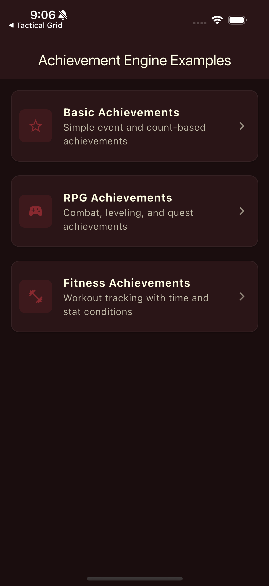
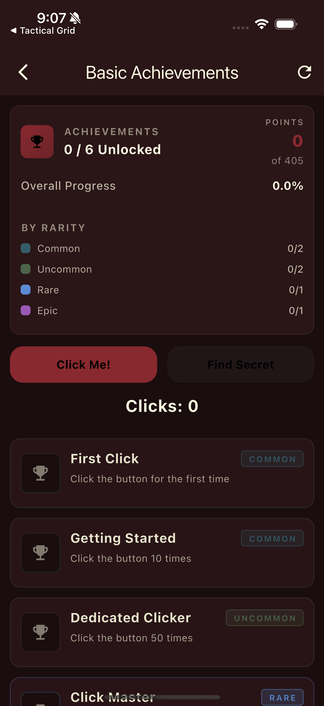
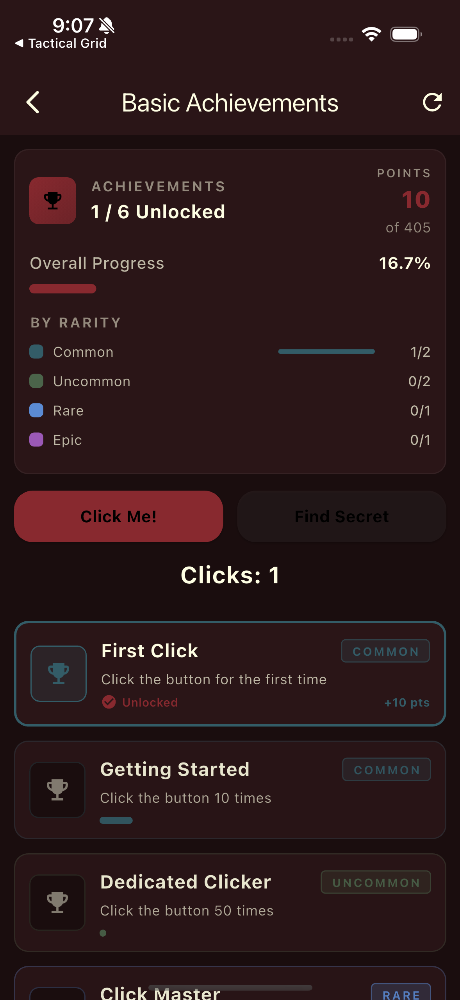
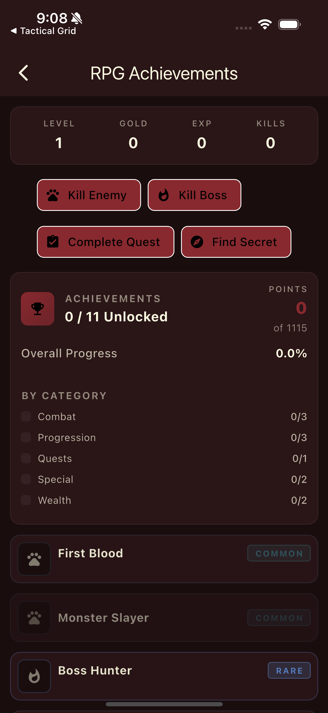

# Fifty Achievement Engine

[](https://pub.dev/packages/fifty_achievement_engine)
[](LICENSE)

**Complete achievement pipeline for Flutter games -- condition engine, progress tracking, and builder-customizable UI.**

Six composable condition types, prerequisite chains, rarity tiers, generic reward data, JSON serialization, and five FDL-styled widgets with optional builder callbacks that let you replace any widget's inner content while keeping all achievement logic intact. Part of [Fifty Flutter Kit](https://github.com/fiftynotai/fifty_flutter_kit).

| Home | Basic Achievements | Achievement Unlocked | RPG Achievements |
|:----:|:------------------:|:-------------------:|:----------------:|
|  |  |  |  |

---

## Why fifty_achievement_engine

- **Full achievement pipeline, any UI** -- `AchievementController` handles condition evaluation, progress tracking, prerequisite chains, and unlock callbacks; you provide the display.
- **Replace any widget's inner content** -- `contentBuilder`, `itemBuilder`, and `barBuilder` callbacks let you swap out default FDL UI for your game's visual style while keeping all achievement logic intact.
- **Six composable condition types** -- `EventCondition`, `CountCondition`, `ThresholdCondition`, `CompositeCondition` (AND/OR), `TimeCondition`, and `SequenceCondition` cover every unlock pattern without custom code.
- **Generic data on every achievement** -- Attach any type `T` to `Achievement<T>` for reward data (gold, items, XP) and access it in the `onUnlock` callback.

---

## Installation

```yaml
dependencies:
  fifty_achievement_engine: ^0.2.1
```

### For Contributors

```yaml
dependencies:
  fifty_achievement_engine:
    path: ../fifty_achievement_engine
```

**Dependencies:** `fifty_tokens`, `fifty_ui`

---

## Quick Start

```dart
import 'package:fifty_achievement_engine/fifty_achievement_engine.dart';

// Create controller with achievements
final controller = AchievementController<void>(
  achievements: [
    Achievement(
      id: 'first_kill',
      name: 'First Blood',
      description: 'Defeat your first enemy',
      condition: EventCondition('enemy_killed'),
      rarity: AchievementRarity.common,
      points: 10,
    ),
    Achievement(
      id: 'kill_100',
      name: 'Century',
      description: 'Defeat 100 enemies',
      condition: CountCondition('enemy_killed', target: 100),
      rarity: AchievementRarity.rare,
      points: 50,
      prerequisites: ['first_kill'],
    ),
  ],
  onUnlock: (achievement) {
    print('Unlocked: ${achievement.name}!');
  },
);

// Track events as they happen
controller.trackEvent('enemy_killed');

// Check progress
final progress = controller.getProgress('kill_100');
print('${(progress * 100).toStringAsFixed(0)}%'); // e.g., "45%"
```

---

## Architecture

```
AchievementController<T>
    |
    +-- achievements: List<Achievement<T>>
    |       Condition-based unlock, rarity, prerequisites
    |
    +-- Event/Stat Tracking
    |       trackEvent(), updateStat(), incrementStat()
    |
    +-- Progress Engine
    |       Real-time progress (0.0-1.0), state machine
    |
    +-- Serialization
            exportProgress(), importProgress(), packs
```

### Core Components

| Component | Description |
|-----------|-------------|
| `AchievementController` | Main controller managing achievements, tracking events/stats, unlock logic |
| `Achievement` | Data model with conditions, prerequisites, rarity, points |
| `AchievementCondition` | Abstract base for condition types |
| `AchievementSerializer` | JSON serialization for save/load and packs |

---

## Customization

Every achievement widget accepts an optional builder callback. When provided, the builder replaces the default FDL rendering while the widget retains ownership of controller listening, animations, and state management.

### Custom Card Content

Replace the inner content of `AchievementCard` (icon, title, description, progress row). The outer container with gesture detection, opacity animation, and border decoration is preserved:

```dart
AchievementCard(
  achievement: myAchievement,
  progress: 0.75,
  state: AchievementState.available,
  contentBuilder: (achievement, progress, state, rarityColor) {
    return Row(
      children: [
        Icon(Icons.star, color: rarityColor),
        const SizedBox(width: 12),
        Expanded(
          child: Column(
            crossAxisAlignment: CrossAxisAlignment.start,
            children: [
              Text(achievement.name, style: const TextStyle(fontWeight: FontWeight.bold)),
              LinearProgressIndicator(value: progress, color: rarityColor),
            ],
          ),
        ),
      ],
    );
  },
)
```

### Custom List Items

Replace the default `AchievementCard` for each item in `AchievementList`:

```dart
AchievementList(
  controller: controller,
  itemBuilder: (achievement, progress, state, index) {
    return ListTile(
      leading: Icon(achievement.icon ?? Icons.emoji_events),
      title: Text(achievement.name),
      subtitle: LinearProgressIndicator(value: progress),
      trailing: Text('${(progress * 100).toInt()}%'),
    );
  },
)
```

### Custom Summary Layout

Replace the entire summary layout in `AchievementSummary`. Receives computed statistics via `AchievementSummaryData`:

```dart
AchievementSummary(
  controller: controller,
  contentBuilder: (data) {
    return Text(
      '${data.unlockedCount}/${data.totalCount} unlocked '
      '(${data.earnedPoints}/${data.totalPoints} pts)',
    );
  },
)
```

### Custom Popup Content

Replace the default popup card in `AchievementPopup`. The animation controller is provided for synchronizing custom animations with the popup lifecycle:

```dart
AchievementPopup(
  achievement: unlockedAchievement,
  contentBuilder: (achievement, rarityColor, animationController) {
    return Container(
      padding: const EdgeInsets.all(16),
      decoration: BoxDecoration(
        color: rarityColor.withValues(alpha: 0.1),
        borderRadius: BorderRadius.circular(12),
        border: Border.all(color: rarityColor),
      ),
      child: Text('Unlocked: ${achievement.name}!'),
    );
  },
)
```

### Custom Progress Bar

Replace the default progress bar rendering in `AchievementProgressBar`:

```dart
AchievementProgressBar(
  progress: 0.75,
  barBuilder: (progress, height, backgroundColor, foregroundColor, borderRadius) {
    return LinearProgressIndicator(
      value: progress,
      backgroundColor: backgroundColor,
      color: foregroundColor,
      minHeight: height,
      borderRadius: borderRadius,
    );
  },
)
```

### Rarity Color Overrides

Override default rarity colors on any widget that displays rarity:

```dart
AchievementCard(
  achievement: myAchievement,
  progress: 0.75,
  rarityColors: {
    AchievementRarity.common: Colors.grey,
    AchievementRarity.legendary: Colors.amber,
  },
)
```

`rarityColors` is available on `AchievementCard`, `AchievementSummary`, and `AchievementPopup`. Unset rarities fall back to theme-derived defaults.

### Builder Signatures

| Widget | Builder parameter | Callback signature |
|--------|------------------|--------------------|
| `AchievementCard` | `contentBuilder` | `Widget Function(Achievement<T> achievement, double progress, AchievementState state, Color rarityColor)` |
| `AchievementList` | `itemBuilder` | `Widget Function(Achievement<T> achievement, double progress, AchievementState state, int index)` |
| `AchievementSummary` | `contentBuilder` | `Widget Function(AchievementSummaryData data)` |
| `AchievementPopup` | `contentBuilder` | `Widget Function(Achievement<T> achievement, Color rarityColor, AnimationController animationController)` |
| `AchievementProgressBar` | `barBuilder` | `Widget Function(double progress, double height, Color backgroundColor, Color foregroundColor, BorderRadius borderRadius)` |

All builders are optional. Omit them to use the default FDL UI.

---

## API Reference

### AchievementController

#### Tracking Events & Stats

```dart
// Track single event
controller.trackEvent('enemy_killed');

// Track multiple occurrences at once
controller.trackEvent('coin_collected', count: 50);

// Update a stat
controller.updateStat('player_level', 25);

// Increment a stat
controller.incrementStat('total_damage', 150);

// Clear tracking data (keeps unlocks)
controller.resetTracking();

// Full reset (unlocks + tracking)
controller.reset();
```

#### Achievement States

```dart
enum AchievementState {
  locked,    // Prerequisites not met
  available, // Can be worked towards
  unlocked,  // Completed!
  claimed,   // Reward collected (optional)
}

// Check state
final state = controller.getState('kill_100');
if (state == AchievementState.available) {
  // Show progress
}
```

#### Progress Details

```dart
// Simple progress (0.0 to 1.0)
final progress = controller.getProgress('kill_100');

// Detailed progress info
final details = controller.getProgressDetails('kill_100');
print('${details.current}/${details.target}'); // "45/100"
print('${details.percentage * 100}%');         // "45%"
print('State: ${details.state.displayName}');  // "In Progress"
```

#### Serialization

##### Save Progress

```dart
// Export all progress data
final progressJson = controller.exportProgress();
await saveToFile(jsonEncode(progressJson));
```

##### Load Progress

```dart
// Import saved progress
final savedData = await loadFromFile();
final progressJson = jsonDecode(savedData) as Map<String, dynamic>;
controller.importProgress(progressJson);
```

### Condition Types

#### EventCondition

Triggered when a specific event occurs at least once.

```dart
// Unlock when player finishes the tutorial
EventCondition('tutorial_completed')
```

#### CountCondition

Requires an event to occur a specific number of times.

```dart
// Kill 100 enemies
CountCondition('enemy_killed', target: 100)
```

#### ThresholdCondition

Satisfied when a stat reaches a target value.

```dart
// Reach level 50
ThresholdCondition('player_level', target: 50)

// Deal 10,000 damage total
ThresholdCondition('total_damage', target: 10000)

// With comparison operators
ThresholdCondition(
  'health',
  target: 1,
  operator: ThresholdOperator.lessOrEqual, // Survive at 1 HP
)
```

#### CompositeCondition

Combines multiple conditions with AND/OR logic.

```dart
// Kill 100 enemies AND reach level 50
CompositeCondition.and([
  CountCondition('enemy_killed', target: 100),
  ThresholdCondition('player_level', target: 50),
])

// Complete tutorial OR skip tutorial
CompositeCondition.or([
  EventCondition('tutorial_completed'),
  EventCondition('tutorial_skipped'),
])
```

#### TimeCondition

Time-based challenges.

```dart
// Play for 10 hours total
TimeCondition(Duration(hours: 10))

// Survive for 30 minutes in survival mode
TimeCondition(
  Duration(minutes: 30),
  duringEvent: 'survival_mode_active',
)
```

#### SequenceCondition

Requires events to occur in a specific order.

```dart
// Execute a specific combo
SequenceCondition(
  ['light_attack', 'light_attack', 'heavy_attack'],
  strict: true, // Must be consecutive
)

// Complete story chapters in order
SequenceCondition(
  ['chapter_1', 'chapter_2', 'chapter_3'],
  strict: false, // Other events allowed between
)
```

### Widgets

#### AchievementCard

Display a single achievement with progress. Optional `contentBuilder` and `rarityColors` for customization (see [Customization](#customization)).

```dart
AchievementCard(
  achievement: myAchievement,
  progress: 0.75,
  state: AchievementState.available,
  onTap: () => showDetails(myAchievement),
)
```

#### AchievementList

Scrollable list with filtering support. Optional `itemBuilder` replaces the default `AchievementCard` per item.

```dart
AchievementList(
  controller: controller,
  filter: AchievementFilter.available, // all, available, unlocked, locked
  rarityFilter: AchievementRarity.rare, // Optional rarity filter
  categoryFilter: 'Combat',             // Optional category filter
  onTap: (achievement) => showDetails(achievement),
)
```

#### AchievementPopup

Animated unlock notification. Optional `contentBuilder` and `rarityColors` for customization.

```dart
controller.onUnlock = (achievement) {
  showOverlay(
    context: context,
    builder: (context) => AchievementPopup(
      achievement: achievement,
      duration: Duration(seconds: 4),
      onDismiss: () => hideOverlay(),
    ),
  );
};
```

> **Note:** `AchievementPopup` includes an internal `Material` wrapper with `MaterialType.transparency` to ensure proper text rendering when displayed via Flutter's `Overlay`. This prevents the yellow underline text issue that occurs when `Text` widgets lack a `Material` ancestor.

#### AchievementSummary

Overall progress statistics. Optional `contentBuilder` receives `AchievementSummaryData` with computed breakdown maps.

```dart
AchievementSummary(
  controller: controller,
  showRarityBreakdown: true,
  showCategoryBreakdown: true,
)
```

#### AchievementProgressBar

Standalone progress bar. Optional `barBuilder` for fully custom visualization.

```dart
AchievementProgressBar(
  progress: 0.75,
  height: 8,
  foregroundColor: Colors.green,
)
```

---

## Usage Patterns

### Custom Achievement Data

Attach game-specific data to achievements:

```dart
class RewardData {
  final int gold;
  final String? itemId;

  RewardData({required this.gold, this.itemId});
}

final controller = AchievementController<RewardData>(
  achievements: [
    Achievement<RewardData>(
      id: 'boss_slayer',
      name: 'Boss Slayer',
      condition: EventCondition('boss_defeated'),
      data: RewardData(gold: 1000, itemId: 'legendary_sword'),
    ),
  ],
  onUnlock: (achievement) {
    if (achievement.data != null) {
      player.addGold(achievement.data!.gold);
      if (achievement.data!.itemId != null) {
        player.giveItem(achievement.data!.itemId!);
      }
    }
  },
);
```

### Achievement Packs

Serialize achievement definitions for modding or DLC:

```dart
// Serialize achievements
final packJson = AchievementSerializer.serializePack<RewardData>(
  achievements,
  packId: 'base_game',
  packName: 'Base Game Achievements',
  dataSerializer: (data) => data.toJson(),
);

// Deserialize
final pack = AchievementSerializer.deserializePack<RewardData>(
  packJson,
  dataDeserializer: (json) => RewardData.fromJson(json),
);
controller.addAchievements(pack.achievements);
```

### Filtering & Querying

```dart
// By state
final available = controller.availableAchievements;
final unlocked = controller.unlockedAchievements;
final locked = controller.lockedAchievements;

// By rarity
final legendary = controller.getByRarity(AchievementRarity.legendary);

// By category
final combat = controller.getByCategory('Combat');

// Get all categories
final categories = controller.categories;

// Statistics
print('Total points: ${controller.totalPoints}');
print('Earned points: ${controller.earnedPoints}');
print('Completion: ${(controller.completionPercentage * 100).toStringAsFixed(1)}%');
```

---

## Platform Support

| Platform | Support | Notes |
|----------|---------|-------|
| Android  | Yes     |       |
| iOS      | Yes     |       |
| macOS    | Yes     |       |
| Linux    | Yes     |       |
| Windows  | Yes     |       |
| Web      | Yes     |       |

---

## Fifty Design Language Integration

This package is part of Fifty Flutter Kit:

- **Theme-aware widgets** - All widgets use `Theme.of(context).colorScheme` for colors (`onSurface` for text, `surfaceContainerHighest` for backgrounds, `primary` for accents, `outline` for borders)
- **FDL token alignment** - Spacing from `FiftySpacing`, typography from `FiftyTypography`, radii from `FiftyRadii`, motion from `FiftyMotion`
- **Rarity semantic colors** - Common, Uncommon, Rare, Epic, Legendary use intentional semantic colors; override via `rarityColors` (see [Customization](#customization))
- **Compatible packages** - Works with `fifty_tokens`, `fifty_theme`, `fifty_ui`

---

## Version

**Current:** 0.2.1

---

## License

MIT License - see [LICENSE](LICENSE) for details.

Part of [Fifty Flutter Kit](https://github.com/fiftynotai/fifty_flutter_kit).
