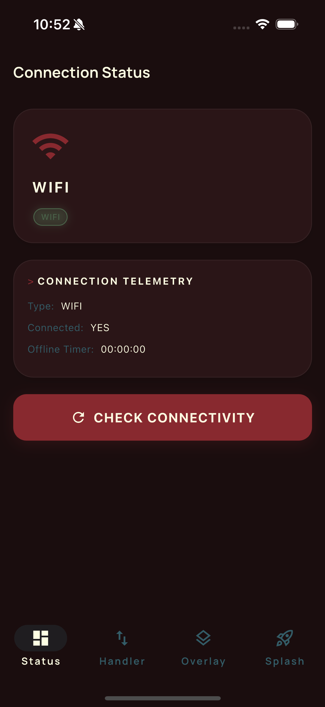
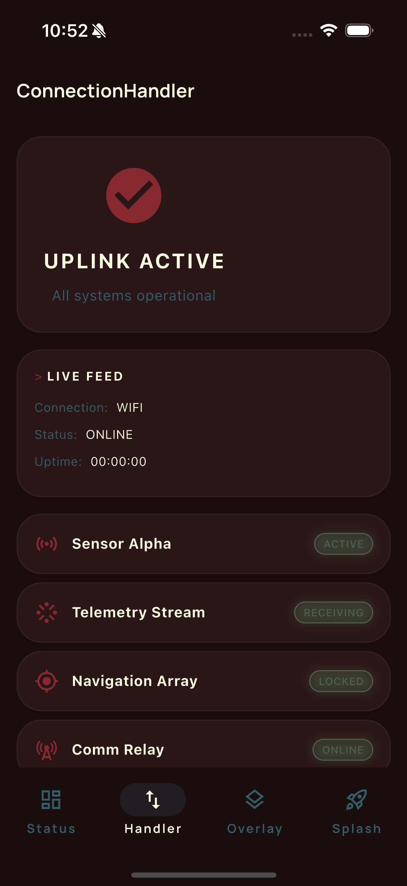
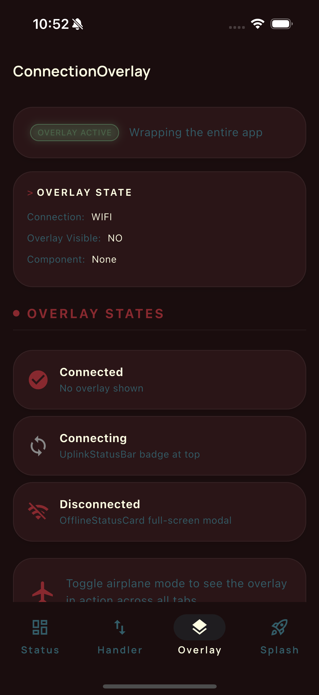
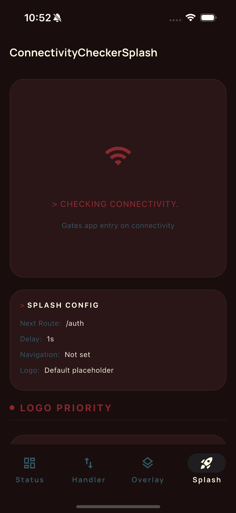

# Fifty Connectivity

[](https://pub.dev/packages/fifty_connectivity)
[](LICENSE)

**Reliable connectivity monitoring for Flutter -- DNS and HTTP health checks, not just network state.**

Distinguishes true internet access from captive portals and offline routers. Ships three ready-to-use UX widgets (overlay banner, content handler, splash gate) and a `contentBuilder` API for fully custom splash screens. Part of [Fifty Flutter Kit](https://github.com/fiftynotai/fifty_flutter_kit).

| Status | Handler | Overlay | Splash |
|:---:|:---:|:---:|:---:|
|  |  |  |  |

---

## Why fifty_connectivity

- **Reliable connectivity, not just network state** -- DNS and HTTP health checks distinguish captive portals and offline routers from true internet access; `ConnectivityType.noInternet` is separate from `ConnectivityType.disconnected`.
- **Three ready-to-use UX patterns** -- `ConnectionOverlay` for status banners, `ConnectionHandler` for content swapping, `ConnectivityCheckerSplash` for app launch gating; use one or all three.
- **Custom splash screens per state** -- `contentBuilder` on `ConnectivityCheckerSplash` gives you `(context, SplashConnectivityState, retryAction)` and replaces the entire splash content for checking/connected/failed states.
- **Telemetry callbacks** -- `onWentOffline` and `onBackOnline` hooks with offline `Duration` for analytics; no subclassing needed.

---

## Installation

```yaml
dependencies:
  fifty_connectivity: ^0.2.0
```

### For Contributors

```yaml
dependencies:
  fifty_connectivity:
    path: ../fifty_connectivity
```

**Dependencies:** `connectivity_plus`, `get`, `fifty_tokens`, `fifty_ui`, `fifty_utils`

---

## Quick Start

```dart
void main() {
  // 1. Register bindings before runApp
  ConnectionBindings().dependencies();

  // 2. Configure navigation
  ConnectivityConfig.navigateOff = (route) async {
    Get.offAllNamed(route);
  };

  // 3. Wrap app with ConnectionOverlay
  runApp(
    ConnectionOverlay(
      child: GetMaterialApp(
        home: HomePage(),
      ),
    ),
  );
}
```

---

## Architecture

```
┌─────────────────────────────────────────────────────┐
│                    UI Layer                          │
│  ConnectionOverlay  ConnectionHandler  Connectivity  │
│                                        CheckerSplash │
└────────────────────┬────────────────────────────────┘
                     │ observes
┌────────────────────▼────────────────────────────────┐
│               ConnectionActions                      │
│         (UX orchestration singleton)                 │
└────────────────────┬────────────────────────────────┘
                     │ drives
┌────────────────────▼────────────────────────────────┐
│            ConnectionViewModel (GetxController)      │
│  connectionType: Rx<ConnectivityType>                │
│  dialogTimer: RxString                               │
└──────────┬──────────────────────┬───────────────────┘
           │ listens               │ probes
┌──────────▼──────┐    ┌──────────▼────────────────────┐
│ connectivity_   │    │       ReachabilityService       │
│ plus stream     │    │  (DNS lookup or HTTP HEAD/GET)  │
└─────────────────┘    └───────────────────────────────┘
```

### Core Components

| Component | Description |
|-----------|-------------|
| `ConnectionViewModel` | GetX controller; single source of truth for `ConnectivityType` and offline timer |
| `ReachabilityService` | Injectable probe service; performs DNS lookup or HTTP HEAD to confirm internet access |
| `ConnectionBindings` | GetX `Bindings` subclass; registers `ConnectionViewModel` as a permanent singleton |
| `ConnectionActions` | Singleton UX orchestration layer; drives connectivity checks and splash navigation |
| `ConnectivityConfig` | Static configuration class for labels, navigation callback, and splash settings |
| `ConnectionOverlay` | Widget that renders an FDL-styled status overlay on connectivity change |
| `ConnectionHandler` | Widget that swaps content based on current connection state |
| `ConnectivityCheckerSplash` | Splash screen that probes connectivity before navigating; supports `contentBuilder` for fully custom UI per `SplashConnectivityState` |
| `SplashConnectivityState` | Simplified enum (`checking`, `connected`, `failed`) used by `contentBuilder` |

---

## Customization

### Custom Splash Content

`ConnectivityCheckerSplash` accepts a `contentBuilder` that replaces the default splash content while preserving the `Scaffold` and connectivity check pipeline. The builder receives the current `SplashConnectivityState` and a retry callback:

```dart
ConnectivityCheckerSplash(
  nextRouteName: '/home',
  contentBuilder: (context, state, retry) {
    return switch (state) {
      SplashConnectivityState.checking => Column(
        mainAxisSize: MainAxisSize.min,
        children: [
          Image.asset('assets/logo.png', height: 120),
          const SizedBox(height: 24),
          const CircularProgressIndicator(),
        ],
      ),
      SplashConnectivityState.connected => const Icon(
        Icons.check_circle,
        size: 64,
        color: Colors.green,
      ),
      SplashConnectivityState.failed => Column(
        mainAxisSize: MainAxisSize.min,
        children: [
          const Icon(Icons.wifi_off, size: 64),
          const SizedBox(height: 16),
          const Text('No connection'),
          const SizedBox(height: 16),
          ElevatedButton(onPressed: retry, child: const Text('Retry')),
        ],
      ),
    };
  },
)
```

#### SplashConnectivityState

The builder receives one of three simplified states mapped from the internal `ConnectivityType`:

| State | Maps from | Description |
|-------|-----------|-------------|
| `checking` | `connecting` | Connectivity check in progress |
| `connected` | `wifi`, `mobileData` | Internet access confirmed |
| `failed` | `disconnected`, `noInternet` | Check failed; show retry UI |

**Note:** When `contentBuilder` is provided, `logoBuilder` is ignored since the builder controls all inner content. The `Scaffold` and `Center` wrapping remain widget-owned.

### Custom Logo

For simpler customization, provide a `logoBuilder` instead:

```dart
ConnectivityCheckerSplash(
  logoBuilder: (context) => SvgPicture.asset('assets/logo.svg'),
)
```

Or set it globally via `ConnectivityConfig.logoBuilder` for all splash instances.

---

## API Reference

### ConnectivityType

High-level connectivity states consumed by all connection-aware widgets:

| Value | Description |
|-------|-------------|
| `wifi` | Connected via Wi-Fi (reachability confirmed) |
| `mobileData` | Connected via cellular data (reachability confirmed) |
| `connecting` | Transitional state while probing reachability |
| `disconnected` | No network transport reported by the OS |
| `noInternet` | Transport available but internet not reachable (DNS/route failure) |

### ConnectionViewModel

```dart
class ConnectionViewModel extends GetxController {
  /// Observable current connection type.
  Rx<ConnectivityType> connectionType;

  /// Formatted elapsed offline duration (e.g., "00:01:23").
  RxString dialogTimer;

  /// Returns true when wifi or mobileData.
  bool isConnected();

  /// Manually trigger a connectivity check.
  Future<void> getConnectivity();
}
```

### ReachabilityService

```dart
class ReachabilityService {
  ReachabilityService({
    String host = 'google.com',
    Duration timeout = const Duration(seconds: 3),
    ReachabilityStrategy strategy = ReachabilityStrategy.dnsLookup,
    Uri? healthEndpoint,
    GetConnect? http,
  });

  /// Returns true when internet appears reachable.
  /// On Web platforms, always returns true (DNS sockets unavailable).
  Future<bool> isReachable();
}

enum ReachabilityStrategy {
  dnsLookup,  // Resolve DNS host (default)
  httpHead,   // HTTP HEAD request to healthEndpoint (falls back to GET on 405)
}
```

### ConnectionBindings

```dart
class ConnectionBindings extends Bindings {
  ConnectionBindings({
    ReachabilityService? reachabilityService,
    void Function()? onWentOffline,
    void Function(Duration offlineDuration)? onBackOnline,
  });

  @override
  void dependencies();
}
```

### ConnectionActions

```dart
class ConnectionActions {
  static ConnectionActions get instance;

  /// Refresh the current connectivity state.
  Future<void> checkConnectivity();

  /// Wait [delayInSeconds], check connectivity, then navigate to [nextRouteString].
  Future<void> initSplash(String nextRouteString, int delayInSeconds);

  /// Placeholder for custom data refresh logic.
  void refreshData();

  /// Placeholder for custom connection-lost handling.
  void onConnectionLost();
}
```

### ConnectivityConfig

```dart
class ConnectivityConfig {
  // Labels (localize by assigning before use)
  static String labelSignalLost;
  static String labelEstablishingUplink;
  static String labelReconnecting;
  static String labelRetryConnection;
  static String labelTryAgain;
  static String labelOfflineFor;
  static String labelAttemptingRestore;
  static String labelConnectionLost;
  static String labelNoInternetSemantics;
  static String labelUplinkActive;

  // Navigation
  static Future<void> Function(String route)? navigateOff;

  // Splash screen
  static Widget Function(BuildContext context)? logoBuilder;
  static String defaultNextRoute;
  static int splashDelaySeconds;

  /// Reset all values to defaults (useful in tests).
  static void reset();
}
```

---

## Configuration

### ConnectivityConfig

Static configuration class that controls labels, navigation, and splash screen behavior. Assign values before `runApp` or in your bindings setup.

#### Labels

| Parameter | Type | Default | Description |
|-----------|------|---------|-------------|
| `labelSignalLost` | `String` | `'Signal Lost'` | Overlay title when connection drops |
| `labelEstablishingUplink` | `String` | `'Establishing uplink'` | Subtitle while reconnecting |
| `labelReconnecting` | `String` | `'Reconnecting'` | Status text during reconnection attempts |
| `labelRetryConnection` | `String` | `'Retry connection'` | Button label for manual retry |
| `labelTryAgain` | `String` | `'Try Again'` | Alternative retry label used in handler |
| `labelOfflineFor` | `String` | `'Offline for'` | Prefix for offline duration timer |
| `labelAttemptingRestore` | `String` | `'Attempting to restore connection'` | Extended reconnection status text |
| `labelConnectionLost` | `String` | `'Connection lost'` | Handler title when disconnected |
| `labelNoInternetSemantics` | `String` | `'No internet connection'` | Accessibility label for screen readers |
| `labelUplinkActive` | `String` | `'Uplink active'` | Status text when connection is restored |

#### Navigation

| Parameter | Type | Default | Description |
|-----------|------|---------|-------------|
| `navigateOff` | `Future<void> Function(String)?` | `null` | Navigation callback for splash-to-home transition |

#### Splash Screen

| Parameter | Type | Default | Description |
|-----------|------|---------|-------------|
| `logoBuilder` | `Widget Function(BuildContext)?` | `null` | Custom logo widget builder for splash screen |
| `defaultNextRoute` | `String` | `'/home'` | Route to navigate to after splash completes |
| `splashDelaySeconds` | `int` | `3` | Seconds to wait before navigating from splash |

#### Utility

| Parameter | Type | Description |
|-----------|------|-------------|
| `reset()` | `void` | Resets all configuration values to defaults (useful in tests) |

---

## Usage Patterns

### ConnectionOverlay

Wrap any subtree to show an FDL-styled status banner when connectivity changes:

```dart
ConnectionOverlay(
  child: YourPage(),
)
```

### ConnectionHandler

Render different widgets based on live connection state:

```dart
ConnectionHandler(
  connectedWidget: YourMainContent(),
  tryAgainAction: () => ConnectionActions.instance.checkConnectivity(),
  // Optional overrides
  onConnectingWidget: CustomLoadingWidget(),
  notConnectedWidget: CustomOfflineWidget(),
)
```

### ConnectivityCheckerSplash

Splash screen that checks connectivity before navigating:

```dart
// Basic -- uses default FDL UI
ConnectivityCheckerSplash()

// Custom logo
ConnectivityCheckerSplash(
  nextRouteName: '/home',
  delayInSeconds: 2,
  logoBuilder: (context) => SvgPicture.asset('assets/logo.svg'),
)

// Fully custom content per connectivity state
ConnectivityCheckerSplash(
  contentBuilder: (context, state, retry) {
    return switch (state) {
      SplashConnectivityState.checking => const CircularProgressIndicator(),
      SplashConnectivityState.connected => const Icon(Icons.check_circle),
      SplashConnectivityState.failed => ElevatedButton(
        onPressed: retry,
        child: const Text('Retry'),
      ),
    };
  },
)
```

### Accessing Connection State Reactively

```dart
final vm = Get.find<ConnectionViewModel>();

// Imperative check
if (vm.isConnected()) { /* online */ }

// Reactive binding
Obx(() => Text(vm.connectionType.value.name));

// Offline duration
Obx(() => Text('Offline: ${vm.dialogTimer.value}'));
```

### Custom Reachability Probe

Use an HTTP health endpoint instead of DNS:

```dart
ConnectionBindings(
  reachabilityService: ReachabilityService(
    host: 'your-api.com',
    timeout: Duration(seconds: 5),
    strategy: ReachabilityStrategy.httpHead,
    healthEndpoint: Uri.parse('https://your-api.com/health'),
  ),
).dependencies();
```

### Telemetry Callbacks

```dart
ConnectionBindings(
  onWentOffline: () {
    analytics.logEvent('connection_lost');
  },
  onBackOnline: (duration) {
    analytics.logEvent('connection_restored', {
      'offline_seconds': duration.inSeconds,
    });
  },
).dependencies();
```

### Localization

```dart
ConnectivityConfig.labelSignalLost = 'SIGNAL_LOST'.tr;
ConnectivityConfig.labelTryAgain = 'TRY_AGAIN'.tr;
ConnectivityConfig.labelEstablishingUplink = 'CONNECTING'.tr;
ConnectivityConfig.labelReconnecting = 'RECONNECTING'.tr;
```

---

## Platform Support

| Platform | Support | Notes |
|----------|---------|-------|
| Android  | Yes     | Requires `ACCESS_NETWORK_STATE` permission |
| iOS      | Yes     |       |
| macOS    | Yes     |       |
| Linux    | Yes     |       |
| Windows  | Yes     |       |
| Web      | Partial | Reachability probing returns `true` optimistically; DNS sockets unavailable |

### Android Setup

Add to `android/app/src/main/AndroidManifest.xml`:

```xml
<uses-permission android:name="android.permission.ACCESS_NETWORK_STATE" />
```

---

## Fifty Design Language Integration

This package is part of Fifty Flutter Kit:

- **`fifty_tokens`** - All UI widgets consume FDL design tokens for color, spacing, and typography, ensuring visual consistency with the FDL v2 aesthetic
- **`fifty_ui`** - Connection overlay and handler widgets use FDL base components and theming primitives
- **`fifty_utils`** - Duration formatting for the offline timer uses FDL utility extensions

---

## Version

**Current:** 0.2.0

---

## License

MIT License - see [LICENSE](LICENSE) for details.

Part of [Fifty Flutter Kit](https://github.com/fiftynotai/fifty_flutter_kit).
