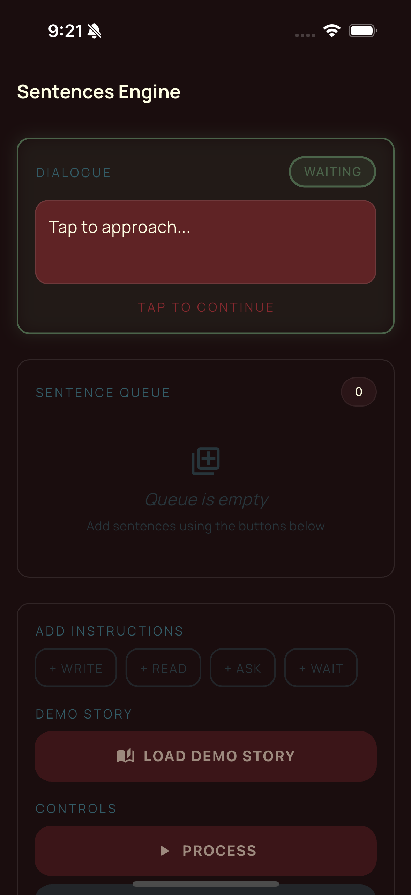

# Fifty Narrative Engine

A sentence processing engine for Flutter games and interactive applications. Part of [Fifty Flutter Kit](https://github.com/fiftynotai/fifty_flutter_kit).

| Sentence Queue | Dialogue Choices | Narration |
|:--------------:|:----------------:|:---------:|
|  |  |  |

---

## Features

- **NarrativeEngine** - Core processor for in-game sentence execution
- **NarrativeInterpreter** - Instruction parsing and handler delegation
- **NarrativeQueue** - Optimized queue with order-based sorting
- **SafeNarrativeWriter** - Deduplication for idempotent sentence rendering
- **BaseNarrativeModel** - Abstract interface for custom sentence models
- **Complete sentence processing system** - Enables narration, player interaction, and navigation control in visual novels, interactive fiction, and narrative games

---

## Installation

Add to your `pubspec.yaml`:

```yaml
dependencies:
  fifty_narrative_engine: ^0.1.0
```

Or for local development in the monorepo:

```yaml
dependencies:
  fifty_narrative_engine:
    path: ../fifty_narrative_engine
```

---

## Quick Start

### 1. Create a Sentence Model

Implement `BaseNarrativeModel` for your application:

```dart
class GameSentence implements BaseNarrativeModel {
  @override
  final int? order;

  @override
  final String text;

  @override
  final String instruction;

  @override
  final bool waitForUserInput;

  @override
  final String? phase;

  @override
  final List<dynamic> choices;

  GameSentence({
    this.order,
    required this.text,
    this.instruction = 'write',
    this.waitForUserInput = false,
    this.phase,
    this.choices = const [],
  });
}
```

### 2. Initialize the Engine

```dart
final engine = NarrativeEngine(
  onStatusChange: (status) {
    print('Engine status: $status');
  },
  onSentencesChanged: (sentences) {
    // Update UI with processed sentences
    setState(() {
      _displayedSentences = sentences;
    });
  },
);
```

### 3. Create an Interpreter

```dart
final interpreter = NarrativeInterpreter(
  engine: engine,
  onRead: (text) async {
    // Text-to-speech
    await ttsService.speak(text);
  },
  onWrite: (sentence) async {
    // Add to chat display
    engine.addSentenceToWritten(sentence);
  },
  onAsk: (sentence) async {
    // Show question with choices
    await showChoiceDialog(sentence);
  },
  onWait: (sentence) async {
    // Wait for user tap
    await engine.pauseUntilUserContinues();
  },
  onNavigate: (sentence) async {
    // Navigate to new screen/phase
    await navigateToPhase(sentence.phase!);
  },
);

engine.registerInterpreter(interpreter);
```

### 4. Process Sentences

```dart
// Create sentences
final sentences = [
  GameSentence(
    order: 1,
    text: 'Welcome to the adventure!',
    instruction: 'read + write',
  ),
  GameSentence(
    order: 2,
    text: 'Choose your path:',
    instruction: 'write',
    choices: ['Forest', 'Mountain', 'Sea'],
  ),
];

// Enqueue and process
engine.enqueue(sentences);
await engine.process(
  onComplete: () => print('All sentences processed!'),
  onInterrupted: () => print('Processing was interrupted'),
);
```

---

## Architecture

```
NarrativeEngine
    |
    +-- NarrativeQueue
    |       Order-based sorting, push/pop operations
    |
    +-- NarrativeInterpreter
    |       Instruction parsing, handler delegation
    |
    +-- SafeNarrativeWriter
    |       Deduplication for idempotent rendering
    |
    +-- ProcessingStatus
            State machine: idle → processing → completed
```

### Core Components

| Component | Description |
|-----------|-------------|
| `NarrativeEngine` | Core processor managing sentence execution flow |
| `NarrativeInterpreter` | Instruction parser and handler delegator |
| `NarrativeQueue` | Optimized queue with order-based sorting |
| `SafeNarrativeWriter` | Deduplication for idempotent sentence rendering |
| `BaseNarrativeModel` | Abstract interface for custom sentence models |

---

## API Reference

### NarrativeEngine

Core processor managing sentence execution flow.

```dart
class NarrativeEngine {
  // Constructor
  NarrativeEngine({
    ValueChanged<ProcessingStatus>? onStatusChange,
    ValueChanged<List<BaseNarrativeModel>>? onSentencesChanged,
    ValueChanged<int>? onProcessingIndexChanged,
    NarrativeInterpreter? interpreter,
  });

  // Getters
  List<BaseNarrativeModel> get sentences;
  int get processingIndex;
  ProcessingStatus get status;
  Stream<ProcessingStatus> get onStatusChanged;

  // Core Methods
  void enqueue(List<BaseNarrativeModel> newSentences);
  Future<void> process({VoidCallback? onComplete, VoidCallback? onInterrupted});

  // Flow Control
  void pause();
  void resume();
  void cancel();
  void reset();

  // User Interaction
  Future<void> pauseUntilUserContinues();
  void continueAfterUserInput();

  // Sentence Management
  void addSentenceToWritten(BaseNarrativeModel sentence);
  void clearProcessedSentences();

  // Registration
  void registerInterpreter(NarrativeInterpreter interpreter);

  // Cleanup
  void dispose();
}
```

### ProcessingStatus

Engine state enumeration:

```dart
enum ProcessingStatus {
  idle,       // Not processing
  processing, // Actively processing
  paused,     // Temporarily paused
  cancelled,  // Cancelled before completion
  completed,  // All sentences processed
}
```

### NarrativeInterpreter

Instruction parser and handler delegator:

```dart
class NarrativeInterpreter {
  NarrativeInterpreter({
    required NarrativeEngine engine,
    Future<void> Function(String text)? onRead,
    Future<void> Function(BaseNarrativeModel sentence)? onWrite,
    Future<void> Function(BaseNarrativeModel sentence)? onAsk,
    Future<void> Function(BaseNarrativeModel sentence)? onNavigate,
    Future<void> Function(BaseNarrativeModel sentence)? onWait,
    Future<void> Function(BaseNarrativeModel sentence)? onUnhandled,
  });

  Future<void> interpret(BaseNarrativeModel sentence);
}
```

**Supported Instructions:**

| Instruction | Handler | Purpose |
|-------------|---------|---------|
| `read` | `onRead` | Text-to-speech output |
| `write` | `onWrite` | Display text on screen |
| `ask` | `onAsk` | Show choices, wait for selection |
| `wait` | `onWait` | Pause until user tap |
| `navigate` | `onNavigate` | Phase-based navigation |

Instructions can be combined: `read + write`

### NarrativeQueue

Optimized queue for large-scale sentence processing:

```dart
class NarrativeQueue {
  // Push operations
  void pushBack(BaseNarrativeModel item);
  void pushBackAll(Iterable<BaseNarrativeModel> items);
  void pushFront(BaseNarrativeModel item);
  void pushFrontAll(Iterable<BaseNarrativeModel> items);
  void pushOrdered(BaseNarrativeModel item);
  void pushOrderedAll(Iterable<BaseNarrativeModel> items);

  // Access
  BaseNarrativeModel pop();
  BaseNarrativeModel peek();
  List<BaseNarrativeModel> toList();

  // Management
  void clear();
  void sortByOrder();
  void remove(BaseNarrativeModel item);
  void removeWhere(bool Function(BaseNarrativeModel) test);

  // Properties
  int get length;
  bool get isEmpty;
  bool get isNotEmpty;
  bool contains(BaseNarrativeModel item);
}
```

### SafeNarrativeWriter

Prevents duplicate sentence rendering:

```dart
class SafeNarrativeWriter {
  SafeNarrativeWriter(Future<void> Function(BaseNarrativeModel) delegate);

  Future<void> write(BaseNarrativeModel sentence);
  void reset();
}
```

### BaseNarrativeModel

Abstract interface for sentence models:

```dart
abstract class BaseNarrativeModel {
  int? get order;           // Queue sorting order
  String get text;          // Sentence content
  String get instruction;   // Processing directive
  bool get waitForUserInput;// Pause after processing
  String? get phase;        // Navigation phase
  List<dynamic> get choices;// Choice options
}
```

---

## Usage Patterns

### Tap to Continue

```dart
final interpreter = NarrativeInterpreter(
  engine: engine,
  onWrite: (sentence) async {
    engine.addSentenceToWritten(sentence);
  },
  onWait: (sentence) async {
    // Engine will pause until user taps
    await engine.pauseUntilUserContinues();
  },
);

// In UI
GestureDetector(
  onTap: () => engine.continueAfterUserInput(),
  child: ChatDisplay(sentences: engine.sentences),
)
```

### Choice System

```dart
final interpreter = NarrativeInterpreter(
  engine: engine,
  onAsk: (sentence) async {
    engine.pause();

    final choice = await showDialog<String>(
      context: context,
      builder: (_) => ChoiceDialog(choices: sentence.choices),
    );

    handleChoice(choice);
    engine.resume();
  },
);
```

### Phase Navigation

```dart
final interpreter = NarrativeInterpreter(
  engine: engine,
  onNavigate: (sentence) async {
    await Navigator.pushNamed(
      context,
      '/game/${sentence.phase}',
    );
  },
);

// Sentences with phases
GameSentence(
  text: 'You enter the forest...',
  instruction: 'write',
  phase: 'forest',  // Will trigger navigation
)
```

### With TTS Integration

```dart
// Using fifty_speech_engine
final speechEngine = FiftySpeechEngine();

final interpreter = NarrativeInterpreter(
  engine: engine,
  onRead: (text) async {
    await speechEngine.speak(text);
  },
  onWrite: (sentence) async {
    engine.addSentenceToWritten(sentence);
  },
);
```

### With Audio Engine

```dart
import 'package:fifty_audio_engine/fifty_audio_engine.dart';

final interpreter = NarrativeInterpreter(
  engine: engine,
  onNavigate: (sentence) async {
    // Play transition sound
    await audioEngine.playSfx('transition.mp3');

    // Change BGM for new phase
    await audioEngine.playBgm('${sentence.phase}_theme.mp3');
  },
);
```

### Order-Based Processing

```dart
final queue = NarrativeQueue();

// Sentences added out of order
queue.pushOrdered(GameSentence(text: 'Third', order: 3));
queue.pushOrdered(GameSentence(text: 'First', order: 1));
queue.pushOrdered(GameSentence(text: 'Second', order: 2));

// Will process: First, Second, Third
while (queue.isNotEmpty) {
  final sentence = queue.pop();
  print(sentence.text);
}
```

---

## Platform Support

| Platform | Support |
|----------|---------|
| Android  | Yes     |
| iOS      | Yes     |
| macOS    | Yes     |
| Linux    | Yes     |
| Windows  | Yes     |
| Web      | Yes     |

---

## Fifty Design Language Integration

This package is part of Fifty Flutter Kit:

- **Consistent naming** - All classes follow Fifty Flutter Kit patterns
- **fifty_speech_engine** - TTS integration for read instructions
- **fifty_audio_engine** - Sound effects for navigation transitions
- **Compatible packages** - Works alongside all Fifty Flutter Kit packages

---

## Migration from erune_narrative_engine

If migrating from the original package:

1. Update import:
   ```dart
   // Before
   import 'package:erune_narrative_engine/erune_narrative_engine.dart';

   // After
   import 'package:fifty_narrative_engine/fifty_narrative_engine.dart';
   ```

2. Replace class names:
   - `EruneSentencesEngine` -> `FiftyNarrativeEngine`

3. **GetX Removal**: The `NarrativeEngine` no longer extends `GetxController`.
   Use the callback parameters instead:
   ```dart
   // Before (with GetX)
   final engine = Get.put(NarrativeEngine());
   engine.sentences; // RxList

   // After (callbacks)
   final engine = NarrativeEngine(
     onSentencesChanged: (sentences) => setState(() {}),
   );
   engine.sentences; // Regular List
   ```

---

## Version

0.1.0

---

## License

MIT License - see [LICENSE](LICENSE) for details.

Part of [Fifty Flutter Kit](https://github.com/fiftynotai/fifty_flutter_kit).
