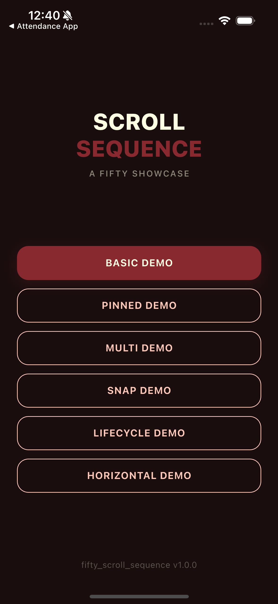
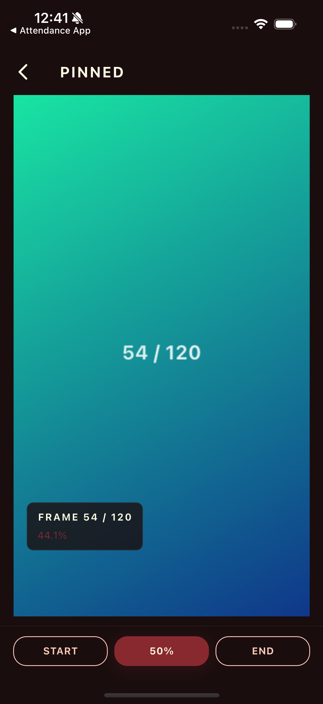
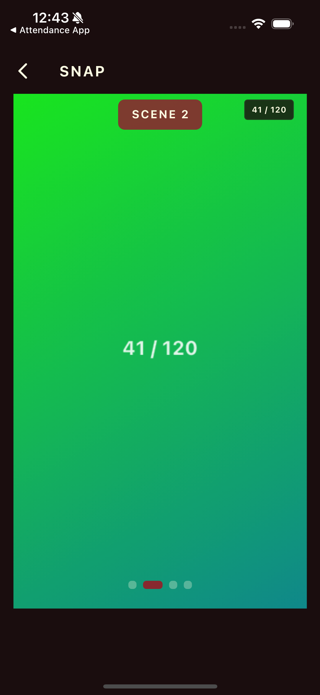
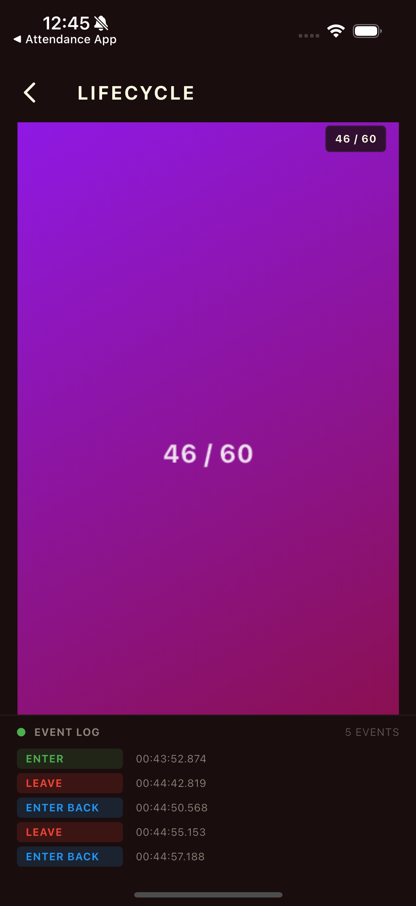

# Fifty Scroll Sequence

[](https://pub.dev/packages/fifty_scroll_sequence)
[](LICENSE)

Scroll-driven image sequences for Flutter. Apple-style frame scrubbing mapped to scroll position. Part of [Fifty Flutter Kit](https://github.com/fiftynotai/fifty_flutter_kit).

| Menu | Pinned Demo | Snap Demo | Lifecycle Demo |
|:----:|:-----------:|:---------:|:--------------:|
|  |  |  |  |

---

## Features

- **Scroll-driven image sequences** - Frames change as the user scrolls, creating cinematic scrubbing effects
- **Pinned (sticky) mode** - Widget pins to viewport top while scroll runway is consumed
- **Non-pinned mode** - Standard viewport-relative frame mapping
- **Sliver support** - `SliverScrollSequence` for use inside `CustomScrollView`
- **Snap-to-keyframe** - `SnapConfig` with explicit points, everyNFrames, or scene boundaries
- **Lifecycle callbacks** - `onEnter`, `onLeave`, `onEnterBack`, `onLeaveBack` via viewport observer state machine
- **Horizontal scrolling** - `scrollDirection: Axis.horizontal` for left-to-right sequences
- **Programmatic control** - `ScrollSequenceController` for jump-to-frame, preload, and cache management
- **3 preload strategies** - Eager (all frames), chunked (sliding window), progressive (keyframes first)
- **Network loading** - `ScrollSequence.network()` with HTTP fetching and disk caching
- **Sprite sheet support** - `ScrollSequence.spriteSheet()` with multi-sheet grid extraction
- **LRU cache** - GPU texture caching with deduplication, automatic eviction, and proper disposal
- **Smooth interpolation** - Ticker-based frame lerping with configurable factor and curve
- **Builder overlay** - Reactive overlay widgets that respond to frame index and progress
- **Loading feedback** - `loadingBuilder` with normalized 0.0-1.0 progress reporting

---

## Installation

```yaml
dependencies:
  fifty_scroll_sequence: ^1.0.0
```

### For Contributors

```yaml
dependencies:
  fifty_scroll_sequence:
    path: ../fifty_scroll_sequence
```

**Dependencies:** Flutter SDK only

---

## Quick Start

### Minimal Example

```dart
import 'package:fifty_scroll_sequence/fifty_scroll_sequence.dart';

ScrollSequence(
  frameCount: 120,
  framePath: 'assets/hero/frame_{index}.webp',
  scrollExtent: 3000,
  fit: BoxFit.cover,
)
```

Place inside a `SingleChildScrollView` (or any scrollable ancestor). The widget pins to the viewport top by default and plays through all 120 frames as the user scrolls 3000 pixels.

### Pinned Mode with Builder Overlay

```dart
SingleChildScrollView(
  child: Column(
    children: [
      const SizedBox(height: 500),
      ScrollSequence(
        frameCount: 120,
        framePath: 'assets/hero/frame_{index}.webp',
        scrollExtent: 3000,
        fit: BoxFit.cover,
        lerpFactor: 0.15,
        curve: Curves.easeInOut,
        builder: (context, frameIndex, progress, child) {
          return Stack(
            children: [
              child,
              Positioned(
                bottom: 16,
                left: 16,
                child: Text('Frame $frameIndex / ${(progress * 100).toInt()}%'),
              ),
            ],
          );
        },
      ),
      const SizedBox(height: 500),
    ],
  ),
)
```

### With Controller

```dart
class _MyPageState extends State<MyPage> {
  final _controller = ScrollSequenceController();

  @override
  void dispose() {
    _controller.dispose();
    super.dispose();
  }

  @override
  Widget build(BuildContext context) {
    return Column(
      children: [
        ScrollSequence(
          frameCount: 120,
          framePath: 'assets/hero/frame_{index}.webp',
          scrollExtent: 3000,
          controller: _controller,
        ),
        ElevatedButton(
          onPressed: () => _controller.jumpToFrame(60),
          child: const Text('Jump to frame 60'),
        ),
      ],
    );
  }
}
```

### Snap-to-Keyframe

```dart
ScrollSequence(
  frameCount: 150,
  framePath: 'assets/hero/frame_{index}.webp',
  scrollExtent: 3000,
  snapConfig: SnapConfig.everyNFrames(
    n: 50,
    frameCount: 150,
  ),
)
```

When the user stops scrolling, the position auto-settles to the nearest snap point. Three constructors are available: `SnapConfig(snapPoints: [...])` for explicit progress values, `SnapConfig.everyNFrames()` for regular intervals, and `SnapConfig.scenes()` for scene boundary frames.

### Lifecycle Callbacks

```dart
ScrollSequence(
  frameCount: 120,
  framePath: 'assets/hero/frame_{index}.webp',
  scrollExtent: 3000,
  onEnter: () => print('Entered viewport (forward)'),
  onLeave: () => print('Exited viewport (forward)'),
  onEnterBack: () => print('Re-entered viewport (backward)'),
  onLeaveBack: () => print('Exited viewport backward'),
)
```

Callbacks fire exactly once per visibility transition via an internal state machine.

### Horizontal Scrolling

```dart
SingleChildScrollView(
  scrollDirection: Axis.horizontal,
  child: Row(
    children: [
      const SizedBox(width: 500),
      ScrollSequence(
        frameCount: 120,
        framePath: 'assets/hero/frame_{index}.webp',
        scrollExtent: 3000,
        scrollDirection: Axis.horizontal,
        fit: BoxFit.cover,
      ),
      const SizedBox(width: 500),
    ],
  ),
)
```

---

## Architecture

```
ScrollSequence / SliverScrollSequence (Widget)
    |
    +-- FrameLoader (abstract)
    |       +-- AssetFrameLoader
    |       +-- NetworkFrameLoader
    |       +-- SpriteSheetLoader
    |
    +-- FrameCacheManager (LRU + dedup)
    |
    +-- FrameController (Ticker + lerp)
    |
    +-- ScrollProgressTracker
    |
    +-- SnapController (opt-in, via SnapConfig)
    |
    +-- ViewportObserver (opt-in, via lifecycle callbacks)
    |
    +-- PinnedScrollSection (pinned mode layout)
    |
    +-- FrameDisplay (RawImage rendering)
    |
    +-- ScrollSequenceController (public facade, opt-in)
```

### Core Components

| Component | Description |
|-----------|-------------|
| `ScrollSequence` | Main scroll-driven image sequence widget (pinned/non-pinned) |
| `SliverScrollSequence` | Sliver variant for `CustomScrollView` |
| `ScrollSequenceController` | Programmatic control: jump, preload, cache management |
| `FrameLoader` | Abstract base for frame loading |
| `FrameCacheManager` | LRU cache with GPU texture disposal and deduplication |
| `FrameController` | Ticker-based progress-to-frame interpolation |
| `ScrollProgressTracker` | Scroll offset to 0.0-1.0 progress mapping |
| `SnapController` | Velocity-based snap-to-keyframe controller |
| `ViewportObserver` | State machine for lifecycle callbacks |
| `PinnedScrollSection` | Scroll runway that pins child to viewport |

---

## API Reference

### Class Overview

| Class | Category | Description |
|-------|----------|-------------|
| `ScrollSequence` | Widget | Main scroll-driven image sequence widget |
| `SliverScrollSequence` | Widget | Sliver variant for `CustomScrollView` |
| `ScrollSequenceController` | Widget | Programmatic control facade |
| `ScrollSequenceStateAccessor` | Widget | Abstract interface for controller attachment |
| `FrameDisplay` | Widget | RawImage renderer with gapless fallback |
| `PinnedScrollSection` | Widget | Viewport-sticky scroll runway |
| `FrameLoader` | Loader | Abstract base for frame loading |
| `AssetFrameLoader` | Loader | Loads frames from Flutter asset bundle |
| `NetworkFrameLoader` | Loader | HTTP frame loading with disk caching |
| `SpriteSheetLoader` | Loader | Grid extraction from sprite sheet images |
| `SpriteSheetConfig` | Loader | Configuration for a single sprite sheet |
| `FrameCacheManager` | Core | LRU cache with GPU texture disposal |
| `FrameController` | Core | Ticker-based progress-to-frame mapping |
| `ScrollProgressTracker` | Core | Scroll offset to progress calculation |
| `SnapController` | Core | Velocity-based snap-to-keyframe behavior |
| `ViewportObserver` | Core | Lifecycle callback state machine |
| `PreloadStrategy` | Strategy | Abstract preload strategy base |
| `EagerPreloadStrategy` | Strategy | Loads all frames upfront |
| `ChunkedPreloadStrategy` | Strategy | Direction-aware sliding window |
| `ProgressivePreloadStrategy` | Strategy | Keyframes first, then gap-filling |
| `ScrollDirection` | Strategy | Enum: forward, backward, idle |
| `FrameInfo` | Model | Immutable frame metadata (index, path, dimensions) |
| `ScrollSequenceConfig` | Model | Immutable configuration data class |
| `SnapConfig` | Model | Snap-to-keyframe configuration |
| `ScrollSequenceLifecycleEvent` | Model | Enum: enter, leave, enterBack, leaveBack |
| `FramePathResolver` | Util | `{index}` placeholder resolution with padding |
| `LerpUtil` | Util | Static lerp and convergence helpers |
| `FrameChangedCallback` | Typedef | `void Function(int frameIndex, double progress)` |
| `LoadingWidgetBuilder` | Typedef | `Widget Function(BuildContext, double progress)` |
| `DownloadProgressCallback` | Typedef | `void Function(int bytesReceived, int totalBytes)` |
| `LoadProgressCallback` | Typedef | `void Function(int loaded, int total)` |

### ScrollSequence

The main widget. Place inside any scrollable ancestor.

| Parameter | Type | Default | Description |
|-----------|------|---------|-------------|
| `frameCount` | `int` | required | Total frames in the sequence |
| `framePath` | `String` | required | Path pattern with `{index}` placeholder |
| `scrollExtent` | `double` | `3000.0` | Scroll distance for full animation |
| `fit` | `BoxFit` | `BoxFit.cover` | How frames fit the display area |
| `width` | `double?` | `null` | Display width (null = parent width) |
| `height` | `double?` | `null` | Display height (null = parent height) |
| `pin` | `bool` | `true` | Whether to pin at viewport top |
| `placeholder` | `ImageProvider?` | `null` | Placeholder during initial load |
| `loadingBuilder` | `LoadingWidgetBuilder?` | `null` | Loading UI with 0.0-1.0 progress |
| `onFrameChanged` | `FrameChangedCallback?` | `null` | Frame change callback |
| `builder` | `Function?` | `null` | Overlay builder (context, frameIndex, progress, child) |
| `lerpFactor` | `double` | `0.15` | Smoothing factor (1.0 = instant) |
| `curve` | `Curve` | `Curves.linear` | Progress-to-frame curve |
| `loader` | `FrameLoader?` | `null` | Custom frame loader |
| `strategy` | `PreloadStrategy?` | `null` | Preload strategy (default: eager) |
| `controller` | `ScrollSequenceController?` | `null` | Programmatic controller |
| `snapConfig` | `SnapConfig?` | `null` | Snap-to-keyframe configuration |
| `onEnter` | `VoidCallback?` | `null` | Viewport enter (forward scroll) |
| `onLeave` | `VoidCallback?` | `null` | Viewport exit (forward scroll) |
| `onEnterBack` | `VoidCallback?` | `null` | Viewport re-enter (backward scroll) |
| `onLeaveBack` | `VoidCallback?` | `null` | Viewport exit backward |
| `scrollDirection` | `Axis` | `Axis.vertical` | Scroll axis (vertical or horizontal) |
| `indexPadWidth` | `int?` | `null` | Zero-pad width override |
| `indexOffset` | `int` | `0` | Frame index offset |
| `maxCacheSize` | `int` | `100` | Maximum cached frames |

### ScrollSequence.network()

Named constructor for network-loaded sequences.

```dart
ScrollSequence.network(
  frameCount: 200,
  frameUrl: 'https://cdn.example.com/hero/frame_{index}.webp',
  cacheDirectory: tempDir.path,
  scrollExtent: 4000,
  headers: {'Authorization': 'Bearer token'},
  onDownloadProgress: (received, total) {
    print('Download: ${received / total * 100}%');
  },
)
```

Defaults to `PreloadStrategy.chunked()` to avoid downloading all frames upfront. Downloaded frames are cached to disk for offline access.

**Additional parameters:** `frameUrl` (required, replaces `framePath`), `cacheDirectory` (required), `headers` (optional), `onDownloadProgress` (optional).

### ScrollSequence.spriteSheet()

Named constructor for sprite-sheet-based sequences.

```dart
ScrollSequence.spriteSheet(
  frameCount: 100,
  sheets: [
    SpriteSheetConfig(
      assetPath: 'assets/sprites/sheet_01.webp',
      columns: 10,
      rows: 10,
      frameWidth: 320,
      frameHeight: 180,
    ),
  ],
  scrollExtent: 3000,
)
```

Multiple sheets are supported for large sequences. Defaults to `PreloadStrategy.chunked()`. The `framePath`, `indexPadWidth`, and `indexOffset` parameters are not used with this constructor.

### SliverScrollSequence

Sliver variant for use inside `CustomScrollView`. Wraps the frame sequence in a `SliverPersistentHeader`.

```dart
CustomScrollView(
  slivers: [
    SliverScrollSequence(
      frameCount: 120,
      framePath: 'assets/hero/frame_{index}.webp',
      scrollExtent: 3000,
      fit: BoxFit.cover,
      pinned: true,
    ),
    SliverList(
      delegate: SliverChildBuilderDelegate(
        (context, index) => ListTile(title: Text('Item $index')),
        childCount: 50,
      ),
    ),
  ],
)
```

Parameters mirror `ScrollSequence` with one difference: uses `pinned` (default `true`) instead of `pin` to control whether the sliver header pins to the viewport top.

### ScrollSequenceController

Programmatic control over the sequence.

```dart
final controller = ScrollSequenceController();

// Read-only state
controller.currentFrame;       // int - current frame index
controller.progress;           // double - 0.0 to 1.0
controller.frameCount;         // int - total frames
controller.isAttached;         // bool - whether attached to widget
controller.isFullyLoaded;      // bool - all frames cached
controller.loadedFrameCount;   // int - cached frame count
controller.loadingProgress;    // double - 0.0 to 1.0

// Commands (throw StateError if not attached)
controller.jumpToFrame(60);
controller.jumpToFrame(60, duration: Duration(seconds: 1));
controller.jumpToProgress(0.5);
await controller.preloadAll();
controller.clearCache();

// Listeners
controller.addListener(() {
  print('Frame: ${controller.currentFrame}');
});

// Cleanup
controller.dispose();
```

### SnapConfig

Configuration for snap-to-keyframe behavior. Three constructors are available:

```dart
// Explicit snap points (progress values 0.0-1.0)
SnapConfig(
  snapPoints: [0.0, 0.25, 0.5, 0.75, 1.0],
  snapDuration: Duration(milliseconds: 300),
  snapCurve: Curves.easeOut,
  idleTimeout: Duration(milliseconds: 150),
)

// Every N frames
SnapConfig.everyNFrames(
  n: 50,
  frameCount: 150,
)

// Scene boundaries
SnapConfig.scenes(
  sceneStartFrames: [0, 50, 100],
  frameCount: 150,
)
```

| Parameter | Type | Default | Description |
|-----------|------|---------|-------------|
| `snapPoints` | `List<double>` | required | Progress values to snap to (0.0-1.0) |
| `snapDuration` | `Duration` | 300ms | Snap animation duration |
| `snapCurve` | `Curve` | `Curves.easeOut` | Snap animation curve |
| `idleTimeout` | `Duration` | 150ms | Idle time before snapping |

**Methods:**

- `nearestSnapPoint(double currentProgress)` - Returns the closest snap point using binary search.

### Lifecycle Callbacks

Four `VoidCallback` parameters on `ScrollSequence` and `SliverScrollSequence`:

| Callback | Fires When |
|----------|------------|
| `onEnter` | Sequence enters viewport (forward scroll) |
| `onLeave` | Sequence exits viewport (forward scroll, progress reaches 1.0) |
| `onEnterBack` | Sequence re-enters viewport (backward scroll) |
| `onLeaveBack` | Sequence exits viewport backward (progress returns to 0.0) |

In **pinned mode**, lifecycle is driven by progress thresholds (0.001 for enter, 0.999 for leave). In **non-pinned mode**, lifecycle is driven by render box visibility within the viewport.

Each callback fires exactly once per transition via an internal `ViewportObserver` state machine.

### PreloadStrategy

Three built-in strategies for different use cases:

```dart
// Load all frames upfront (best for small sequences, <50 frames)
const PreloadStrategy.eager()

// Sliding window (best for large sequences, network loading)
const PreloadStrategy.chunked(
  chunkSize: 40,
  preloadAhead: 30,
  preloadBehind: 10,
)

// Keyframes first, then fill gaps (best for preview + detail)
const PreloadStrategy.progressive(
  keyframeCount: 20,
  windowAhead: 15,
  windowBehind: 5,
)
```

| Strategy | Best For | Memory | Initial Load |
|----------|----------|--------|--------------|
| Eager | Small sequences (<50 frames) | High | Slow |
| Chunked | Large sequences, network | Low | Fast |
| Progressive | Preview + progressive detail | Medium | Fast |

---

## Frame Preparation Guide

### Extracting Frames from Video

Use `ffmpeg` to extract individual frames from a video file:

```bash
# Extract all frames as WebP (recommended format)
ffmpeg -i input.mp4 -vf "fps=30" -c:v libwebp -q:v 80 frames/frame_%04d.webp

# Extract at specific resolution
ffmpeg -i input.mp4 -vf "fps=30,scale=1080:-1" -c:v libwebp -q:v 80 frames/frame_%04d.webp

# Extract specific segment (seconds 5 to 10)
ffmpeg -i input.mp4 -ss 5 -t 5 -vf "fps=30" -c:v libwebp -q:v 80 frames/frame_%04d.webp
```

### Recommended Format

- **Format:** WebP (smallest file size with good quality)
- **Resolution:** Match your target display size (avoid scaling at runtime)
- **Naming:** `frame_{index}.webp` with zero-padded indices (e.g., `frame_0001.webp`)
- **Frame count:** 60-200 frames is typical for a 2-5 second scroll sequence

### Asset Registration

```yaml
# pubspec.yaml
flutter:
  assets:
    - assets/hero/
```

---

## Usage Patterns

### Custom FrameLoader

Implement `FrameLoader` for custom frame sources:

```dart
class MyCustomLoader implements FrameLoader {
  @override
  Future<ui.Image> loadFrame(int index) async {
    final recorder = ui.PictureRecorder();
    final canvas = Canvas(recorder, Rect.fromLTWH(0, 0, 320, 180));
    // ... draw frame content ...
    final picture = recorder.endRecording();
    return picture.toImage(320, 180);
  }

  @override
  String resolveFramePath(int index) => 'custom_frame_$index';

  @override
  void dispose() {
    // Clean up resources
  }
}

ScrollSequence(
  frameCount: 60,
  framePath: 'unused',
  loader: MyCustomLoader(),
  scrollExtent: 2000,
)
```

### Horizontal Scrolling

Set `scrollDirection: Axis.horizontal` on both the scrollable ancestor and the `ScrollSequence`. In horizontal mode, pinned sequences pin at the left edge and use width-based layout. Non-pinned sequences use the widget's left offset for progress calculation.

All features (snap, lifecycle callbacks, builder, strategies) work identically in horizontal mode.

### Strategy Selection Guide

| Scenario | Recommended Strategy |
|----------|---------------------|
| Product showcase (<50 frames, local assets) | `PreloadStrategy.eager()` |
| Long cinematic scroll (100+ frames, local) | `PreloadStrategy.chunked()` |
| Network-loaded sequence | `PreloadStrategy.chunked()` |
| Quick preview with progressive detail | `PreloadStrategy.progressive()` |
| Sprite sheet extraction | `PreloadStrategy.chunked()` |

### Multiple Sequences on One Page

Each `ScrollSequence` maintains its own independent cache, loader, and controller:

```dart
SingleChildScrollView(
  child: Column(
    children: [
      ScrollSequence(
        frameCount: 60,
        framePath: 'assets/sequence_a/frame_{index}.webp',
        scrollExtent: 2000,
        pin: true,
      ),
      const SizedBox(height: 200),
      ScrollSequence(
        frameCount: 80,
        framePath: 'assets/sequence_b/frame_{index}.webp',
        scrollExtent: 2500,
        pin: true,
      ),
    ],
  ),
)
```

### Performance Tips

- **Use WebP format** - Smallest file size with good quality. Significantly smaller than PNG.
- **Use chunked strategy for >100 frames** - Avoids loading all frames into memory at once.
- **Set appropriate `maxCacheSize`** - Default is 100. Lower for memory-constrained devices.
- **Match frame resolution to display size** - Avoid loading 4K frames for a 300px widget.
- **Dispose controllers** - Always call `controller.dispose()` in your widget's `dispose` method.
- **Use `lerpFactor: 1.0` for instant response** - Disables smoothing if you want pixel-perfect tracking.
- **Pre-extract frames at target resolution** - Runtime scaling wastes GPU cycles.
- **Eager strategy keeps all frames** - Cache size equals `frameCount` for eager strategy, preventing eviction.

### Example App

See the [example app](example/) for working demos:

- **Basic demo** - Non-pinned usage with viewport-relative scrubbing
- **Pinned demo** - Pinned mode with controller and overlays
- **Multi-sequence demo** - Two independent sequences on one page
- **Snap demo** - Snap-to-keyframe with scene dots
- **Lifecycle demo** - Enter/leave callbacks with event log
- **Horizontal demo** - Horizontal scrolling mode

#### Running the Example

```bash
cd packages/fifty_scroll_sequence/example
flutter run
```

---

## Platform Support

| Platform | Support | Notes |
|----------|---------|-------|
| Android  | Yes     | Asset and network frame loading |
| iOS      | Yes     | Asset and network frame loading |
| macOS    | Yes     | Asset and network frame loading |
| Linux    | Yes     | Asset and network frame loading |
| Windows  | Yes     | Asset and network frame loading |
| Web      | Yes     | Asset loading only (no disk cache for network) |

---

## Fifty Design Language Integration

This package is part of Fifty Flutter Kit:

- **Standalone package** — No dependencies on other kit packages; works with any Flutter project
- **Token compatible** — Use with `fifty_tokens` for consistent spacing, sizing, and animation curves
- **Theme integration** — Builder overlay widgets can reference `fifty_theme` for colors and typography

---

## Version

**Current:** 1.0.0

See [CHANGELOG.md](CHANGELOG.md) for release notes.

---

## License

MIT License - see [LICENSE](LICENSE) for details.

Part of [Fifty Flutter Kit](https://github.com/fiftynotai/fifty_flutter_kit).
