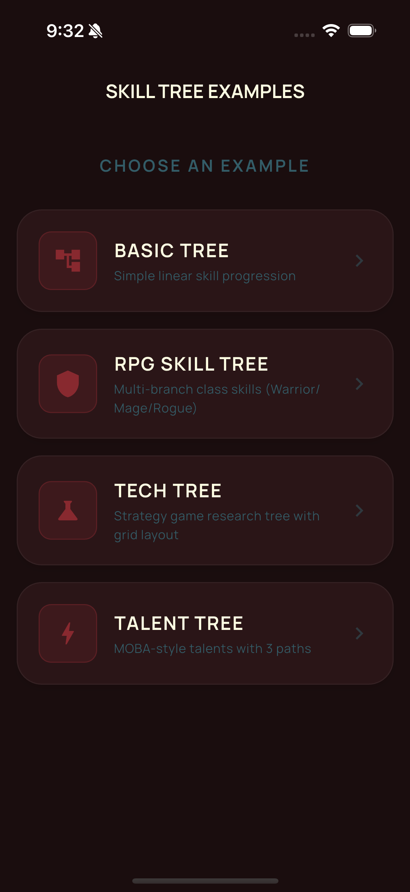
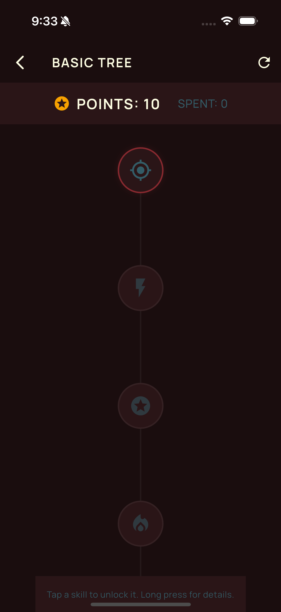
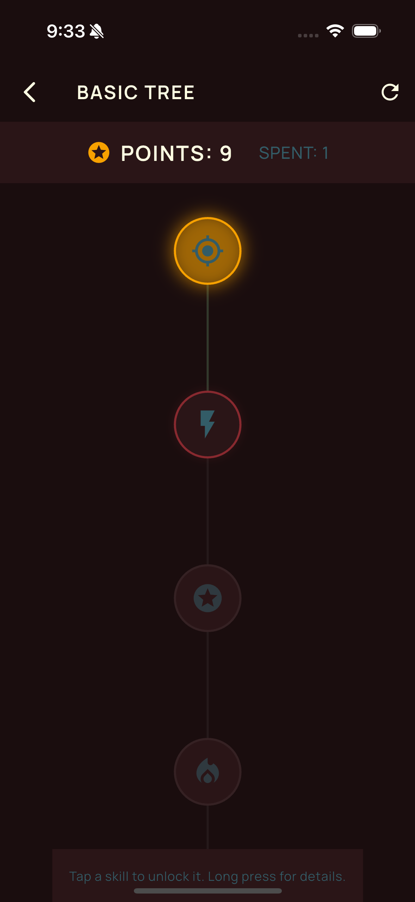
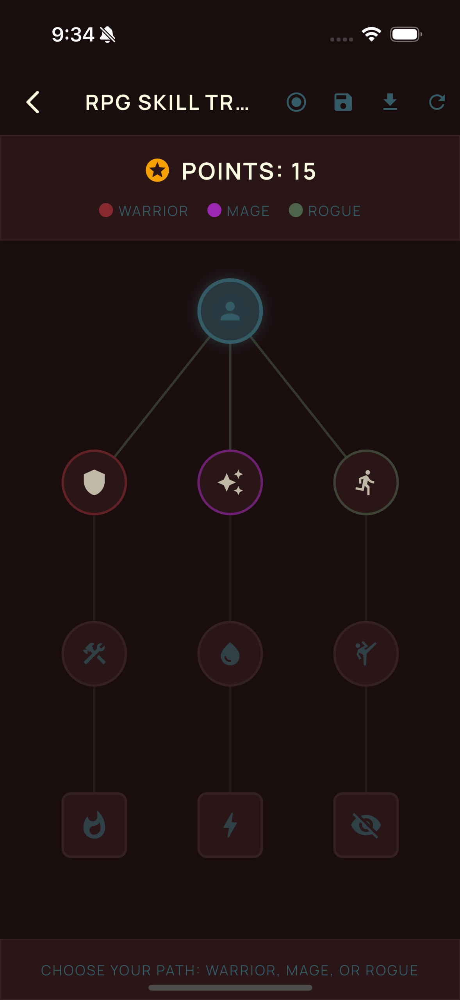

# Fifty Skill Tree

Interactive skill tree widget for Flutter games — customizable, animated, and game-ready. Part of [Fifty Flutter Kit](https://github.com/fiftynotai/fifty_flutter_kit).

| Home | Basic Tree | Node Unlock | RPG Skill Tree |
|:----:|:----------:|:-----------:|:--------------:|
|  |  |  |  |

---

## Features

- **Multiple Layout Algorithms** - Vertical, horizontal, radial, grid, and custom positioning
- **Skill States** - Locked, available, unlocked, and maxed states with visual feedback
- **Point/Currency System** - Built-in point management for unlocking skills
- **Prerequisites & Dependencies** - Automatic prerequisite checking and dependency visualization
- **Unlock Animations** - Smooth animations for unlocking, pulsing, and highlighting
- **Save/Load Progress** - JSON serialization for game save files
- **Mobile-Friendly** - Touch interactions with pan and pinch-to-zoom support
- **Fully Customizable Theming** - Dark/light preset themes, FDL integration, and full customization support
- **Generic Data Support** - Attach any custom data to skill nodes

---

## Installation

Add to your `pubspec.yaml`:

```yaml
dependencies:
  fifty_skill_tree: ^0.1.0
```

Then run:

```bash
flutter pub get
```

---

## Quick Start

### 1. Create a Skill Tree

```dart
import 'package:fifty_skill_tree/fifty_skill_tree.dart';

// Create a skill tree
final tree = SkillTree<void>(
  id: 'warrior',
  name: 'Warrior Skills',
);

// Add nodes
tree.addNode(SkillNode(
  id: 'slash',
  name: 'Slash',
  description: 'A basic sword attack',
  costs: [1],
  tier: 0,
));

tree.addNode(SkillNode(
  id: 'power_slash',
  name: 'Power Slash',
  description: 'A powerful overhead strike',
  costs: [2],
  prerequisites: ['slash'],
  tier: 1,
));

tree.addNode(SkillNode(
  id: 'whirlwind',
  name: 'Whirlwind',
  description: 'Spin attack hitting all nearby enemies',
  costs: [3],
  prerequisites: ['power_slash'],
  tier: 2,
));

// Add connections for visualization
tree.addConnection(SkillConnection(fromId: 'slash', toId: 'power_slash'));
tree.addConnection(SkillConnection(fromId: 'power_slash', toId: 'whirlwind'));

// Give the player some points
tree.addPoints(10);
```

### 2. Create a Controller

```dart
final controller = SkillTreeController<void>(
  tree: tree,
  theme: SkillTreeTheme.dark(),
);

// Listen for changes
controller.addListener(() {
  print('Points: ${controller.availablePoints}');
});
```

### 3. Display the Tree

```dart
SkillTreeView<void>(
  controller: controller,
  layout: const VerticalTreeLayout(),
  onNodeTap: (node) async {
    final result = await controller.unlock(node.id);
    if (result.success) {
      print('Unlocked ${node.name}!');
    } else {
      print('Cannot unlock: ${result.reason}');
    }
  },
)
```

---

## Architecture

```
SkillTreeView<T> (Widget)
    |
    +-- SkillTreeController<T>
    |       State management, unlock logic, point tracking
    |
    +-- SkillTree<T>
    |       +-- SkillNode<T> (nodes with conditions, costs, levels)
    |       +-- SkillConnection (prerequisite relationships)
    |
    +-- TreeLayout (Abstract)
    |       +-- VerticalTreeLayout
    |       +-- HorizontalTreeLayout
    |       +-- RadialTreeLayout
    |       +-- GridLayout
    |       +-- CustomLayout
    |
    +-- SkillTreeTheme
            Visual styling (dark/light/custom/FDL defaults)
```

### Core Components

| Component | Description |
|-----------|-------------|
| `SkillTree<T>` | Container for nodes and connections |
| `SkillNode<T>` | Individual skill with costs, levels, prerequisites |
| `SkillConnection` | Defines relationships between nodes |
| `SkillTreeController<T>` | State management, unlock logic, serialization |
| `SkillTreeView<T>` | Widget that renders the tree with interactions |
| `SkillTreeTheme` | Visual styling configuration |

---

## API Reference

### SkillTree

```dart
final tree = SkillTree<void>(
  id: 'warrior',
  name: 'Warrior Skills',
);

tree.addNode(node);
tree.addConnection(connection);
tree.addPoints(10);
```

### SkillNode

**Basic Node:**

```dart
SkillNode(
  id: 'fireball',
  name: 'Fireball',
  description: 'Launches a ball of fire at enemies',
  costs: [1], // 1 point to unlock
)
```

**Node Types:**

```dart
SkillNode(
  id: 'skill',
  name: 'Skill',
  type: SkillType.passive,   // Passive skill
  // type: SkillType.active,  // Active ability
  // type: SkillType.ultimate, // Ultimate skill
  // type: SkillType.keystone, // Keystone/capstone
)
```

### SkillConnection

**Basic Connection:**

```dart
tree.addConnection(SkillConnection(
  fromId: 'slash',
  toId: 'power_slash',
));
```

**Connection Types:**

```dart
// Required connection (must unlock parent first)
SkillConnection(
  fromId: 'a',
  toId: 'b',
  type: ConnectionType.required,
)

// Optional connection (can skip parent)
SkillConnection(
  fromId: 'a',
  toId: 'b',
  type: ConnectionType.optional,
)

// Exclusive connection (only one can be unlocked)
SkillConnection(
  fromId: 'a',
  toId: 'b',
  type: ConnectionType.exclusive,
)
```

### SkillTreeController

```dart
final controller = SkillTreeController<void>(
  tree: tree,
  theme: SkillTreeTheme.dark(),
);

controller.addListener(() {
  print('Points: ${controller.availablePoints}');
});
```

### SkillTreeView

```dart
SkillTreeView<void>(
  controller: controller,
  layout: const VerticalTreeLayout(),
  onNodeTap: (node) {
    controller.unlock(node.id);
  },
  onNodeLongPress: (node) {
    showSkillDetails(context, node);
  },
)
```

### SkillTreeTheme

**Built-in Themes:**

```dart
// Dark theme (default)
final theme = SkillTreeTheme.dark();

// Light theme
final theme = SkillTreeTheme.light();
```

When no theme is provided, the widgets use **FDL (Fifty Design Language)** defaults automatically.

**Custom Theme:**

```dart
final customTheme = SkillTreeTheme(
  // Node colors by state
  lockedNodeColor: Colors.grey[800]!,
  lockedNodeBorderColor: Colors.grey[600]!,
  availableNodeColor: Colors.blue[900]!,
  availableNodeBorderColor: Colors.blue[400]!,
  unlockedNodeColor: Colors.green[900]!,
  unlockedNodeBorderColor: Colors.green[400]!,
  maxedNodeColor: Colors.amber[900]!,
  maxedNodeBorderColor: Colors.amber[400]!,

  // Connection colors
  connectionLockedColor: Colors.grey[600]!,
  connectionUnlockedColor: Colors.green[400]!,

  // Sizes
  nodeRadius: 28.0,
  nodeBorderWidth: 2.0,
  connectionWidth: 2.0,
);
```

**Apply Theme:**

```dart
// At creation
final controller = SkillTreeController(
  tree: tree,
  theme: customTheme,
);

// Or update later
controller.setTheme(SkillTreeTheme.light());

// Or revert to FDL defaults
controller.setTheme(null);
```

### Layouts

**Vertical Layout (Default)** - Traditional top-to-bottom skill tree layout:

```dart
SkillTreeView(
  controller: controller,
  layout: const VerticalTreeLayout(),
)
```

**Horizontal Layout** - Left-to-right skill tree layout:

```dart
SkillTreeView(
  controller: controller,
  layout: const HorizontalTreeLayout(),
)
```

**Radial Layout** - Circular layout with skills radiating from center:

```dart
SkillTreeView(
  controller: controller,
  layout: const RadialTreeLayout(
    startAngle: -90, // Start from top
    sweepAngle: 360, // Full circle
  ),
)
```

**Grid Layout** - Organize skills in a grid pattern:

```dart
SkillTreeView(
  controller: controller,
  layout: const GridLayout(
    columns: 4,
    rows: 3,
  ),
)
```

**Custom Layout** - Provide your own positioning logic:

```dart
SkillTreeView(
  controller: controller,
  layout: CustomLayout(
    positionBuilder: (node, index, total, size) {
      // Return custom Offset for each node
      return Offset(node.position?.dx ?? 0, node.position?.dy ?? 0);
    },
  ),
)
```

### Enums

| Enum | Values |
|------|--------|
| `SkillState` | `locked`, `available`, `unlocked`, `maxed` |
| `SkillType` | `passive`, `active`, `ultimate`, `keystone`, `minor` |
| `ConnectionType` | `required`, `optional`, `exclusive` |
| `ConnectionStyle` | `solid`, `dashed`, `animated` |

### Serialization

**Save Progress:**

```dart
// Export only progress (compact, for save games)
final progress = controller.exportProgress();
final jsonString = jsonEncode(progress);
await saveToFile(jsonString);

// Export full tree (includes structure)
final fullExport = controller.exportTree();
```

**Load Progress:**

```dart
final jsonString = await loadFromFile();
final progress = jsonDecode(jsonString) as Map<String, dynamic>;
controller.importProgress(progress);
```

**Example Progress JSON:**

```json
{
  "availablePoints": 5,
  "nodes": {
    "slash": 1,
    "power_slash": 2,
    "whirlwind": 1
  }
}
```

---

## Usage Patterns

### Node Interactions

```dart
SkillTreeView(
  controller: controller,
  onNodeTap: (node) {
    // Handle tap - typically unlock the skill
    controller.unlock(node.id);
  },
  onNodeLongPress: (node) {
    // Handle long press - show details
    showSkillDetails(context, node);
  },
)
```

### View Controls

```dart
// Enable/disable interactions
SkillTreeView(
  controller: controller,
  enablePan: true,   // Allow panning
  enableZoom: true,  // Allow zooming
  minZoom: 0.5,      // Minimum zoom level
  maxZoom: 2.0,      // Maximum zoom level
  initialZoom: 1.0,  // Starting zoom
)
```

### Programmatic Control

```dart
// Zoom to specific level
controller.zoomTo(1.5);

// Pan to offset
controller.panTo(Offset(100, 50));

// Focus on a specific node
controller.focusNode(
  'fireball',
  nodePositions: calculatedPositions,
  viewSize: viewSize,
);

// Reset view
controller.resetView();
```

### Point Management

```dart
// Add points (e.g., on level up)
controller.addPoints(5);

// Remove points
controller.removePoints(2);

// Set points directly
controller.setPoints(10);

// Check available points
print('Available: ${controller.availablePoints}');
print('Spent: ${controller.spentPoints}');
```

### Unlocking Skills

```dart
// Attempt to unlock
final result = await controller.unlock('fireball');

if (result.success) {
  // Skill was unlocked
  print('Unlocked ${result.node?.name} (Level ${result.newLevel})');
  print('Points spent: ${result.pointsSpent}');
} else {
  // Unlock failed - check reason
  switch (result.reason) {
    case UnlockFailureReason.nodeNotFound:
      print('Node does not exist');
      break;
    case UnlockFailureReason.alreadyMaxed:
      print('Skill is already at max level');
      break;
    case UnlockFailureReason.prerequisitesNotMet:
      print('Prerequisites not met');
      break;
    case UnlockFailureReason.insufficientPoints:
      print('Not enough points');
      break;
    case UnlockFailureReason.lockedByExclusive:
      print('Locked by exclusive choice');
      break;
  }
}
```

### Reset Functions

```dart
// Reset entire tree (refunds all points)
controller.reset();

// Reset single node (refunds its points)
controller.resetNode('fireball');
```

### Custom Node Widget

```dart
SkillTreeView(
  controller: controller,
  nodeBuilder: (node, state) {
    return Container(
      width: 60,
      height: 60,
      decoration: BoxDecoration(
        shape: BoxShape.circle,
        color: _getColorForState(state),
        border: Border.all(color: Colors.white, width: 2),
      ),
      child: Center(
        child: Icon(
          node.icon ?? Icons.star,
          color: Colors.white,
        ),
      ),
    );
  },
)
```

### Multi-Level Nodes

```dart
SkillNode(
  id: 'fireball',
  name: 'Fireball',
  maxLevel: 5,
  costs: [1, 1, 2, 2, 3], // Cost for each level
)
```

### Node with Custom Data

```dart
// Define your data class
class AbilityData {
  final int damage;
  final double cooldown;

  AbilityData({required this.damage, required this.cooldown});
}

// Create typed tree and node
final tree = SkillTree<AbilityData>(id: 'mage', name: 'Mage Skills');

tree.addNode(SkillNode<AbilityData>(
  id: 'fireball',
  name: 'Fireball',
  data: AbilityData(damage: 50, cooldown: 2.0),
));

// Access data later
final node = tree.getNode('fireball');
print('Damage: ${node?.data?.damage}');
```

---

## Platform Support

| Platform | Support | Notes |
|----------|---------|-------|
| Android  | Yes     |       |
| iOS      | Yes     |       |
| macOS    | Yes     |       |
| Linux    | Yes     |       |
| Windows  | Yes     |       |
| Web      | Yes     |       |

---

## Fifty Design Language Integration

This package is part of Fifty Flutter Kit:

- **FDL defaults** - When no theme is provided, widgets use Fifty Design Language defaults automatically
- **Theme presets** - Built-in dark/light themes, or full custom theming
- **Token alignment** - Compatible with `fifty_tokens`, `fifty_theme`, `fifty_ui`

---

## Version

0.1.0

---

## License

MIT License - see [LICENSE](LICENSE) for details.

Part of [Fifty Flutter Kit](https://github.com/fiftynotai/fifty_flutter_kit).
