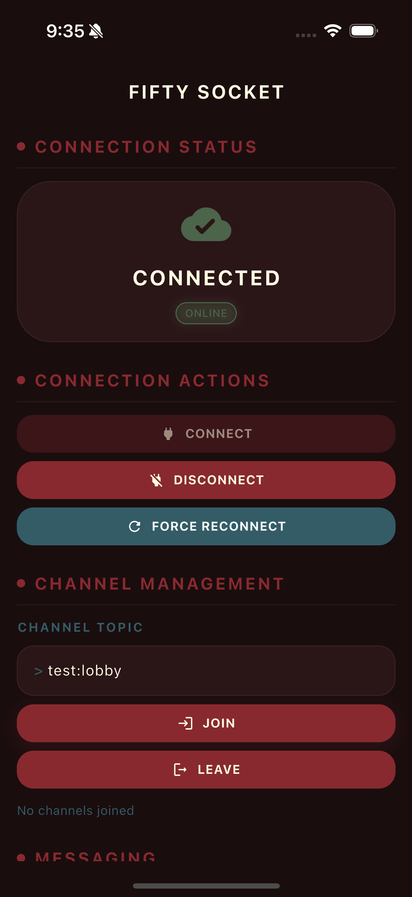
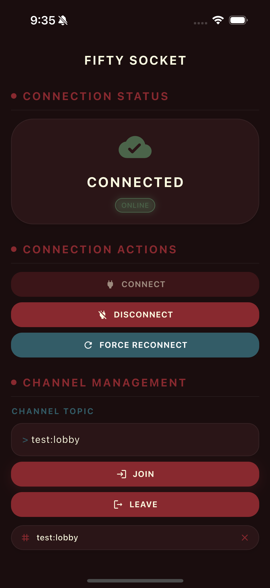
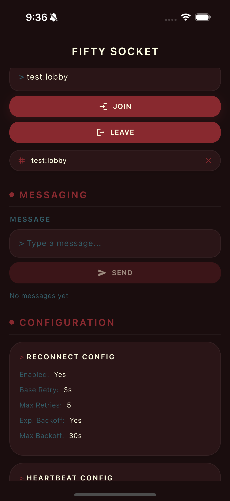

# Fifty Socket

Phoenix WebSocket infrastructure with auto-reconnect, heartbeat monitoring, and channel management. Part of [Fifty Flutter Kit](https://github.com/fiftynotai/fifty_flutter_kit).

| Connected | Disconnected | Channel Joined | Event Log |
|:---------:|:------------:|:--------------:|:---------:|
|  |  |  |  |

---

## Features

- **Abstract base class** -- Extend `SocketService` for any Phoenix WebSocket use case
- **Auto-reconnect** -- Configurable retry strategy with exponential backoff
- **Heartbeat monitoring** -- Ping/pong watchdog detects silent disconnects
- **Channel management** -- Join, leave, and auto-restore channels on reconnect
- **Typed errors** -- Categorized error stream (`SocketErrorType`) for granular handling
- **Connection state** -- Observable state stream with reconnect attempt tracking
- **Subscription guards** -- Prevent duplicate channel joins per connection session
- **Configurable logging** -- Four log levels (none, error, info, debug)

---

## Installation

Add to your `pubspec.yaml`:

```yaml
dependencies:
  fifty_socket: ^0.1.0
```

**Dependencies:**
- `phoenix_socket: ^0.8.0`
- `meta: ^1.11.0`

---

## Quick Start

Extend `SocketService` and implement `getWebSocketUrl()`:

```dart
import 'package:fifty_socket/fifty_socket.dart';

class ChatSocketService extends SocketService {
  final String _token;

  ChatSocketService({required String token})
      : _token = token,
        super(
          reconnectConfig: const ReconnectConfig(
            enabled: true,
            baseRetrySeconds: 5,
            maxRetries: 10,
            exponentialBackoff: true,
          ),
          heartbeatConfig: const HeartbeatConfig(
            pingIntervalSeconds: 30,
          ),
          logLevel: LogLevel.info,
        );

  @override
  String getWebSocketUrl() {
    return 'wss://api.example.com/socket?jwt=$_token';
  }

  void subscribeToChat(String roomId) {
    if (shouldAllowSubscription()) {
      joinChannel('chat:$roomId');
      markSubscriptionComplete();
    }
  }
}
```

### Connect and listen:

```dart
final socket = ChatSocketService(token: 'my-jwt-token');

// Listen for state changes
socket.stateStream.listen((state) {
  print('State: ${state.state}');
  if (state.reconnectAttempt != null) {
    print('Reconnect attempt: ${state.reconnectAttempt}');
  }
});

// Listen for errors
socket.errorStream.listen((error) {
  if (error.type == SocketErrorType.authentication) {
    // Refresh token and reconnect
  }
});

// Connect
await socket.connect();

// Join a channel
socket.subscribeToChat('room_123');

// Listen for messages on a channel
socket.messageStream
    .where((msg) => msg.topic == 'chat:room_123')
    .listen((msg) => print('Message: ${msg.payload}'));

// Disconnect when done
socket.disconnect();
socket.dispose();
```

---

## Architecture

```
SocketService (Abstract Base)
    |
    +-- Connection Lifecycle
    |       connect(), disconnect(), reconnect()
    |       forceReconnect(), autoReconnectIfNeeded()
    |
    +-- Channel Management
    |       joinChannel(), leaveChannel(), leaveAllChannels()
    |       Auto-restore channels on reconnect
    |
    +-- Reconnect Engine
    |       Configurable retries, exponential backoff
    |       _scheduleReconnect(), _calculateBackoff()
    |
    +-- Heartbeat Watchdog
    |       Ping/pong monitoring, silent disconnect detection
    |       _startPingWatchdog(), _checkPingTimeout()
    |
    +-- Subscription Guard
    |       shouldAllowSubscription(), markSubscriptionComplete()
    |       Prevents duplicate joins per connection session
    |
    +-- Streams
            stateStream: Stream<SocketStateInfo>
            errorStream: Stream<SocketError>
            messageStream: Stream<Message>
```

### Core Components

| Component | Description |
|-----------|-------------|
| `SocketService` | Abstract base class; extend to create domain-specific socket services |
| `ReconnectConfig` | Retry strategy configuration (base delay, max retries, backoff) |
| `HeartbeatConfig` | Ping watchdog configuration (interval, timeout, check frequency) |
| `SocketConnectionState` | Connection state enum (disconnected, connecting, connected, etc.) |
| `SocketStateInfo` | State event with optional reconnect attempt number |
| `SocketError` | Typed error with category, message, and original exception |
| `SocketErrorType` | Error category enum (connection, auth, channel, message, timeout) |
| `LogLevel` | Logging verbosity (none, error, info, debug) |

---

## API Reference

### SocketService

Abstract base class providing complete WebSocket infrastructure.

```dart
/// Connection lifecycle
Future<void> connect()
void disconnect()
void reconnect()
void forceReconnect()
void autoReconnectIfNeeded()

/// Channel management
PhoenixChannel joinChannel(String topic, {Map<String, dynamic>? params})
void leaveChannel(PhoenixChannel channel)
void leaveAllChannels()

/// Runtime configuration
void enableAutoReconnect({int? baseRetrySeconds, int? maxRetries, bool? exponentialBackoff})
void disableAutoReconnect()
void setLogLevel(LogLevel level)

/// Subscription guards (for subclasses)
bool shouldAllowSubscription()
void markSubscriptionComplete()

/// Streams
Stream<SocketStateInfo> get stateStream
Stream<SocketError> get errorStream
Stream<Message> get messageStream

/// State
SocketConnectionState get currentState
bool get isConnected
bool get isReconnecting
List<PhoenixChannel> get activeChannels
ReconnectConfig get reconnectConfig

/// Cleanup
void dispose()
```

---

## Configuration

### ReconnectConfig

Controls automatic reconnection behavior:

```dart
const config = ReconnectConfig(
  enabled: true,             // Enable auto-reconnect (default: true)
  baseRetrySeconds: 5,       // Base delay between retries (default: 5)
  maxRetries: 10,            // Maximum retry attempts (default: 10)
  exponentialBackoff: true,  // Use exponential backoff (default: true)
  maxBackoffSeconds: 60,     // Maximum backoff delay (default: 60)
);

// Convenience constructors
const disabled = ReconnectConfig.disabled;
const defaults = ReconnectConfig.defaults;
```

### HeartbeatConfig

Controls ping/pong watchdog for silent disconnect detection:

```dart
const config = HeartbeatConfig(
  pingIntervalSeconds: 30,           // Phoenix ping interval (default: 30)
  timeoutSeconds: 60,                // Timeout threshold (default: 2x ping)
  watchdogCheckIntervalSeconds: 15,  // Watchdog check frequency (default: 15)
);
```

### LogLevel

Controls logging verbosity:

| Level | What gets logged |
|-------|-----------------|
| `LogLevel.none` | Nothing |
| `LogLevel.error` | Errors only |
| `LogLevel.info` | Errors + connect/disconnect events |
| `LogLevel.debug` | Everything including individual messages |

Change at runtime:

```dart
socketService.setLogLevel(LogLevel.debug);
```

---

## Error Handling

Errors are emitted to a dedicated `errorStream` with typed categorization:

```dart
socketService.errorStream.listen((error) {
  switch (error.type) {
    case SocketErrorType.connection:
      // Connection failed
      break;
    case SocketErrorType.authentication:
      // Token invalid/expired -- refresh and reconnect
      break;
    case SocketErrorType.channel:
      // Channel join/leave failed
      break;
    case SocketErrorType.message:
      // Message parsing failed
      break;
    case SocketErrorType.timeout:
      // Heartbeat timeout (silent disconnect detected)
      break;
    case SocketErrorType.unknown:
      // Uncategorized error
      break;
  }
});
```

---

## Reconnection Methods

Three methods for different reconnection scenarios:

| Method | Use Case | Resets Counter | Guards |
|--------|----------|---------------|--------|
| `reconnect()` | Internal auto-reconnect | No | Checks enabled + not already reconnecting |
| `forceReconnect()` | User taps "reconnect" button | Yes | Cancels pending reconnect, always attempts |
| `autoReconnectIfNeeded()` | Network restored, app resumed | Yes | Checks connected + not already reconnecting |

**`forceReconnect()` flow:**

```
forceReconnect()
  +-- _stopReconnect()       // Cancel pending timer, reset _isReconnecting
  +-- _reconnectAttempts = 0 // Fresh retry budget
  +-- reconnect()            // Guaranteed to execute (flag is cleared)
       +-- state -> reconnecting
       +-- close old socket
       +-- _scheduleReconnect()
            +-- Timer(backoff) -> connect()
                 +-- new PhoenixSocket
                 +-- state -> connected
```

**`autoReconnectIfNeeded()` flow:**

```dart
// Safe to call from network listeners or app lifecycle observers
connectivityService.onRestore.listen((_) {
  socketService.autoReconnectIfNeeded();
});
```

---

## Usage Patterns

### Channel Auto-Restoration

Channels are automatically restored after reconnection. The `openStream` listener detects reconnection and re-joins all previously active channels:

```dart
class NotificationService extends SocketService {
  @override
  String getWebSocketUrl() => 'wss://api.example.com/socket?jwt=$_token';

  void initialize() {
    stateStream.listen((state) {
      if (state.state == SocketConnectionState.connected) {
        if (shouldAllowSubscription()) {
          joinChannel('notifications:$userId');
          markSubscriptionComplete();
        }
      }
    });
  }
}
```

On reconnect, previously joined channels are restored automatically before the `connected` state is emitted.

### Subscription Guards

Prevent duplicate channel joins when Phoenix socket emits multiple `connected` events:

```dart
stateStream.listen((state) {
  if (state.state == SocketConnectionState.connected) {
    // Guard prevents duplicate joins
    if (shouldAllowSubscription()) {
      joinChannel('presence:lobby');
      joinChannel('updates:feed');
      markSubscriptionComplete();
    }
  }
});
```

The guard resets automatically on disconnect/reconnect for fresh subscriptions.

### Runtime Configuration

Toggle auto-reconnect at runtime (e.g., for airplane mode):

```dart
// Disable during intentional offline
socketService.disableAutoReconnect();
socketService.disconnect();

// Re-enable when back online
socketService.enableAutoReconnect(
  baseRetrySeconds: 3,
  maxRetries: 15,
);
socketService.autoReconnectIfNeeded();
```

---

## Connection State Machine

```
[disconnected] --(connect)--> [connecting] --(success)--> [connected]
       ^                           |                           |
       |                     (failure +                   (close/error)
       |                      reconnect                        |
       |                      enabled)                         v
       +----(max retries)---- [reconnecting] <--(auto)---- [disconnected]
```

| State | Description |
|-------|-------------|
| `disconnected` | No active connection |
| `connecting` | Connection attempt in progress |
| `connected` | WebSocket open, heartbeat active |
| `disconnecting` | Graceful shutdown in progress |
| `reconnecting` | Auto-reconnect cycle active (with attempt count) |

---

## Fifty Design Language Integration

This package is part of Fifty Flutter Kit:

- **Abstract design** -- No UI dependencies, works with any state management
- **Namespace isolation** -- All logs prefixed with subclass `runtimeType`
- **Compatible packages** -- Integrates with `fifty_connectivity` for network-aware reconnection

---

## Version

**Current:** 0.1.0

---

## License

MIT License -- see [LICENSE](LICENSE) for details.

Part of [Fifty Flutter Kit](https://github.com/fiftynotai/fifty_flutter_kit).
