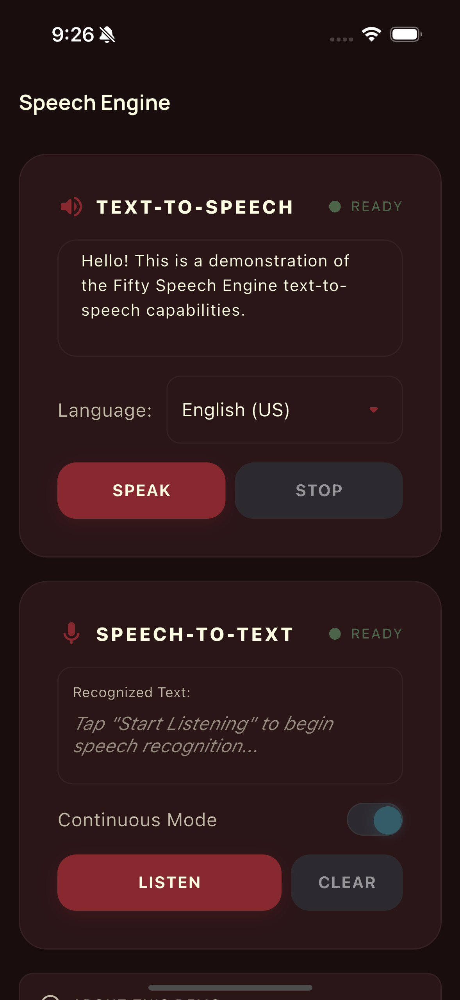
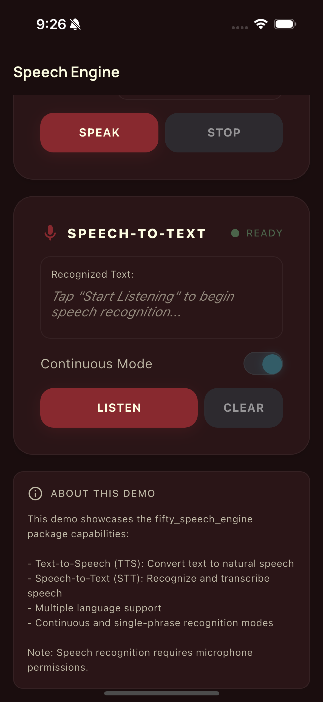

# Fifty Speech Engine

[](https://pub.dev/packages/fifty_speech_engine)
[](LICENSE)

A unified speech interface for Flutter games and applications with TTS and STT capabilities. Part of [Fifty Flutter Kit](https://github.com/fiftynotai/fifty_flutter_kit).

| TTS Panel | STT Panel |
|:---------:|:---------:|
|  |  |

---

## Features

- **Unified API** - Single interface for both Text-to-Speech and Speech-to-Text
- **Text-to-Speech** - Speech synthesis for game narration and accessibility
- **Speech-to-Text** - Voice recognition for commands and dictation
- **Locale-Aware** - Multi-language configuration with runtime switching
- **Continuous Listening** - Dictation mode for longer voice input
- **Result Queueing** - Prevents overlap in speech recognition results
- **Callback-Based** - Clean async result handling

---

## Installation

```yaml
dependencies:
  fifty_speech_engine: ^0.1.2
```

### For Contributors

```yaml
dependencies:
  fifty_speech_engine:
    path: ../fifty_speech_engine
```

**Dependencies:** `speech_to_text`, `flutter_tts`, `fifty_tokens`, `fifty_theme`, `fifty_ui`

---

## Quick Start

```dart
import 'package:fifty_speech_engine/fifty_speech_engine.dart';

// 1. Create engine with locale
final engine = FiftySpeechEngine(
  locale: Locale('en', 'US'),
  onSttResult: (text) async => print('Heard: $text'),
  onSttError: (error) => print('Error: $error'),
);

// 2. Initialize
await engine.initialize();

// 3. Speak text
await engine.speak('Hello! How can I help you?');

// 4. Listen for voice input
await engine.startListening(continuous: true);

// 5. Stop listening when done
await engine.stopListening();

// 6. Clean up
engine.dispose();
```

---

## Architecture

```
FiftySpeechEngine
    |
    +-- tts: TtsManager
    |       Text-to-Speech synthesis via flutter_tts
    |
    +-- stt: SttManager
            Speech-to-Text recognition via speech_to_text
```

### Core Components

| Component | Description |
|-----------|-------------|
| `FiftySpeechEngine` | Unified interface combining TTS and STT |
| `TtsManager` | Text-to-Speech handler with voice configuration |
| `SttManager` | Speech-to-Text handler with queue support |
| `SpeechResultModel` | Result container for recognized speech |

---

## API Reference

### FiftySpeechEngine

Main unified controller.

```dart
/// Create with locale and optional callbacks
FiftySpeechEngine({
  required Locale locale,
  Future Function(String text)? onSttResult,
  void Function(String error)? onSttError,
})

/// Initialize both TTS and STT engines
Future<void> initialize()

/// Text-to-Speech
Future<void> speak(String text)
Future<void> stopSpeaking()
bool get isSpeaking

/// Speech-to-Text
Future<void> startListening({bool continuous = false})
Future<void> stopListening()
Future<void> cancelListening()
bool get isListening

/// Access individual managers
TtsManager get tts
SttManager get stt

/// Clean up resources
void dispose()
```

### TtsManager

Text-to-Speech handler.

```dart
/// Initialize with language and optional voice
Future<void> initialize({
  String language = 'en-US',
  String? voiceId,
})

/// Speak text aloud
Future<void> speak(String text)

/// Stop current speech
Future<void> stop()

/// Change language at runtime
Future<void> changeLanguage(String language, {String? voiceId})

/// Status
bool get isSpeaking

/// Callback when speech completes
VoidCallback? onSpeechComplete
```

**Language Examples:**
```dart
await tts.initialize(language: 'en-US');  // English (US)
await tts.initialize(language: 'fr-FR');  // French
await tts.initialize(language: 'de-DE');  // German
await tts.initialize(language: 'ja-JP');  // Japanese
```

### SttManager

Speech-to-Text handler with queue support.

```dart
/// Initialize the STT engine
Future<bool> initialize()

/// Start listening for speech
Future<void> startListening({
  String localeId = 'en_US',
  bool partialResults = true,
  bool listenContinuously = true,
})

/// Stop listening (returns final result)
Future<void> stopListening()

/// Cancel listening (discards results)
Future<void> cancelListening()

/// Status
bool get isListening
bool get isAvailable

/// Clear queued results
void flushQueue()

/// Callbacks
Future<void> Function(String text)? onResult
void Function(String error)? onError
```

**Listen Modes:**
- `listenContinuously: true` - Dictation mode for longer input
- `listenContinuously: false` - Confirmation mode for commands

### SpeechResultModel

Container for recognition results.

```dart
/// Properties
final String text      // Recognized text
final bool isFinal     // Whether result is final

/// Constructors
SpeechResultModel(text, isFinal)
SpeechResultModel.final_(text)
SpeechResultModel.partial(text)
```

---

## Usage Patterns

### Voice Commands

```dart
final engine = FiftySpeechEngine(
  locale: Locale('en', 'US'),
  onSttResult: (text) async {
    final command = text.toLowerCase();

    if (command.contains('attack')) {
      await performAttack();
    } else if (command.contains('defend')) {
      await performDefend();
    } else if (command.contains('help')) {
      await engine.speak('Available commands: attack, defend, help');
    }
  },
);

await engine.initialize();
await engine.startListening();
```

### Interactive Storytelling

```dart
// Narrate story segment
await engine.speak('You enter a dark cave. What do you do?');

// Wait for response
engine.stt.onResult = (text) async {
  if (text.contains('light') || text.contains('torch')) {
    await engine.speak('You light a torch, revealing ancient runes on the walls.');
  } else if (text.contains('back') || text.contains('leave')) {
    await engine.speak('You step back into the sunlight.');
  }
};

await engine.startListening();
```

### Accessibility Features

```dart
// Read UI elements aloud
Future<void> announceButton(String label) async {
  await engine.speak('Button: $label');
}

// Describe screen content
Future<void> describeScreen(String description) async {
  await engine.speak(description);
}
```

### Language Switching

```dart
// Switch TTS language dynamically
await engine.tts.changeLanguage('es-ES');
await engine.speak('Hola, bienvenido al juego!');

// Switch back
await engine.tts.changeLanguage('en-US');
await engine.speak('Welcome back!');
```

### Best Practices

1. **Initialize once** - Call `initialize()` at app startup
2. **Handle errors** - Always provide `onSttError` callback
3. **Check availability** - Use `stt.isAvailable` before listening
4. **Clean up** - Call `dispose()` when done
5. **Request permissions** - Handle microphone permissions before STT

The [example directory](example/) contains a complete demo app with MVVM + Actions architecture, TTS/STT panels, language selection for 9 languages, and FDL styling.

---

## Platform Support

| Platform | TTS | STT | Notes |
|----------|-----|-----|-------|
| Android | Yes | Yes | Requires RECORD_AUDIO permission |
| iOS | Yes | Yes | Requires microphone usage description |
| macOS | Yes | Yes | Requires audio-input entitlement |
| Linux | Yes | Limited | STT requires libspeechd |
| Windows | No | No | Not supported |
| Web | Yes | Yes | Browser-dependent |

### Platform Configuration

#### Android

Add to `android/app/src/main/AndroidManifest.xml`:

```xml
<manifest xmlns:android="http://schemas.android.com/apk/res/android">
    <!-- Speech Recognition Permissions -->
    <uses-permission android:name="android.permission.RECORD_AUDIO"/>
    <uses-permission android:name="android.permission.INTERNET"/>

    <application>
        <!-- ... your application config ... -->
    </application>

    <!-- Required for Android 11+ (API 30+) package visibility -->
    <queries>
        <intent>
            <action android:name="android.speech.RecognitionService"/>
        </intent>
    </queries>
</manifest>
```

**Important Notes:**
- `RECORD_AUDIO` is required for STT to function
- The `<queries>` block is **required for Android 11+** (API 30+) due to package visibility restrictions
- Without the queries block, `stt.initialize()` will return `false` on Android 11+ devices

#### iOS

Add to `ios/Runner/Info.plist`:

```xml
<key>NSSpeechRecognitionUsageDescription</key>
<string>This app uses speech recognition for voice commands.</string>
<key>NSMicrophoneUsageDescription</key>
<string>This app uses the microphone for speech recognition.</string>
```

**Important Notes:**
- Both keys are **required** - iOS will crash without them
- Customize the description strings for your app's use case
- Users must grant permission when prompted

#### macOS

Add to `macos/Runner/*.entitlements` (both Debug and Release):

```xml
<key>com.apple.security.device.audio-input</key>
<true/>
```

---

## Fifty Design Language Integration

This package is part of Fifty Flutter Kit:

- **Consistent naming** - FiftySpeechEngine follows Fifty Flutter Kit patterns
- **Compatible packages** - Works with `fifty_audio_engine`, `fifty_ui`
- **Unified locale handling** - Consistent with other Fifty packages
- **FDL Foundation** - Uses `fifty_tokens`, `fifty_theme`, `fifty_ui` for widget styling

---

## Version

**Current:** 0.1.2

---

## License

MIT License - see [LICENSE](LICENSE) for details.

Part of [Fifty Flutter Kit](https://github.com/fiftynotai/fifty_flutter_kit).
