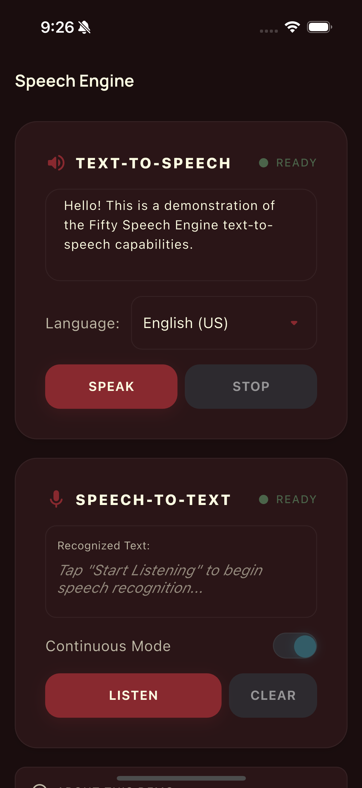
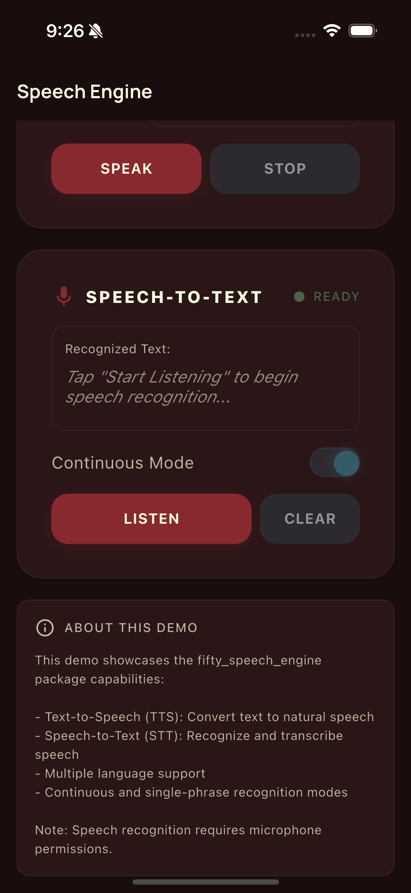

# Fifty Speech Engine

[](https://pub.dev/packages/fifty_speech_engine)
[](LICENSE)

**One engine, two speech modes -- TTS narration and STT recognition with builder-customizable controls.**

Unifies `flutter_tts` and `speech_to_text` behind a single `initialize()`/`speak()`/`startListening()` API. Ships three FDL-styled control widgets (`SpeechTtsControls`, `SpeechSttControls`, `SpeechControlsPanel`) with optional `contentBuilder` callbacks that let you replace the default UI while keeping all state management intact. Part of [Fifty Flutter Kit](https://github.com/fiftynotai/fifty_flutter_kit).

| TTS Panel | STT Panel |
|:---------:|:---------:|
|  |  |

---

## Why fifty_speech_engine

- **One engine, two speech modes** -- `FiftySpeechEngine` unifies `flutter_tts` and `speech_to_text` behind a single `initialize()`/`speak()`/`startListening()` API; no managing two SDKs.
- **Custom TTS and STT controls, logic unchanged** -- `SpeechTtsControls` and `SpeechSttControls` accept optional `contentBuilder` callbacks; replace the default FDL UI while keeping all state management intact.
- **Type-safe builder state** -- Builders receive `SpeechTtsState` (enabled, rate, pitch, volume, isSpeaking) and `SpeechSttState` (enabled, isListening, recognizedText, isAvailable) data classes, not raw booleans; your custom UI compiles cleanly.
- **Continuous and command modes** -- Set `listenContinuously: true` for dictation, `false` for single voice commands; the same engine handles both.

---

## Installation

```yaml
dependencies:
  fifty_speech_engine: ^0.2.0
```

### For Contributors

```yaml
dependencies:
  fifty_speech_engine:
    path: ../fifty_speech_engine
```

**Dependencies:** `speech_to_text`, `flutter_tts`, `fifty_tokens`, `fifty_theme`, `fifty_ui`

---

## Quick Start

```dart
import 'package:fifty_speech_engine/fifty_speech_engine.dart';

// 1. Create engine with locale
final engine = FiftySpeechEngine(
  locale: Locale('en', 'US'),
  onSttResult: (text) async => print('Heard: $text'),
  onSttError: (error) => print('Error: $error'),
);

// 2. Initialize
await engine.initialize();

// 3. Speak text
await engine.speak('Hello! How can I help you?');

// 4. Listen for voice input
await engine.startListening(continuous: true);

// 5. Stop listening when done
await engine.stopListening();

// 6. Clean up
engine.dispose();
```

---

## Architecture

```
FiftySpeechEngine
    |
    +-- tts: TtsManager
    |       Text-to-Speech synthesis via flutter_tts
    |
    +-- stt: SttManager
            Speech-to-Text recognition via speech_to_text
```

### Core Components

| Component | Description |
|-----------|-------------|
| `FiftySpeechEngine` | Unified interface combining TTS and STT |
| `TtsManager` | Text-to-Speech handler with voice configuration |
| `SttManager` | Speech-to-Text handler with queue support |
| `SpeechResultModel` | Result container for recognized speech |

---

## Widgets

Three FDL-styled control widgets for TTS and STT. All are callback-based (no internal state management dependency) and accept optional builder callbacks for custom UI.

### SpeechTtsControls

TTS enable/disable toggle with optional rate, pitch, and volume sliders. Speaking indicator shown when active.

```dart
SpeechTtsControls(
  enabled: ttsEnabled,
  onEnabledChanged: (value) => setState(() => ttsEnabled = value),
  rate: rate,
  onRateChanged: (value) => setState(() => rate = value),
  pitch: pitch,
  onPitchChanged: (value) => setState(() => pitch = value),
  volume: volume,
  onVolumeChanged: (value) => setState(() => volume = value),
  isSpeaking: isSpeaking,
)
```

| Parameter | Type | Default | Description |
|-----------|------|---------|-------------|
| `enabled` | `bool` | required | Whether TTS is enabled |
| `onEnabledChanged` | `ValueChanged<bool>` | required | Toggle callback |
| `rate` | `double` | `1.0` | Speech rate (0.5--2.0) |
| `onRateChanged` | `ValueChanged<double>?` | `null` | Rate slider callback; null hides the slider |
| `pitch` | `double` | `1.0` | Speech pitch (0.5--2.0) |
| `onPitchChanged` | `ValueChanged<double>?` | `null` | Pitch slider callback; null hides the slider |
| `volume` | `double` | `1.0` | Speech volume (0.0--1.0) |
| `onVolumeChanged` | `ValueChanged<double>?` | `null` | Volume slider callback; null hides the slider |
| `isSpeaking` | `bool` | `false` | Whether TTS is currently speaking |
| `compact` | `bool` | `false` | Use compact layout |
| `showCard` | `bool` | `true` | Wrap in FiftyCard; set false when embedding |
| `contentBuilder` | `SpeechTtsContentBuilder?` | `null` | Custom content builder (see [Customization](#customization)) |

### SpeechSttControls

STT enable/disable toggle with microphone button, pulsing listening indicator, recognized text display, and error handling.

```dart
SpeechSttControls(
  enabled: sttEnabled,
  onEnabledChanged: (value) => setState(() => sttEnabled = value),
  isListening: isListening,
  onListenPressed: toggleListening,
  recognizedText: recognizedText,
  onClear: () => setState(() => recognizedText = ''),
  errorMessage: errorMessage,
)
```

| Parameter | Type | Default | Description |
|-----------|------|---------|-------------|
| `enabled` | `bool` | required | Whether STT is enabled |
| `onEnabledChanged` | `ValueChanged<bool>` | required | Toggle callback |
| `isListening` | `bool` | required | Whether STT is currently listening |
| `onListenPressed` | `VoidCallback` | required | Microphone button callback |
| `recognizedText` | `String` | `''` | Last recognized text |
| `isAvailable` | `bool` | `true` | Whether STT is available on this device |
| `errorMessage` | `String?` | `null` | Error message to display |
| `onClear` | `VoidCallback?` | `null` | Clear text callback; null hides the clear button |
| `compact` | `bool` | `false` | Use compact layout |
| `showCard` | `bool` | `true` | Wrap in FiftyCard; set false when embedding |
| `hintText` | `String?` | `'TAP TO SPEAK'` | Hint text below microphone button |
| `contentBuilder` | `SpeechSttContentBuilder?` | `null` | Custom content builder (see [Customization](#customization)) |

### SpeechControlsPanel

Combined panel with both TTS and STT controls in a single card. Supports `showTts` and `showStt` flags to selectively display either section.

```dart
SpeechControlsPanel(
  ttsEnabled: ttsEnabled,
  onTtsEnabledChanged: (v) => setState(() => ttsEnabled = v),
  rate: rate,
  onRateChanged: (v) => setState(() => rate = v),
  isSpeaking: isSpeaking,

  sttEnabled: sttEnabled,
  onSttEnabledChanged: (v) => setState(() => sttEnabled = v),
  isListening: isListening,
  onListenPressed: toggleListening,
  recognizedText: recognizedText,
)
```

| Parameter | Type | Default | Description |
|-----------|------|---------|-------------|
| `showTts` | `bool` | `true` | Show TTS controls section |
| `showStt` | `bool` | `true` | Show STT controls section |
| `compact` | `bool` | `false` | Use compact layout for both sections |
| `title` | `String?` | `null` | Optional panel title |
| `ttsBuilder` | `SpeechTtsContentBuilder?` | `null` | Custom TTS content builder |
| `sttBuilder` | `SpeechSttContentBuilder?` | `null` | Custom STT content builder |

All TTS and STT parameters from the individual widgets are also available on the panel.

---

## Customization

All three widgets accept optional builder callbacks. When provided, the builder replaces the default FDL rendering while the widget retains ownership of the `FiftyCard` wrapper (when `showCard` is true) and all state computation.

### Custom TTS Controls

Replace the default TTS controls layout. The builder receives a `SpeechTtsState` data class with all state values and callbacks:

```dart
SpeechTtsControls(
  enabled: ttsEnabled,
  onEnabledChanged: (v) => setState(() => ttsEnabled = v),
  rate: rate,
  onRateChanged: (v) => setState(() => rate = v),
  isSpeaking: isSpeaking,
  contentBuilder: (state) {
    return Column(
      children: [
        Switch(value: state.enabled, onChanged: state.onEnabledChanged),
        if (state.enabled) ...[
          Slider(value: state.rate, min: 0.5, max: 2.0, onChanged: state.onRateChanged),
          if (state.isSpeaking) const Text('Speaking...'),
        ],
      ],
    );
  },
)
```

#### SpeechTtsState

| Field | Type | Description |
|-------|------|-------------|
| `enabled` | `bool` | Whether TTS is enabled |
| `onEnabledChanged` | `ValueChanged<bool>` | Toggle callback |
| `rate` | `double` | Current speech rate |
| `onRateChanged` | `ValueChanged<double>?` | Rate change callback |
| `pitch` | `double` | Current pitch |
| `onPitchChanged` | `ValueChanged<double>?` | Pitch change callback |
| `volume` | `double` | Current volume |
| `onVolumeChanged` | `ValueChanged<double>?` | Volume change callback |
| `isSpeaking` | `bool` | Whether TTS is speaking |
| `compact` | `bool` | Whether compact mode is active |

### Custom STT Controls

Replace the default STT controls layout. The builder receives a `SpeechSttState` data class:

```dart
SpeechSttControls(
  enabled: sttEnabled,
  onEnabledChanged: (v) => setState(() => sttEnabled = v),
  isListening: isListening,
  onListenPressed: toggleListening,
  recognizedText: recognizedText,
  contentBuilder: (state) {
    return Column(
      children: [
        Switch(value: state.enabled, onChanged: state.onEnabledChanged),
        if (state.enabled) ...[
          IconButton(
            icon: Icon(state.isListening ? Icons.mic : Icons.mic_none),
            onPressed: state.onListenPressed,
          ),
          if (state.recognizedText.isNotEmpty)
            Text('"${state.recognizedText}"'),
        ],
      ],
    );
  },
)
```

#### SpeechSttState

| Field | Type | Description |
|-------|------|-------------|
| `enabled` | `bool` | Whether STT is enabled |
| `onEnabledChanged` | `ValueChanged<bool>` | Toggle callback |
| `isListening` | `bool` | Whether STT is listening |
| `onListenPressed` | `VoidCallback` | Microphone button callback |
| `recognizedText` | `String` | Last recognized text |
| `isAvailable` | `bool` | Whether STT is available |
| `errorMessage` | `String?` | Error message |
| `onClear` | `VoidCallback?` | Clear text callback |
| `compact` | `bool` | Whether compact mode is active |
| `hintText` | `String?` | Hint text for microphone button |

### Custom Panel Sections

`SpeechControlsPanel` forwards builder callbacks to the internal `SpeechTtsControls` and `SpeechSttControls`:

```dart
SpeechControlsPanel(
  ttsEnabled: ttsEnabled,
  onTtsEnabledChanged: (v) => setState(() => ttsEnabled = v),
  isSpeaking: isSpeaking,

  sttEnabled: sttEnabled,
  onSttEnabledChanged: (v) => setState(() => sttEnabled = v),
  isListening: isListening,
  onListenPressed: toggleListening,
  recognizedText: recognizedText,

  ttsBuilder: (state) => MyTtsControls(state: state),
  sttBuilder: (state) => MySttControls(state: state),
)
```

### Builder Signatures

| Widget | Builder parameter | Callback signature |
|--------|------------------|--------------------|
| `SpeechTtsControls` | `contentBuilder` | `Widget Function(SpeechTtsState state)` |
| `SpeechSttControls` | `contentBuilder` | `Widget Function(SpeechSttState state)` |
| `SpeechControlsPanel` | `ttsBuilder` | `Widget Function(SpeechTtsState state)` |
| `SpeechControlsPanel` | `sttBuilder` | `Widget Function(SpeechSttState state)` |

All builders are optional. Omit them to use the default FDL UI.

---

## API Reference

### FiftySpeechEngine

Main unified controller.

```dart
/// Create with locale and optional callbacks
FiftySpeechEngine({
  required Locale locale,
  Future Function(String text)? onSttResult,
  void Function(String error)? onSttError,
})

/// Initialize both TTS and STT engines
Future<void> initialize()

/// Text-to-Speech
Future<void> speak(String text)
Future<void> stopSpeaking()
bool get isSpeaking

/// Speech-to-Text
Future<void> startListening({bool continuous = false})
Future<void> stopListening()
Future<void> cancelListening()
bool get isListening

/// Access individual managers
TtsManager get tts
SttManager get stt

/// Clean up resources
void dispose()
```

### TtsManager

Text-to-Speech handler.

```dart
/// Initialize with language and optional voice
Future<void> initialize({
  String language = 'en-US',
  String? voiceId,
})

/// Speak text aloud
Future<void> speak(String text)

/// Stop current speech
Future<void> stop()

/// Change language at runtime
Future<void> changeLanguage(String language, {String? voiceId})

/// Status
bool get isSpeaking

/// Callback when speech completes
VoidCallback? onSpeechComplete
```

**Language Examples:**
```dart
await tts.initialize(language: 'en-US');  // English (US)
await tts.initialize(language: 'fr-FR');  // French
await tts.initialize(language: 'de-DE');  // German
await tts.initialize(language: 'ja-JP');  // Japanese
```

### SttManager

Speech-to-Text handler with queue support.

```dart
/// Initialize the STT engine
Future<bool> initialize()

/// Start listening for speech
Future<void> startListening({
  String localeId = 'en_US',
  bool partialResults = true,
  bool listenContinuously = true,
})

/// Stop listening (returns final result)
Future<void> stopListening()

/// Cancel listening (discards results)
Future<void> cancelListening()

/// Status
bool get isListening
bool get isAvailable

/// Clear queued results
void flushQueue()

/// Callbacks
Future<void> Function(String text)? onResult
void Function(String error)? onError
```

**Listen Modes:**
- `listenContinuously: true` - Dictation mode for longer input
- `listenContinuously: false` - Confirmation mode for commands

### SpeechResultModel

Container for recognition results.

```dart
/// Properties
final String text      // Recognized text
final bool isFinal     // Whether result is final

/// Constructors
SpeechResultModel(text, isFinal)
SpeechResultModel.final_(text)
SpeechResultModel.partial(text)
```

---

## Usage Patterns

### Voice Commands

```dart
final engine = FiftySpeechEngine(
  locale: Locale('en', 'US'),
  onSttResult: (text) async {
    final command = text.toLowerCase();

    if (command.contains('attack')) {
      await performAttack();
    } else if (command.contains('defend')) {
      await performDefend();
    } else if (command.contains('help')) {
      await engine.speak('Available commands: attack, defend, help');
    }
  },
);

await engine.initialize();
await engine.startListening();
```

### Interactive Storytelling

```dart
// Narrate story segment
await engine.speak('You enter a dark cave. What do you do?');

// Wait for response
engine.stt.onResult = (text) async {
  if (text.contains('light') || text.contains('torch')) {
    await engine.speak('You light a torch, revealing ancient runes on the walls.');
  } else if (text.contains('back') || text.contains('leave')) {
    await engine.speak('You step back into the sunlight.');
  }
};

await engine.startListening();
```

### Accessibility Features

```dart
// Read UI elements aloud
Future<void> announceButton(String label) async {
  await engine.speak('Button: $label');
}

// Describe screen content
Future<void> describeScreen(String description) async {
  await engine.speak(description);
}
```

### Language Switching

```dart
// Switch TTS language dynamically
await engine.tts.changeLanguage('es-ES');
await engine.speak('Hola, bienvenido al juego!');

// Switch back
await engine.tts.changeLanguage('en-US');
await engine.speak('Welcome back!');
```

### Best Practices

1. **Initialize once** - Call `initialize()` at app startup
2. **Handle errors** - Always provide `onSttError` callback
3. **Check availability** - Use `stt.isAvailable` before listening
4. **Clean up** - Call `dispose()` when done
5. **Request permissions** - Handle microphone permissions before STT

The [example directory](example/) contains a complete demo app with MVVM + Actions architecture, TTS/STT panels, language selection for 9 languages, and FDL styling.

---

## Platform Support

| Platform | TTS | STT | Notes |
|----------|-----|-----|-------|
| Android | Yes | Yes | Requires RECORD_AUDIO permission |
| iOS | Yes | Yes | Requires microphone usage description |
| macOS | Yes | Yes | Requires audio-input entitlement |
| Linux | Yes | Limited | STT requires libspeechd |
| Windows | No | No | Not supported |
| Web | Yes | Yes | Browser-dependent |

### Platform Configuration

#### Android

Add to `android/app/src/main/AndroidManifest.xml`:

```xml
<manifest xmlns:android="http://schemas.android.com/apk/res/android">
    <!-- Speech Recognition Permissions -->
    <uses-permission android:name="android.permission.RECORD_AUDIO"/>
    <uses-permission android:name="android.permission.INTERNET"/>

    <application>
        <!-- ... your application config ... -->
    </application>

    <!-- Required for Android 11+ (API 30+) package visibility -->
    <queries>
        <intent>
            <action android:name="android.speech.RecognitionService"/>
        </intent>
    </queries>
</manifest>
```

**Important Notes:**
- `RECORD_AUDIO` is required for STT to function
- The `<queries>` block is **required for Android 11+** (API 30+) due to package visibility restrictions
- Without the queries block, `stt.initialize()` will return `false` on Android 11+ devices

#### iOS

Add to `ios/Runner/Info.plist`:

```xml
<key>NSSpeechRecognitionUsageDescription</key>
<string>This app uses speech recognition for voice commands.</string>
<key>NSMicrophoneUsageDescription</key>
<string>This app uses the microphone for speech recognition.</string>
```

**Important Notes:**
- Both keys are **required** - iOS will crash without them
- Customize the description strings for your app's use case
- Users must grant permission when prompted

#### macOS

Add to `macos/Runner/*.entitlements` (both Debug and Release):

```xml
<key>com.apple.security.device.audio-input</key>
<true/>
```

---

## Fifty Design Language Integration

This package is part of Fifty Flutter Kit:

- **FDL-styled widgets** - `SpeechTtsControls`, `SpeechSttControls`, and `SpeechControlsPanel` use `FiftyCard`, `FiftySwitch`, `FiftySlider`, and FDL design tokens for consistent styling
- **Builder-customizable** - Replace any widget's inner content via `contentBuilder` while keeping FDL card wrappers and layout intact (see [Customization](#customization))
- **Compatible packages** - Works with `fifty_audio_engine`, `fifty_tokens`, `fifty_theme`, `fifty_ui`
- **Unified locale handling** - Consistent with other Fifty packages

---

## Version

**Current:** 0.2.0

---

## License

MIT License - see [LICENSE](LICENSE) for details.

Part of [Fifty Flutter Kit](https://github.com/fiftynotai/fifty_flutter_kit).
