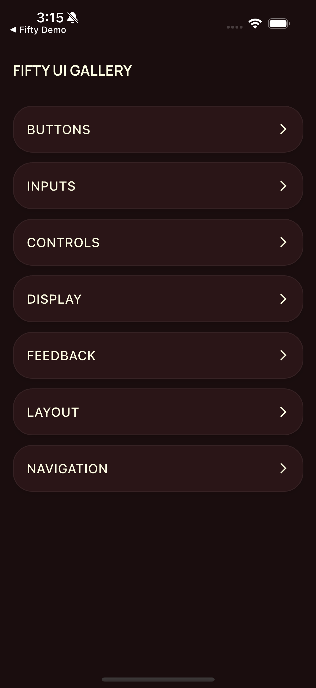
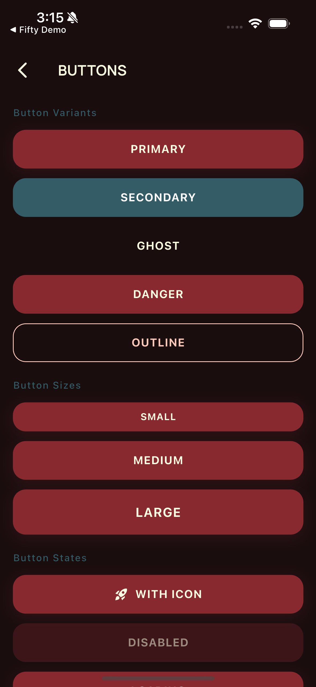
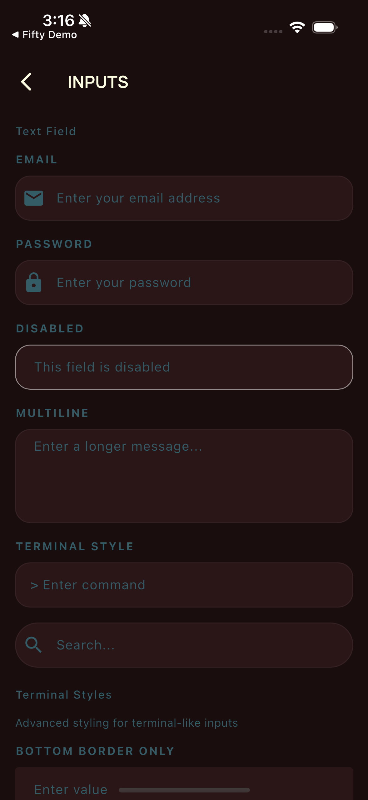
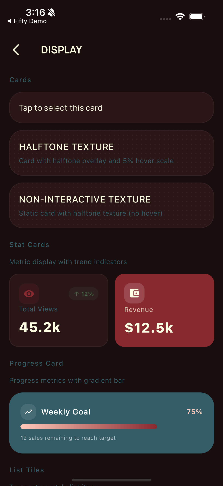

# Fifty UI

FDL-styled Flutter component library implementing the Fifty Design Language v2. Part of [Fifty Flutter Kit](https://github.com/fiftynotai/fifty_flutter_kit).

| Gallery | Buttons | Inputs | Display |
|:-------:|:-------:|:------:|:-------:|
|  |  |  |  |

---

## Features

- **Buttons** - Primary, secondary, outline, ghost, and danger variants with glitch and loading states
- **Inputs** - Text fields, sliders, switches, dropdowns, checkboxes, and radio controls with FDL terminal styling
- **Controls** - Segmented control and nav pill for selection and filtering patterns
- **Display** - Stat cards, list tiles, badges, chips, avatars, progress bars, data slates, and loading indicators
- **Feedback** - Snackbar toasts, modal dialogs, and hover tooltips with kinetic animations
- **Layout** - Card containers with halftone texture, scanline effects, and bento-style hover states
- **Navigation** - Floating glassmorphism nav bar with Dynamic Island pill style
- **Effects** - KineticEffect, GlitchEffect, GlowContainer, and HalftoneOverlay as composable primitives
- **Dark-first** - Optimized for OLED displays with voidBlack backgrounds and crimson glow focus states
- **WCAG 2.1 AA** - Accessible contrast ratios, reduced motion support, required tooltips on icon buttons

---

## Installation

Add to your `pubspec.yaml`:

```yaml
dependencies:
  fifty_ui:
    path: ../fifty_ui
  fifty_theme:
    path: ../fifty_theme
  fifty_tokens:
    path: ../fifty_tokens
```

### Git Dependency

```yaml
dependencies:
  fifty_ui:
    git:
      url: https://github.com/fiftynotai/fifty_flutter_kit.git
      path: packages/fifty_ui
  fifty_theme:
    git:
      url: https://github.com/fiftynotai/fifty_flutter_kit.git
      path: packages/fifty_theme
  fifty_tokens:
    git:
      url: https://github.com/fiftynotai/fifty_flutter_kit.git
      path: packages/fifty_tokens
```

---

## Quick Start

```dart
import 'package:fifty_theme/fifty_theme.dart';
import 'package:fifty_ui/fifty_ui.dart';

void main() {
  runApp(
    MaterialApp(
      theme: FiftyTheme.dark(),
      home: MyApp(),
    ),
  );
}

// Use components directly
FiftyButton(
  label: 'DEPLOY',
  onPressed: () => handleDeploy(),
  variant: FiftyButtonVariant.primary,
  icon: Icons.rocket_launch,
  isGlitch: true,
  shape: FiftyButtonShape.sharp,
)
```

---

## Architecture

```
fifty_ui
├── buttons/
│   ├── FiftyButton          — Primary action button (5 variants)
│   ├── FiftyIconButton      — Circular icon button with tooltip
│   └── FiftyLabeledIconButton — Icon button with inline label
├── inputs/
│   ├── FiftyTextField       — Terminal command-line text input
│   ├── FiftySwitch          — Kinetic toggle with snap animation
│   ├── FiftySlider          — Brutalist range selector (square thumb)
│   ├── FiftyDropdown        — Terminal-styled dropdown selector
│   ├── FiftyCheckbox        — Multi-select boolean control
│   ├── FiftyRadio           — Single-select option control
│   └── FiftyRadioCard       — Card-style radio selection
├── controls/
│   ├── FiftySegmentedControl — Pill-style segmented control
│   └── FiftyNavPill         — Navigation pill indicator
├── containers/
│   └── FiftyCard            — Bento-style container with hover effects
├── display/
│   ├── FiftyStatCard        — KPI metric card with trend indicators
│   ├── FiftyListTile        — Transaction and settings list item
│   ├── FiftyProgressCard    — Goal progress card with gradient fill
│   ├── FiftyBadge           — Status indicator pill with glow
│   ├── FiftyChip            — Tag/label with optional delete
│   ├── FiftyDivider         — Themed horizontal or vertical divider
│   ├── FiftyDataSlate       — Terminal key-value display panel
│   ├── FiftyAvatar          — Circular avatar with fallback initials
│   ├── FiftyProgressBar     — Linear progress with crimson fill
│   ├── FiftyLoadingIndicator — Text-based loading (no spinners)
│   ├── FiftyInfoRow         — Labeled info display row
│   ├── FiftySectionHeader   — Section heading with optional action
│   ├── FiftySettingsRow     — Settings list row with value display
│   └── FiftyStatusIndicator — Dot-based status icon
├── feedback/
│   ├── FiftySnackbar        — Toast notification with variants
│   ├── FiftyDialog          — Modal dialog with animated border glow
│   └── FiftyTooltip         — Hover-triggered tooltip wrapper
├── organisms/
│   ├── FiftyHero            — Dramatic headline with Manrope font
│   └── FiftyNavBar          — Floating glassmorphism nav bar
├── molecules/
│   └── FiftyCodeBlock       — Terminal code display with syntax highlight
└── utils/
    ├── KineticEffect        — Hover/press scale animation wrapper
    ├── GlitchEffect         — RGB chromatic aberration effect
    ├── GlowContainer        — Reusable glow animation wrapper
    ├── HalftonePainter      — CustomPainter for halftone dot patterns
    ├── HalftoneOverlay      — Widget wrapper for halftone textures
    └── FiftyCursor          — Custom cursor styling utilities
```

### Core Components

| Component | Category | Description |
|-----------|----------|-------------|
| `FiftyButton` | Buttons | Primary action button with 5 variants |
| `FiftyTextField` | Inputs | Terminal-style text input with 48px height |
| `FiftyCard` | Containers | Bento card with kinetic hover effects |
| `FiftyNavBar` | Navigation | Floating glassmorphism navigation bar |
| `FiftySnackbar` | Feedback | Toast notification with semantic variants |
| `FiftyDialog` | Feedback | Modal dialog with border glow animation |

---

## API Reference

### Buttons

| Widget | Description |
|--------|-------------|
| `FiftyButton` | Primary action button. Variants: `primary`, `secondary`, `outline`, `ghost`, `danger`. Supports glitch effect, loading state, leading/trailing icons, and expanded width. |
| `FiftyIconButton` | Circular icon button. Requires `tooltip` for accessibility. |
| `FiftyLabeledIconButton` | Icon button with an inline text label. |

**FiftyButton Properties:**

| Property | Type | Default | Description |
|----------|------|---------|-------------|
| `label` | String | required | Button text (rendered uppercase) |
| `onPressed` | VoidCallback? | null | Tap callback |
| `variant` | FiftyButtonVariant | primary | Visual style |
| `size` | FiftyButtonSize | medium | Height: small(32), medium(40), large(48) |
| `shape` | FiftyButtonShape | sharp | Border radius: sharp(4px), pill(100px) |
| `isGlitch` | bool | false | RGB split effect on hover |
| `loading` | bool | false | Show animated dots instead of label |
| `icon` | IconData? | null | Leading icon |
| `trailingIcon` | IconData? | null | Trailing icon (e.g., arrow) |
| `expanded` | bool | false | Fill available width |

---

### Inputs

| Widget | Description |
|--------|-------------|
| `FiftyTextField` | Text input styled as a terminal command line. Supports multiple border styles, prefix styles (chevron, comment), and cursor types (line, block, underscore). |
| `FiftySwitch` | Kinetic toggle switch with 150ms snap animation. Sizes: `small`, `medium`, `large`. |
| `FiftySlider` | Brutalist range selector with square thumb and crimson active track. Supports discrete divisions and custom label formatting. |
| `FiftyDropdown` | Terminal-styled dropdown with animated chevron and slide-down menu. Generic type support. |
| `FiftyCheckbox` | Multi-select boolean control with FDL v2 styling. |
| `FiftyRadio` | Single-select option control with FDL v2 styling. |
| `FiftyRadioCard` | Card-style radio with icon, kinetic hover animation, and crimson glow on selection. |

**FiftyTextField Properties:**

| Property | Type | Default | Description |
|----------|------|---------|-------------|
| `shape` | FiftyTextFieldShape | standard | Shape: standard (xl radius), rounded (pill) |
| `borderStyle` | FiftyBorderStyle | full | Border rendering: full, bottom, none |
| `prefixStyle` | FiftyPrefixStyle? | null | Prefix character: chevron(">"), comment("//"), custom, none |
| `customPrefix` | String? | null | Custom prefix when prefixStyle is custom |
| `cursorStyle` | FiftyCursorStyle | line | Cursor type: line, block, underscore |
| `terminalStyle` | bool | false | Legacy: enables chevron prefix + bottom border |

**FiftySwitch Sizes:**

| Size | Dimensions | Thumb Size |
|------|------------|------------|
| `small` | 36x20 | 16 |
| `medium` | 48x24 | 20 |
| `large` | 60x32 | 28 |

**FiftySlider Properties:**

| Property | Type | Default | Description |
|----------|------|---------|-------------|
| `value` | double | required | Current slider value |
| `onChanged` | ValueChanged<double>? | required | Value change callback |
| `min` | double | 0.0 | Minimum value |
| `max` | double | 1.0 | Maximum value |
| `divisions` | int? | null | Discrete steps (null = continuous) |
| `label` | String? | null | Label above slider |
| `showLabel` | bool | false | Show value label above thumb |
| `labelBuilder` | String Function(double)? | null | Custom value formatter |

**FiftyDropdown Properties:**

| Property | Type | Default | Description |
|----------|------|---------|-------------|
| `items` | List<FiftyDropdownItem<T>> | required | Selectable items |
| `value` | T? | null | Currently selected value |
| `onChanged` | ValueChanged<T?>? | required | Selection callback |
| `label` | String? | null | Label above dropdown |
| `hint` | String? | null | Placeholder when no selection |
| `enabled` | bool | true | Enable/disable interaction |

---

### Controls

| Widget | Description |
|--------|-------------|
| `FiftySegmentedControl` | Pill-style segmented control for toggling between options. New in v2. |
| `FiftyNavPill` | Navigation pill indicator for use inside custom nav layouts. |

---

### Containers

| Widget | Description |
|--------|-------------|
| `FiftyCard` | Bento-style data container with optional halftone texture, scanline hover effect, selected state with crimson border and glow, and kinetic scale on hover. |

**FiftyCard Properties:**

| Property | Type | Default | Description |
|----------|------|---------|-------------|
| `hasTexture` | bool | false | Halftone dot pattern overlay |
| `hoverScale` | double | 1.02 | Scale factor on hover (1.0 to disable) |
| `scanlineOnHover` | bool | true | Sweeping scanline effect on hover |
| `selected` | bool | false | Crimson border + glow state |
| `onTap` | VoidCallback? | null | Tap callback |

---

### Display

| Widget | Description |
|--------|-------------|
| `FiftyStatCard` | KPI metric card with trend indicator arrows (up/down/neutral), icon container, and optional highlight variant. |
| `FiftyListTile` | List item for transactions and settings. Supports two-line trailing text, colored leading icon container, and optional divider. |
| `FiftyProgressCard` | Goal progress card with gradient fill progress bar, percentage display, and icon container. |
| `FiftyBadge` | Status indicator pill with optional glow animation. Variants: `primary`, `success`, `warning`, `error`, `neutral`. Factory constructors: `.tech()`, `.status()`, `.ai()`. |
| `FiftyChip` | Tag/label component with optional delete action. |
| `FiftyDivider` | Themed horizontal or vertical divider. |
| `FiftyDataSlate` | Terminal-style key-value display panel for system info. |
| `FiftyAvatar` | Circular avatar with image or fallback initials. |
| `FiftyProgressBar` | Linear progress indicator with crimson fill and optional label. |
| `FiftyLoadingIndicator` | Text-based loading indicator. Styles: `dots`, `pulse`, `static`, `sequence`. No spinners per FDL. |
| `FiftyInfoRow` | Labeled info display row for detail views. |
| `FiftySectionHeader` | Section heading with optional trailing action widget. |
| `FiftySettingsRow` | Settings list row with key-value display. |
| `FiftyStatusIndicator` | Dot-based status icon with semantic color variants. |

**FiftyStatCard Properties:**

| Property | Type | Default | Description |
|----------|------|---------|-------------|
| `label` | String | required | Metric label text |
| `value` | String | required | Metric value (formatted) |
| `icon` | IconData | required | Icon in circular container |
| `trend` | FiftyStatTrend? | null | Trend direction: up, down, neutral |
| `trendValue` | String? | null | Trend percentage (e.g., "12%") |
| `iconColor` | Color? | null | Custom icon color |
| `highlight` | bool | false | Use primary background variant |

**FiftyListTile Properties:**

| Property | Type | Default | Description |
|----------|------|---------|-------------|
| `title` | String | required | Primary text |
| `subtitle` | String? | null | Secondary text |
| `leading` | Widget? | null | Custom leading widget |
| `leadingIcon` | IconData? | null | Icon (alternative to leading) |
| `leadingIconColor` | Color? | null | Icon color |
| `leadingIconBackgroundColor` | Color? | null | Icon background color |
| `trailing` | Widget? | null | Custom trailing widget |
| `trailingText` | String? | null | Trailing text (e.g., amount) |
| `trailingSubtext` | String? | null | Trailing subtext (e.g., date) |
| `trailingTextColor` | Color? | null | Custom trailing text color |
| `onTap` | VoidCallback? | null | Tap callback |
| `showDivider` | bool | false | Show bottom divider |

**FiftyLoadingIndicator Styles:**

| Style | Description |
|-------|-------------|
| `dots` | Animated dots sequence: "." -> ".." -> "..." |
| `pulse` | Text opacity pulsing effect |
| `static` | No animation (for reduced motion) |
| `sequence` | Cycles through custom text sequences |

---

### Feedback

| Widget | Description |
|--------|-------------|
| `FiftySnackbar` | Toast notification. Call via `FiftySnackbar.show(context, message: ..., variant: ...)`. Variants: `success`, `error`, `warning`, `info`. |
| `FiftyDialog` | Modal dialog with animated border glow. Display via `showFiftyDialog(context, builder: ...)`. |
| `FiftyTooltip` | Hover-triggered tooltip wrapper widget. |

---

### Navigation

| Widget | Description |
|--------|-------------|
| `FiftyNavBar` | Floating "Dynamic Island" style navigation bar with glassmorphism (20px blur + 50% black opacity). Supports `pill` and `standard` border radius styles. Active item has crimson underbar indicator. |

---

### Effects and Utils

| Widget/Class | Description |
|--------------|-------------|
| `KineticEffect` | Hover/press scale animation wrapper. Configurable `hoverScale` (default 1.02) and `pressScale` (default 0.95). |
| `GlitchEffect` | RGB chromatic aberration effect. Configurable `intensity`, `offset`, `triggerOnHover`, `triggerOnMount`. |
| `GlowContainer` | Reusable crimson glow animation wrapper. |
| `HalftonePainter` | CustomPainter for halftone dot patterns. |
| `HalftoneOverlay` | Widget wrapper that applies halftone texture over a child. |
| `FiftyCursor` | Custom cursor styling utilities. |

---

## Usage Patterns

### Button Variants

```dart
// Primary with glitch effect
FiftyButton(
  label: 'DEPLOY',
  onPressed: () => handleDeploy(),
  variant: FiftyButtonVariant.primary,
  isGlitch: true,
  shape: FiftyButtonShape.sharp,
)

// Secondary (slate-grey filled)
FiftyButton(
  label: 'DOWNLOAD',
  onPressed: () => handleDownload(),
  variant: FiftyButtonVariant.secondary,
  icon: Icons.download,
)

// Outline (burgundy border)
FiftyButton(
  label: 'LOG IN',
  onPressed: () => handleLogin(),
  variant: FiftyButtonVariant.outline,
)

// With trailing icon
FiftyButton(
  label: 'GET STARTED',
  onPressed: () => handleStart(),
  variant: FiftyButtonVariant.primary,
  trailingIcon: Icons.arrow_forward,
)

// Loading state (animated dots, not spinner)
FiftyButton(
  label: 'PROCESSING',
  onPressed: null,
  loading: true,
)
```

### Terminal Input Styles

```dart
// Standard with full border
FiftyTextField(
  controller: _emailController,
  label: 'Email',
  hint: 'Enter your email',
  prefix: Icon(Icons.email),
)

// Rounded/pill shape (for search inputs)
FiftyTextField(
  controller: _searchController,
  hint: 'Search...',
  prefixIcon: Icons.search,
  shape: FiftyTextFieldShape.rounded,
)

// Terminal style (bottom border + chevron prefix)
FiftyTextField(
  controller: _commandController,
  borderStyle: FiftyBorderStyle.bottom,
  prefixStyle: FiftyPrefixStyle.chevron,
  cursorStyle: FiftyCursorStyle.block,
  hint: 'Enter command',
)

// Comment prefix style
FiftyTextField(
  controller: _noteController,
  prefixStyle: FiftyPrefixStyle.comment, // Shows "//"
)
```

### Radio Card Selection

```dart
Row(
  children: [
    Expanded(
      child: FiftyRadioCard<ThemeMode>(
        value: ThemeMode.light,
        groupValue: _themeMode,
        onChanged: (v) => setState(() => _themeMode = v),
        icon: Icons.light_mode,
        label: 'Light',
      ),
    ),
    SizedBox(width: FiftySpacing.md),
    Expanded(
      child: FiftyRadioCard<ThemeMode>(
        value: ThemeMode.dark,
        groupValue: _themeMode,
        onChanged: (v) => setState(() => _themeMode = v),
        icon: Icons.dark_mode,
        label: 'Dark',
      ),
    ),
  ],
)
```

### Slider with Custom Formatter

```dart
// Discrete divisions with custom formatter
FiftySlider(
  value: _level,
  onChanged: (value) => setState(() => _level = value),
  min: 1,
  max: 10,
  divisions: 9,
  showLabel: true,
  labelBuilder: (value) => 'Level ${value.round()}',
)
```

### Dropdown with Icons

```dart
FiftyDropdown<String>(
  value: _status,
  onChanged: (value) => setState(() => _status = value),
  items: [
    FiftyDropdownItem(value: 'active', label: 'Active', icon: Icons.check_circle),
    FiftyDropdownItem(value: 'paused', label: 'Paused', icon: Icons.pause_circle),
    FiftyDropdownItem(value: 'stopped', label: 'Stopped', icon: Icons.stop_circle),
  ],
)
```

### KPI Dashboard with Stat Cards

```dart
FiftyStatCard(
  label: 'Total Views',
  value: '45.2k',
  icon: Icons.visibility,
  trend: FiftyStatTrend.up,
  trendValue: '12%',
)

// Highlight variant (primary background)
FiftyStatCard(
  label: 'Revenue',
  value: '\$12.5k',
  icon: Icons.account_balance_wallet,
  highlight: true,
)
```

### Transaction List Item

```dart
FiftyListTile(
  leadingIcon: Icons.subscriptions,
  leadingIconColor: Colors.blue,
  leadingIconBackgroundColor: Colors.blue.withOpacity(0.1),
  title: 'Subscription',
  subtitle: 'Adobe Creative Cloud',
  trailingText: '-\$54.00',
  trailingSubtext: 'Today',
  onTap: () => navigateToDetail(),
)
```

### Progress Card with Custom Gradient

```dart
FiftyProgressCard(
  title: 'Storage Used',
  progress: 0.82,
  icon: Icons.storage,
  progressGradient: LinearGradient(
    colors: [FiftyColors.hunterGreen, FiftyColors.slateGrey],
  ),
)
```

### Badges

```dart
FiftyBadge(label: 'LIVE', variant: FiftyBadgeVariant.success, showGlow: true)

// Factory constructors
FiftyBadge.tech('FLUTTER')  // HyperChrome border, no glow
FiftyBadge.status('ONLINE') // Success green with glow
FiftyBadge.ai('IGRIS')      // IgrisGreen with glow
```

### Sequence Loading Indicator

```dart
FiftyLoadingIndicator(
  style: FiftyLoadingStyle.sequence,
  sequences: [
    '> INITIALIZING...',
    '> LOADING ASSETS...',
    '> ESTABLISHING LINK...',
    '> COMPILING...',
  ],
)
```

### Modal Dialog

```dart
showFiftyDialog(
  context: context,
  builder: (context) => FiftyDialog(
    title: 'CONFIRM',
    content: Text('Proceed with action?'),
    actions: [
      FiftyButton(
        label: 'CANCEL',
        variant: FiftyButtonVariant.ghost,
        onPressed: () => Navigator.pop(context),
      ),
      FiftyButton(
        label: 'CONFIRM',
        onPressed: () => handleConfirm(context),
      ),
    ],
  ),
);
```

### Floating Navigation Bar

```dart
FiftyNavBar(
  items: [
    FiftyNavItem(label: 'Home', icon: Icons.home),
    FiftyNavItem(label: 'Search', icon: Icons.search),
    FiftyNavItem(label: 'Profile', icon: Icons.person),
  ],
  selectedIndex: _currentIndex,
  onItemSelected: (index) => setState(() => _currentIndex = index),
  style: FiftyNavBarStyle.pill,
)
```

### Headline Typography

```dart
FiftyHero(
  text: 'Welcome to Fifty',
  size: FiftyHeroSize.display,
  glitchOnMount: true,
  gradient: LinearGradient(
    colors: [FiftyColors.crimsonPulse, FiftyColors.terminalWhite],
  ),
)

// Hero section with subtitle
FiftyHeroSection(
  title: 'The Future of AI',
  subtitle: 'Powered by Fifty.ai',
  glitchOnMount: true,
)
```

### Code Block

```dart
FiftyCodeBlock(
  code: '''
void main() {
  print('Hello, Fifty!');
}
''',
  language: 'dart',
  showLineNumbers: true,
  copyButton: true,
)
```

### Composable Effects

```dart
// Kinetic hover/press
KineticEffect(
  onTap: () => handleTap(),
  hoverScale: 1.02,
  pressScale: 0.95,
  child: MyCard(),
)

// RGB glitch on hover
GlitchEffect(
  triggerOnHover: true,
  intensity: 0.8,
  offset: 3.0,
  child: Text('GLITCH'),
)
```

### Theme Access Pattern

All components access theme via `FiftyThemeExtension`:

```dart
final theme = Theme.of(context);
final fifty = theme.extension<FiftyThemeExtension>()!;

// Access FDL tokens
fifty.focusGlow      // Crimson box shadow
fifty.fast           // 150ms duration
fifty.compiling      // 300ms duration
fifty.standardCurve  // easeOutExpo
fifty.success        // Success green
fifty.igrisGreen     // AI indicator green
```

---

## Platform Support

| Platform | Support | Notes |
|----------|---------|-------|
| Android  | Yes     | Optimized for OLED displays |
| iOS      | Yes     | Full gesture and animation support |
| macOS    | Yes     | Hover states active on desktop |
| Linux    | Yes     | Hover states active on desktop |
| Windows  | Yes     | Hover states active on desktop |
| Web      | Yes     | Hover states active via mouse |

All hover-dependent features (KineticEffect, GlitchEffect, scanline on FiftyCard) activate on desktop and web platforms where mouse input is available.

---

## Fifty Design Language Integration

This package is part of Fifty Flutter Kit:

- **FDL v2** - Implements the full design language: burgundy primary palette, mode-aware colors, Manrope typography, fast motion (150ms / 300ms FDL timing tokens), and refined feedback (focus glow states, scanlines, RGB glitch effects)
- **fifty_tokens dependency** - All spacing, color, radius, and duration values are sourced from `fifty_tokens` for consistency across the kit
- **fifty_theme dependency** - Components read `FiftyThemeExtension` from the widget tree for focus glow, animation curves, and semantic colors
- **Dark-first with light mode** - All components respond to `ThemeMode` automatically; dark mode uses voidBlack backgrounds, light mode adapts contrast appropriately
- **No spinners** - Loading states use text-based animations (animated dots, pulse, sequence) per FDL specification

---

## Version

**Current:** 0.6.0

---

## License

MIT License - see [LICENSE](LICENSE) for details.

Part of [Fifty Flutter Kit](https://github.com/fiftynotai/fifty_flutter_kit).
