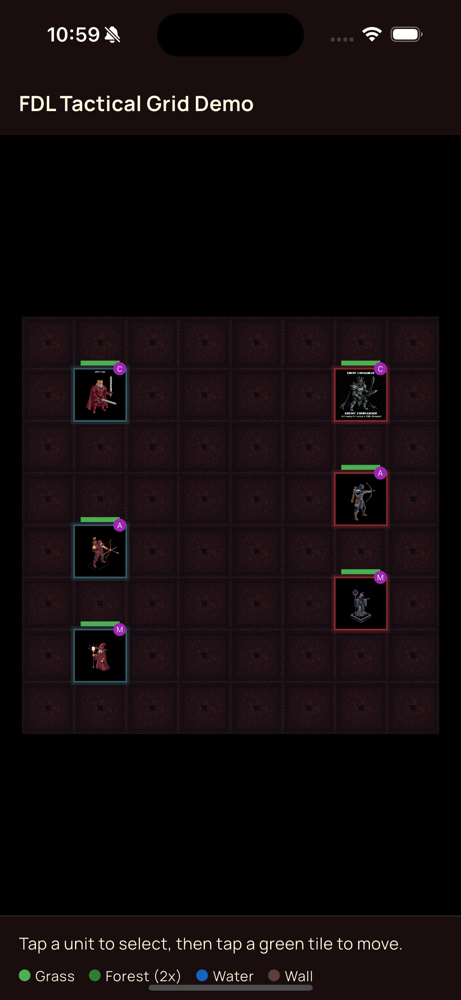

# Fifty World Engine

[](https://pub.dev/packages/fifty_world_engine)
[](LICENSE)

**Game-ready grid maps without custom renderers -- sprite tiles, entity hierarchy, pan/zoom, and tap callbacks built on Flame.**

A Flame-based interactive grid map system for dungeon crawlers, strategy games, and tactical RPGs. Define maps as JSON, register assets, spawn entities with parent-child hierarchy, animate movement, and handle tap events. Extend with custom entity types in one call. Part of [Fifty Flutter Kit](https://github.com/fiftynotai/fifty_flutter_kit).

| FDL Tactical Grid Demo |
|:----------------------:|
|  |

---

## Why fifty_world_engine

- **Game-ready grid maps without custom renderers** -- Sprite tiles, entity hierarchy, pan/zoom, and tap callbacks built on Flame; no raw canvas work needed.
- **Design data, not code** -- Define maps as JSON and load them with FiftyWorldLoader; level designers work in data, not Dart.
- **A* pathfinding out of the box** -- GridGraph + Pathfinder give you shortest-path navigation with diagonal support; MovementRange computes BFS reachable tiles in one call.
- **Layered tile highlighting** -- HighlightStyle presets (validMove, attackRange, selection) and group-based batch clearing make tactical UI state trivial to manage.
- **Sequential animation with input blocking** -- AnimationQueue executes async entries in order and automatically gates tap input while animations run.
- **Extend entity types in one call** -- FiftyEntitySpawner.register() adds any custom game entity type without modifying engine source.
- **Safe controller pattern** -- FiftyWorldController is a no-op until bound; call any method before the game loads without null guards.

---

## Installation

```yaml
dependencies:
  fifty_world_engine: ^0.1.2
```

### For Contributors

```yaml
dependencies:
  fifty_world_engine:
    path: ../fifty_world_engine
```

**Dependencies:** `flame`, `logging`

---

## Quick Start

### Entity Mode

```dart
import 'package:fifty_world_engine/fifty_world_engine.dart';

// 1. Register your assets before the game starts
FiftyAssetLoader.registerAssets([
  'rooms/room1.png',
  'rooms/room2.png',
  'characters/hero.png',
  'monsters/goblin.png',
  'events/npc.png',
  'events/basic.png',
  'events/master_of_shadow.png',
]);

// 2. Create your map entities
final entities = [
  FiftyWorldEntity(
    id: 'room1',
    type: 'room',
    asset: 'rooms/room1.png',
    gridPosition: Vector2(0, 0),
    blockSize: FiftyBlockSize(4, 3),
    components: [
      FiftyWorldEntity(
        id: 'hero',
        parentId: 'room1',
        type: 'character',
        asset: 'characters/hero.png',
        gridPosition: Vector2(1, 1),
        blockSize: FiftyBlockSize(1, 1),
      ),
    ],
  ),
];

// 3. Create controller and widget
final controller = FiftyWorldController();

FiftyWorldWidget(
  controller: controller,
  initialEntities: entities,
  onEntityTap: (entity) {
    print('Tapped: ${entity.id}');
  },
);

// 4. Use the controller to manipulate the map
controller.addEntities(newEntities);
controller.move(entity, 5, 3);
controller.centerOnEntity(entity);
controller.zoomIn();
```

### Tile Grid Mode

```dart
import 'package:fifty_world_engine/fifty_world_engine.dart';

// 1. Register tile assets (if using sprite tiles)
FiftyAssetLoader.registerAssets([
  'tiles/grass.png',
  'tiles/water.png',
]);

// 2. Build your grid
final grid = TileGrid(width: 8, height: 8);
grid.fill(TileType(id: 'grass', asset: 'tiles/grass.png'));
grid.fillRect(GridPosition(2, 2), 2, 2,
    TileType(id: 'water', asset: 'tiles/water.png', walkable: false));

// 3. Create controller and widget
final controller = FiftyWorldController();

FiftyWorldWidget(
  grid: grid,
  controller: controller,
  onEntityTap: (entity) { },
  onTileTap: (GridPosition pos) {
    if (controller.isAnimating) return;
    final reachable = controller.getMovementRange(
      selected, budget: 3.0, grid: grid,
    );
    controller.clearHighlights();
    controller.highlightTiles(reachable.toList(), HighlightStyle.validMove);
    controller.setSelection(pos);
  },
);

// 4. Find a path and queue movement
final path = controller.findPath(from, to, grid: grid);
if (path != null) {
  for (final step in path.skip(1)) {
    controller.queueAnimation(AnimationEntry(
      execute: () async {
        controller.move(heroEntity, step.x.toDouble(), step.y.toDouble());
        await Future.delayed(Duration(milliseconds: 300));
      },
    ));
  }
}
```

---

## Architecture

### Entity Layer

```
FiftyWorldWidget (Flutter Widget)
    |
    +-- FiftyWorldController (UI Facade)
    |       Entity orchestration, camera control, lookups
    |
    +-- FiftyWorldBuilder (FlameGame)
            |
            +-- World (Entity Container)
            |       Holds all spawned components
            |
            +-- CameraComponent (View Control)
            |       Pan, zoom, center operations
            |
            +-- Entity Registry (Map<String, Component>)
                    Quick ID-based lookups
```

### Tile Layer

```
TileGrid (data)
    |
    +-- TileGridComponent (Flame renderer) -- renders below entities
    |
    +-- OverlayManager (batch highlight/clear)
            |
            +-- TileOverlayComponent (per-tile colored rect)

FiftyWorldController (unified facade)
    |
    +-- highlightTiles / clearHighlights / setSelection  (overlay API)
    +-- findPath / getMovementRange                      (pathfinding API)
    +-- queueAnimation / cancelAnimations                (animation API)
    +-- updateHP / setSelected / setTeamColor / ...      (decorator API)
    +-- inputManager                                     (input blocking)
```

### Core Components

| Component | Description |
|-----------|-------------|
| `FiftyWorldController` | UI-friendly facade for map manipulation |
| `FiftyWorldBuilder` | FlameGame implementation with pan/zoom gestures |
| `FiftyWorldWidget` | Flutter widget embedding the map game |
| `FiftyWorldEntity` | Data model for map entities |
| `FiftyEntitySpawner` | Factory for creating entity components |

### Coordinate Systems

The engine uses two independent coordinate systems:

- **TileGrid coordinates** (top-down): `GridPosition(x, y)` where `(0, 0)` is the **top-left** corner. Y increases downward, X increases rightward. Used by the tile grid, overlays, and pathfinding.
- **Entity coordinates** (bottom-left): `Vector2(x, y)` where `(0, 0)` is the **bottom-left** corner. Used by the legacy entity system (`FiftyWorldEntity.gridPosition`). Pixel conversion: `gridPosition * FiftyWorldConfig.blockSize` with Y-axis flipped internally.

These are separate coordinate spaces. `GridPosition` is the coordinate type for all tile-based APIs. `Vector2` is used by the entity layer.

---

## Tile Grid System

`TileGrid` is a pure data structure representing a 2D grid of tiles. It uses top-down coordinates: `(0, 0)` is the top-left corner, Y increases downward.

### TileType

Each tile on the grid has a `TileType` that determines its appearance and game properties.

```dart
// Sprite-based tile
const TileType grass = TileType(
  id: 'grass',
  asset: 'tiles/grass.png',
  walkable: true,
  movementCost: 1.0,
);

// Color-based tile (no asset needed)
const TileType wall = TileType(
  id: 'wall',
  color: Color(0xFF444444),
  walkable: false,
);
```

| Field | Type | Default | Description |
|-------|------|---------|-------------|
| `id` | `String` | required | Unique identifier |
| `asset` | `String?` | `null` | Sprite asset path |
| `color` | `Color?` | `null` | Solid fill color (fallback when no asset) |
| `walkable` | `bool` | `true` | Whether entities can traverse this tile |
| `movementCost` | `double` | `1.0` | Cost for pathfinding (higher = harder) |
| `metadata` | `Map<String, dynamic>?` | `null` | Arbitrary game-specific data |

### TileGrid

```dart
final grid = TileGrid(width: 10, height: 8);
grid.fill(grass);                                    // fill entire grid
grid.fillRect(GridPosition(0, 0), 3, 3, wall);      // 3x3 wall block
grid.fillCheckerboard(grass, stone);                 // alternating pattern
grid.setTile(GridPosition(5, 3), TileType(id: 'water', walkable: false));

// Query
grid.getTile(GridPosition(2, 1));    // TileType?
grid.isWalkable(GridPosition(2, 1)); // bool
grid.isValid(GridPosition(2, 1));    // bool (within bounds)
grid.allPositions;                   // Iterable<GridPosition> (row by row)
```

### GridPosition

Integer coordinate for tile-based positioning.

```dart
const pos = GridPosition(3, 2);
pos + GridPosition(1, 0);    // GridPosition(4, 2)
pos - GridPosition(1, 0);    // GridPosition(2, 2)
pos.manhattanDistanceTo(GridPosition(0, 0)); // 5
pos.euclideanDistanceTo(GridPosition(0, 0)); // ~3.6
pos.getAdjacent();           // 4 cardinal neighbors
pos.getAdjacent(includeDiagonals: true); // 8 neighbors
pos.notation;                // 'D3'
pos.isValidFor(10, 8);      // true
GridPosition.zero;           // GridPosition(0, 0)
```

### Passing the Grid to the Widget

```dart
FiftyWorldWidget(
  grid: grid,
  controller: controller,
  onEntityTap: (entity) { ... },
  onTileTap: (GridPosition pos) {
    print('Tapped tile: $pos');
  },
);
```

When `grid` is provided, `FiftyWorldWidget` operates in grid mode. `onTileTap` only fires in grid mode. Both entity and grid layers can be active simultaneously.

---

## Tile Overlays

Overlays are semi-transparent colored rectangles rendered above tiles but below entities. Use groups for batch clearing.

### HighlightStyle Presets

| Preset | Color | Opacity | Group |
|--------|-------|---------|-------|
| `HighlightStyle.validMove` | Green `#4CAF50` | 0.4 | `'validMoves'` |
| `HighlightStyle.attackRange` | Red `#F44336` | 0.4 | `'attackRange'` |
| `HighlightStyle.abilityTarget` | Purple `#9C27B0` | 0.3 | `'abilityTarget'` |
| `HighlightStyle.selection` | Yellow `#FFC107` | 0.5 | `'selection'` |
| `HighlightStyle.danger` | Orange-red `#FF5722` | 0.3 | `'danger'` |

### Usage

```dart
// Highlight reachable tiles (batch)
controller.highlightTiles(reachableTiles, HighlightStyle.validMove);

// Set selected tile (clears previous selection automatically)
controller.setSelection(GridPosition(3, 4));
controller.setSelection(null);  // deselect

// Clear a specific group
controller.clearHighlights(group: 'validMoves');

// Clear everything
controller.clearHighlights();
```

### Custom Overlays

```dart
final custom = HighlightStyle.custom(
  color: Color(0xFF2196F3),
  opacity: 0.35,
  group: 'aoeBlast',
);
controller.highlightTiles(blastTiles, custom);
controller.clearHighlights(group: 'aoeBlast');
```

Multiple overlays can be stacked on the same tile (e.g., validMove + selection).

---

## Pathfinding

The engine provides A* pathfinding with Manhattan heuristic (4-directional) or Chebyshev heuristic (8-directional with diagonals). Respects tile walkability and per-tile movement costs.

### Find Path (via Controller)

```dart
final path = controller.findPath(
  GridPosition(0, 0),
  GridPosition(7, 5),
  grid: grid,
  blocked: occupiedPositions,  // optional: entity positions
  diagonal: false,
);
// path is List<GridPosition>? -- null if unreachable
if (path != null) {
  for (final step in path) {
    print(step.notation);  // e.g. 'A1', 'B2', ...
  }
}
```

### Movement Range (via Controller)

```dart
final reachable = controller.getMovementRange(
  unitPosition,
  budget: 3.0,          // movement points
  grid: grid,
  blocked: enemyPositions,
);
// reachable is Set<GridPosition>
controller.highlightTiles(reachable.toList(), HighlightStyle.validMove);
```

### Direct API (Advanced)

For cases where you need more control than the controller provides:

```dart
// Build a graph with custom blocked set and diagonal movement
final graph = GridGraph(
  grid: grid,
  blocked: {GridPosition(3, 3), GridPosition(4, 3)},
  diagonal: true,
);

// A* -- returns null if no path
final path = Pathfinder.findPath(
  start: GridPosition(1, 1),
  goal: GridPosition(8, 6),
  graph: graph,
);

// BFS movement range -- returns Map<GridPosition, double> of pos -> cost
final rangeMap = MovementRange.calculate(
  start: GridPosition(2, 2),
  budget: 4.0,
  graph: graph,
);

// Just the reachable positions (without costs)
final positionsOnly = MovementRange.reachable(
  start: GridPosition(2, 2),
  budget: 4.0,
  graph: graph,
);
```

**Movement cost:** each `TileType` has a `movementCost` (default 1.0). Diagonal steps are multiplied by sqrt(2) (~1.414). A tile with `movementCost: 2.0` (swamp) costs 2 points to enter.

---

## Animation Queue

`AnimationQueue` runs async entries sequentially and fires `onStart`/`onComplete` callbacks for input blocking integration. The controller wires this automatically -- input is blocked while animations are running.

### Queue Animations (via Controller)

```dart
// Queue a move + damage pop sequence
controller.queueAnimation(AnimationEntry(
  execute: () async {
    controller.move(hero, 4.0, 3.0);
    await Future<void>.delayed(const Duration(milliseconds: 400));
  },
));
controller.queueAnimation(AnimationEntry.timed(
  action: () => controller.showFloatingText(
    GridPosition(4, 3), '-12', color: Color(0xFFFF4444),
  ),
  duration: Duration(milliseconds: 800),
));
// Input is automatically blocked until all entries complete
```

### AnimationEntry.timed

Synchronous action with a fixed wait duration:

```dart
final entry = AnimationEntry.timed(
  action: () { /* do sync thing */ },
  duration: Duration(milliseconds: 500),
  onComplete: () => print('entry done'),
);
```

### Input Guards

```dart
void onTileTap(GridPosition pos) {
  if (controller.isAnimating) return;  // ignore taps during animation
  // ... handle tap
}
```

### Cancel

```dart
controller.cancelAnimations();  // clears pending entries, current finishes
```

### InputManager (Direct Access)

The controller exposes the input manager for cases where game code needs to check block state directly:

```dart
controller.inputManager.isBlocked; // bool
controller.inputManager.onUnblocked = () => refreshUI();
```

---

## Entity Decorators

Decorators are child components attached to entity components at runtime -- HP bars, selection rings, team color borders, and status icons. All managed through the controller.

### HP Bar

```dart
// Add or update an HP bar (ratio: 0.0 to 1.0)
controller.updateHP('hero', 0.75);
controller.updateHP('goblin', 0.3, color: Color(0xFFFF0000));
```

### Selection Ring

```dart
controller.setSelected('hero', selected: true);
controller.setSelected('hero', selected: false);  // removes ring
```

### Team Color Border

```dart
controller.setTeamColor('hero', Color(0xFF2196F3));    // blue team
controller.setTeamColor('goblin', Color(0xFFF44336));  // red team
```

### Status Icon

```dart
controller.addStatusIcon('hero', 'P', color: Color(0xFF9C27B0)); // poisoned
```

### Remove All Decorators

```dart
controller.removeDecorators('hero');  // removes ALL decorators from entity
```

### Floating Text

```dart
controller.showFloatingText(
  GridPosition(3, 4),
  '-15',
  color: Color(0xFFFF4444),
  fontSize: 18.0,
  duration: 1.2,   // seconds
);
```

---

## Sprite Animation Config

`SpriteAnimationConfig` is a data class for describing sprite sheet layouts. Associate it with an entity via `FiftyWorldEntity.metadata` and implement a custom spawner component that reads the config.

```dart
const heroAnim = SpriteAnimationConfig(
  spriteSheetAsset: 'characters/hero_sheet.png',
  frameWidth: 32,
  frameHeight: 32,
  states: {
    'idle':   SpriteAnimationStateConfig(row: 0, frameCount: 4),
    'walk':   SpriteAnimationStateConfig(row: 1, frameCount: 6),
    'attack': SpriteAnimationStateConfig(row: 2, frameCount: 4, loop: false),
    'die':    SpriteAnimationStateConfig(row: 3, frameCount: 4, loop: false),
  },
  defaultState: 'idle',
);
```

| Field | Type | Default | Description |
|-------|------|---------|-------------|
| `spriteSheetAsset` | `String` | required | Path to sprite sheet image |
| `frameWidth` | `int` | required | Width of a single frame (px) |
| `frameHeight` | `int` | required | Height of a single frame (px) |
| `states` | `Map<String, SpriteAnimationStateConfig>` | required | Named animation states |
| `defaultState` | `String` | `'idle'` | Initial animation state |

Each `SpriteAnimationStateConfig` defines a row in the sprite sheet:

| Field | Type | Default | Description |
|-------|------|---------|-------------|
| `row` | `int` | required | Row index (0-based) |
| `frameCount` | `int` | required | Number of frames |
| `stepTime` | `double` | `0.1` | Seconds per frame |
| `loop` | `bool` | `true` | Whether the animation loops |

---

## Customization

### Custom Entity Types

Register custom entity types with the spawner to add game-specific components without modifying engine source:

```dart
class TrapComponent extends FiftyBaseComponent {
  TrapComponent({required super.model});

  @override
  Future<void> onLoad() async {
    await super.onLoad();
    // Custom trap initialization
  }

  void trigger() {
    // Trap activation logic
  }
}

// Register before game starts
FiftyEntitySpawner.register(
  'trap',
  (model) => TrapComponent(model: model),
);

// Use in entity definitions
final trap = FiftyWorldEntity(
  id: 'trap1',
  type: 'trap',  // Uses registered spawner
  asset: 'traps/spike.png',
  gridPosition: Vector2(3, 2),
  blockSize: FiftyBlockSize(1, 1),
);
```

### Custom Tile Types

Define any tile type by creating `TileType` instances with your own ids, assets, and movement costs:

```dart
const TileType swamp = TileType(
  id: 'swamp',
  asset: 'tiles/swamp.png',
  walkable: true,
  movementCost: 2.0,  // costs 2 movement points to enter
  metadata: {'effect': 'slow'},
);
```

### Custom Overlays

Create custom highlight styles beyond the built-in presets:

```dart
final healRange = HighlightStyle.custom(
  color: Color(0xFF00E676),
  opacity: 0.3,
  group: 'healRange',
);
controller.highlightTiles(healTiles, healRange);
controller.clearHighlights(group: 'healRange');
```

### Custom Animation Entries

Build complex animation sequences by queuing multiple entries:

```dart
controller.queueAnimation(AnimationEntry(
  execute: () async {
    // Multi-step async animation
    controller.move(entity, 3.0, 4.0);
    await Future.delayed(Duration(milliseconds: 400));
  },
  onComplete: () => print('Move complete'),
));
```

### JSON Map Loading

Design levels in JSON and load them at runtime without recompiling:

```dart
// Load from asset bundle
final entities = await FiftyWorldLoader.loadFromAssets('assets/maps/dungeon.json');

// Load from JSON string (e.g. from a server)
final entities = FiftyWorldLoader.loadFromJsonString(jsonString);

// Clear and load a new level
controller.clear();
controller.addEntities(entities);
controller.centerMap();
```

See the [Map JSON Format](#map-json-format) section for the full schema.

---

## API Reference

### FiftyWorldController

UI-friendly facade for map manipulation.

```dart
final controller = FiftyWorldController();

/// Binding lifecycle
controller.bind(game);       // Bind to a FiftyWorldBuilder
controller.unbind();         // Unbind and cleanup
controller.isBound;          // Check if bound

/// Entity Management
controller.addEntities(entities);     // Add or update entities
controller.removeEntity(entity);      // Remove an entity
controller.clear();                   // Remove all entities

/// Movement (grid coordinates as doubles)
controller.move(entity, x, y);        // Move to position
controller.moveUp(entity, steps);     // Move up by steps
controller.moveDown(entity, steps);   // Move down by steps
controller.moveLeft(entity, steps);   // Move left by steps
controller.moveRight(entity, steps);  // Move right by steps

/// Lookups
controller.currentEntities;           // Initial entities list
controller.getComponentById(id);      // Get component by ID
controller.getEntityById(id);         // Get entity model by ID

/// Camera Control
controller.centerMap();                               // Center on all entities
controller.centerMap(animate: true, duration: dur);    // Animated centering
controller.centerOnEntity(entity);                     // Center on specific entity
controller.zoomIn();                                   // Zoom in (1.2x factor)
controller.zoomOut();                                  // Zoom out (1.2x factor)

/// Tile Highlights
controller.highlightTiles(positions, overlay);       // Add overlay at multiple tiles
controller.clearHighlights();                        // Clear all overlays
controller.clearHighlights(group: 'validMoves');     // Clear one group
controller.setSelection(pos);                        // Yellow selection; null to deselect

/// Pathfinding
controller.findPath(from, to, grid: grid);           // A* -> List<GridPosition>?
controller.findPath(from, to, grid: grid,            // With options
    blocked: occupied, diagonal: true);
controller.getMovementRange(from, budget: 3.0,       // BFS -> Set<GridPosition>
    grid: grid, blocked: enemies);

/// Animation Queue
controller.queueAnimation(entry);                    // Enqueue one entry
controller.queueAnimations(entries);                 // Enqueue multiple entries
controller.cancelAnimations();                       // Clear pending
controller.isAnimating;                              // bool getter
controller.inputManager;                             // InputManager instance

/// Entity Decorators
controller.updateHP(entityId, ratio);                // Add/update HP bar
controller.updateHP(entityId, ratio, color: c);      // With custom color
controller.setSelected(entityId, selected: true);    // Selection ring
controller.setSelected(entityId, color: c);          // With custom color
controller.setTeamColor(entityId, color);            // Team border
controller.addStatusIcon(entityId, label);           // Status icon
controller.addStatusIcon(entityId, label, color: c); // With custom color
controller.removeDecorators(entityId);               // Remove all decorators

/// Floating Text
controller.showFloatingText(pos, text);              // Default red, 20px, 1s
controller.showFloatingText(pos, text,               // Custom
    color: c, fontSize: 18.0, duration: 1.2);
```

**Design Notes:**
- Safe-by-default: if no game is bound (`isBound == false`), public methods are no-ops
- Movement helpers only work on `FiftyMovableComponent` instances
- All operations are synchronous proxies; spawning/animations occur on Flame tick

### FiftyWorldBuilder

FlameGame implementation with pan/zoom gestures.

```dart
final game = FiftyWorldBuilder(
  initialEntities: entities,
  onEntityTap: (entity) => print('Tapped: ${entity.id}'),
  grid: grid,                  // optional tile grid
  onTileTap: (pos) { ... },   // optional tile tap callback
);

/// Lifecycle
game.initializeGame();        // Setup world, camera, spawn initial entities
game.destroy();               // Pause engine and clear entities

/// Entity Management
game.addEntities(entities);   // Add or update batch of entities
game.removeEntity(entity);    // Remove single entity
game.clear();                 // Clear all entities
game.spawnEntity(entity);     // Spawn single entity

/// Lookups
game.getComponentById(id);    // Get component by ID
game.initialEntities;         // Original entity list

/// Camera Control
game.centerMap(duration: Duration(seconds: 1));
game.centerMap(animate: true, duration: Duration(seconds: 1));
game.centerOnEntity(entity, duration: Duration(seconds: 1));
game.zoomIn(factor: 1.2);
game.zoomOut(factor: 1.2);
game.resetZoom();
```

**Gesture Model:**
- One finger drag: Pans the camera
- Two finger pinch: Zooms anchored at pinch midpoint
- Zoom range: 0.3x to 3.0x

### FiftyWorldWidget

Flutter widget embedding the map game.

```dart
FiftyWorldWidget(
  controller: controller,           // Required controller
  initialEntities: entities,        // Optional preloaded entities
  onEntityTap: (entity) => {...},   // Required tap callback
  grid: grid,                       // Optional tile grid
  onTileTap: (GridPosition pos) {   // Optional, fires in grid mode only
    print('Tapped: $pos');
  },
);
```

The widget:
- Automatically binds the controller to a new FiftyWorldBuilder
- Initializes with provided entities
- Forwards tap events via callback
- When `grid` is provided, operates in grid mode with tile rendering and tile tap events

**FiftyTileTapCallback:** `void Function(GridPosition position)` -- typedef for tile tap handlers.

### FiftyWorldEntity

Data model for map entities.

```dart
final entity = FiftyWorldEntity(
  id: 'room1',                           // Unique identifier (required)
  parentId: null,                        // Parent entity ID (optional)
  type: 'room',                          // Entity type string (required)
  asset: 'rooms/room1.png',              // Sprite asset path (required)
  gridPosition: Vector2(0, 0),           // Tile coordinates (required)
  blockSize: FiftyBlockSize(4, 3),       // Size in tiles (required)
  zIndex: 0,                             // Render priority (default: 0)
  quarterTurns: 0,                       // Rotation 0-3 (default: 0)
  text: 'Room A',                        // Optional text overlay
  event: FiftyWorldEvent(...),             // Optional event marker
  components: [...],                     // Child entities (default: [])
  metadata: {...},                       // Custom data (optional)
);

/// Computed properties
entity.position;   // Pixel position (Vector2)
entity.size;       // Pixel size (Vector2)

/// Serialization
final json = entity.toJson();
final restored = FiftyWorldEntity.fromJson(json);
```

### FiftyWorldEvent

Event marker attached to entities.

```dart
final event = FiftyWorldEvent(
  text: 'Quest',                         // Display text
  type: FiftyEventType.npc,              // Event type
  alignment: FiftyEventAlignment.topLeft, // Position relative to parent
  clicked: false,                        // Acknowledged state
);

/// Serialization
final json = event.toJson();
final restored = FiftyWorldEvent.fromJson(json);
```

### FiftyBlockSize

Tile-based size wrapper for map entities.

```dart
final size = FiftyBlockSize(4, 3);  // 4 tiles wide, 3 tiles tall

/// Properties
size.width;   // Horizontal tiles
size.height;  // Vertical tiles

/// Serialization
final json = size.toJson();
final restored = FiftyBlockSize.fromJson(json);
```

### Entity Types

| Type | Class | Description |
|------|-------|-------------|
| `room` | FiftyRoomComponent | Container with children |
| `character` | FiftyMovableComponent | Movable player/NPC |
| `monster` | FiftyMovableComponent | Movable enemy |
| `furniture` | FiftyStaticComponent | Static prop |
| `door` | FiftyStaticComponent | Static door |
| `event` | FiftyEventComponent | Event marker |

### Event Types

| Type | Description |
|------|-------------|
| `FiftyEventType.basic` | Generic event |
| `FiftyEventType.npc` | NPC interaction |
| `FiftyEventType.masterOfShadow` | Boss/story event |

### Event Alignments

```
FiftyEventAlignment.topLeft      FiftyEventAlignment.topCenter      FiftyEventAlignment.topRight
FiftyEventAlignment.centerLeft   FiftyEventAlignment.center         FiftyEventAlignment.centerRight
FiftyEventAlignment.bottomLeft   FiftyEventAlignment.bottomCenter   FiftyEventAlignment.bottomRight
```

### Component Classes

#### FiftyBaseComponent

Abstract base for all entity components.

```dart
abstract class FiftyBaseComponent extends SpriteComponent
    with HasGameReference<FiftyWorldBuilder>, TapCallbacks {

  FiftyWorldEntity model;              // Entity data model
  FiftyEventComponent? eventComponent;  // Optional event overlay
  FiftyTextComponent? textComponent;    // Optional text overlay

  void spawnChild(FiftyWorldEntity child);  // Hook for nested entities
}
```

**Features:**
- Loads sprite from model.asset
- Calculates pixel position with Y-axis flip
- Applies rotation via quarterTurns
- Attaches RectangleHitbox for collisions
- Spawns event/text overlays if present
- Forwards taps to game handler

#### FiftyStaticComponent

Component for static, non-moving entities (furniture, doors).

```dart
final component = FiftyStaticComponent(model: entity);
```

Inherits all base behaviors with no additional logic.

#### FiftyMovableComponent

Component for movable entities (characters, monsters).

```dart
final component = FiftyMovableComponent(model: entity);

/// Movement
component.moveTo(newPosition, newModel, speed: 200);
component.moveUp(steps, speed: 200);
component.moveDown(steps, speed: 200);
component.moveLeft(steps, speed: 200);
component.moveRight(steps, speed: 200);

/// Effects
component.attack(onComplete: () => {...});  // Bounce animation
component.die(onComplete: () => {...});     // Fade out and remove

/// Sprite Swap
await component.swapSprite('characters/hero_battle.png');
```

**Movement Notes:**
- All movements animate smoothly using MoveToEffect
- Speed is in pixels per second (default: 200)
- Event overlays automatically follow parent movement

#### FiftyRoomComponent

Container component that spawns child entities.

```dart
final room = FiftyRoomComponent(model: roomEntity);
// Child entities in model.components are auto-spawned
```

#### FiftyEventComponent

Event marker overlay component.

```dart
final event = FiftyEventComponent(model: entity);
event.moveWithParent(newModel);  // Follow parent movement
```

#### FiftyTextComponent

Text overlay component for entity labels.

```dart
// Automatically spawned when entity.text is non-null
```

### Services

#### FiftyAssetLoader

Asset registration and loading.

```dart
/// Register assets (call before game starts)
FiftyAssetLoader.registerAssets([
  'rooms/room1.png',
  'characters/hero.png',
  'events/npc.png',
]);

/// Check registered assets
FiftyAssetLoader.registeredAssets;

/// Reset registry (for testing/hot reload)
FiftyAssetLoader.reset();
```

**Notes:**
- Safe to call registerAssets multiple times
- Duplicates are automatically ignored
- Throws exception if loadAll() called with empty registry

#### FiftyWorldLoader

Map JSON loading and serialization.

```dart
/// Load from asset bundle
final entities = await FiftyWorldLoader.loadFromAssets('assets/maps/level1.json');

/// Load from JSON string
final entities = FiftyWorldLoader.loadFromJsonString(jsonString);

/// Serialize to JSON
final json = FiftyWorldLoader.toJsonString(entities);
```

#### FiftyEntitySpawner

Factory for spawning map entity components.

```dart
/// Spawn a component
final component = FiftyEntitySpawner.spawn(entityModel);
game.world.add(component);

/// Register custom entity type
FiftyEntitySpawner.register(
  'trap',
  (model) => TrapComponent(model: model),
);
```

### Pathfinding Classes

#### GridGraph

Graph adapter wrapping a `TileGrid` for pathfinding algorithms.

```dart
final graph = GridGraph(
  grid: grid,
  blocked: {GridPosition(3, 3)},  // additional blocked positions
  diagonal: true,                  // allow 8-directional movement
);
graph.neighbors(pos);    // List<GridPosition> -- traversable neighbors
graph.cost(from, to);    // double -- movement cost to enter 'to'
```

#### Pathfinder

Static A* pathfinder.

```dart
final path = Pathfinder.findPath(
  start: GridPosition(1, 1),
  goal: GridPosition(8, 6),
  graph: graph,
);
// List<GridPosition>? -- start to goal inclusive, or null
```

#### MovementRange

Static BFS range calculator.

```dart
// Map of positions to their minimum cost
final costs = MovementRange.calculate(
  start: pos, budget: 4.0, graph: graph,
);

// Just the reachable positions
final positions = MovementRange.reachable(
  start: pos, budget: 4.0, graph: graph,
);
```

### Animation Classes

#### AnimationEntry

```dart
// Async animation
AnimationEntry(
  execute: () async { ... },
  onComplete: () => print('done'),
);

// Sync action with fixed duration
AnimationEntry.timed(
  action: () { ... },
  duration: Duration(milliseconds: 500),
  onComplete: () => print('done'),
);
```

#### AnimationQueue

```dart
final queue = AnimationQueue(
  onStart: () => inputManager.block(),
  onComplete: () => inputManager.unblock(),
);
queue.enqueue(entry);        // add one
queue.enqueueAll(entries);   // add multiple
queue.cancel();              // clear pending
queue.isRunning;             // bool
queue.length;                // pending count
```

#### InputManager

```dart
final input = InputManager();
input.isBlocked;        // bool
input.block();          // block input
input.unblock();        // unblock input
input.onUnblocked = () => refreshUI();
```

### Extensions

#### FiftyWorldEntityExtension

```dart
/// Clone with overrides
final copy = entity.copyWith(id: 'new-id', zIndex: 5);

/// Change position
final moved = entity.changePosition(gridPosition: Vector2(5, 3));

/// Offset by parent position
final absolute = entity.copyWithParent(parentPosition);

/// Type checks
entity.entityType;     // FiftyEntityType enum
entity.isRoom;         // true if room
entity.isMonster;      // true if monster
entity.isCharacter;    // true if character
entity.isFurniture;    // true if furniture
entity.isEvent;        // true if event
entity.isMovable;      // true if character or monster
```

---

## Configuration

### FiftyWorldConfig

Grid configuration controlling tile size for the world map.

| Parameter | Type | Default | Description |
|-----------|------|---------|-------------|
| `blockSize` | `double` | `64.0` | Size of each grid tile in pixels |

```dart
FiftyWorldConfig.blockSize  // 64.0
```

### FiftyRenderPriority

Default render priorities controlling draw order (higher values render on top).

| Priority | Value | Description |
|----------|-------|-------------|
| `tileGrid` | `-10` | Tile grid ground layer (below everything) |
| `background` | `0` | Background layer |
| `tileOverlay` | `5` | Tile overlay highlights (above tiles, below entities) |
| `furniture` | `10` | Static furniture props |
| `door` | `20` | Door elements |
| `monster` | `30` | Enemy entities |
| `character` | `40` | Player and NPC entities |
| `event` | `50` | Event marker overlays |
| `decorator` | `60` | Entity decorators (HP bars, selection rings) |
| `floatingEffect` | `70` | Floating effects (damage popups) |
| `uiOverlay` | `100` | Top-level UI elements |

```dart
FiftyRenderPriority.tileGrid       // -10
FiftyRenderPriority.background     // 0
FiftyRenderPriority.tileOverlay    // 5
FiftyRenderPriority.furniture      // 10
FiftyRenderPriority.door           // 20
FiftyRenderPriority.monster        // 30
FiftyRenderPriority.character      // 40
FiftyRenderPriority.event          // 50
FiftyRenderPriority.decorator      // 60
FiftyRenderPriority.floatingEffect // 70
FiftyRenderPriority.uiOverlay      // 100
```

Override the default render order for any entity using the `zIndex` parameter on `FiftyWorldEntity`.

### Map JSON Format

```json
[
  {
    "id": "room1",
    "type": "room",
    "asset": "rooms/room1.png",
    "grid_position": {"x": 0, "y": 0},
    "size": {"width": 4, "height": 3},
    "z_index": 0,
    "quarter_turns": 0,
    "text": "Room A",
    "components": [
      {
        "id": "hero",
        "parent_id": "room1",
        "type": "character",
        "asset": "characters/hero.png",
        "grid_position": {"x": 1, "y": 1},
        "size": {"width": 1, "height": 1},
        "event": {
          "event_text": "Quest",
          "event_type": "npc",
          "alignment": "topLeft",
          "clicked": false
        }
      }
    ],
    "metadata": {
      "custom_key": "custom_value"
    }
  }
]
```

---

## Usage Patterns

### Loading Maps Dynamically

```dart
// Load from JSON file
final entities = await FiftyWorldLoader.loadFromAssets('assets/maps/dungeon.json');

// Clear existing and load new
controller.clear();
controller.addEntities(entities);
controller.centerMap();
```

### Character Movement with Collision Checks

```dart
void moveCharacter(FiftyWorldEntity character, double x, double y) {
  // Get destination cell
  final targetPos = Vector2(x, y);

  // Check for obstacles (custom logic)
  final blocked = checkCollision(targetPos);

  if (!blocked) {
    controller.move(character, x, y);
  }
}
```

### Event Marker Interaction

```dart
FiftyWorldWidget(
  controller: controller,
  initialEntities: entities,
  onEntityTap: (entity) {
    if (entity.event != null && !entity.event!.clicked) {
      // Mark event as acknowledged
      entity.event!.clicked = true;

      // Show quest dialog
      showQuestDialog(entity.event!.text);
    }
  },
);
```

### Camera Animation Sequences

```dart
// Pan through locations
await controller.centerOnEntity(entrance, duration: Duration(seconds: 1));
await Future.delayed(Duration(milliseconds: 500));
await controller.centerOnEntity(treasure, duration: Duration(seconds: 2));
await Future.delayed(Duration(milliseconds: 500));
await controller.centerOnEntity(exit, duration: Duration(seconds: 1));
```

### Full Turn Sequence (Tile Grid)

```dart
// Turn sequence: select -> show moves -> tap destination -> animate path
FiftyWorldEntity? _selected;

void onEntityTap(FiftyWorldEntity entity) {
  if (controller.isAnimating) return;
  _selected = entity;
  final from = GridPosition(
    entity.gridPosition.x.toInt(),
    entity.gridPosition.y.toInt(),
  );
  final reachable = controller.getMovementRange(
    from, budget: 4.0, grid: grid,
  );
  controller.clearHighlights();
  controller.highlightTiles(reachable.toList(), HighlightStyle.validMove);
  controller.setSelection(from);
}

void onTileTap(GridPosition pos) {
  if (controller.isAnimating || _selected == null) return;
  final from = GridPosition(
    _selected!.gridPosition.x.toInt(),
    _selected!.gridPosition.y.toInt(),
  );
  final path = controller.findPath(from, pos, grid: grid);
  if (path == null) return;

  controller.clearHighlights();

  for (final step in path.skip(1)) {
    final entity = _selected!;
    controller.queueAnimation(AnimationEntry(
      execute: () async {
        controller.move(entity, step.x.toDouble(), step.y.toDouble());
        await Future.delayed(Duration(milliseconds: 300));
      },
    ));
  }
  // Show text float at destination
  controller.queueAnimation(AnimationEntry.timed(
    action: () => controller.showFloatingText(pos, 'Move!'),
    duration: Duration(milliseconds: 600),
  ));
}
```

### Best Practices

1. **Register assets first** - Call `FiftyAssetLoader.registerAssets()` before game starts
2. **Use controller methods** - Prefer controller over direct game access
3. **Check isBound** - Verify controller is bound before operations
4. **Clean up properly** - Call `controller.unbind()` when disposing
5. **Use grid coordinates** - Movement methods use tile units, not pixels
6. **Leverage custom types** - Register custom spawners for game-specific entities
7. **Guard against animations** - Check `controller.isAnimating` before handling taps in grid mode
8. **Use groups for overlays** - Assign groups to overlays so you can clear categories independently

See the [example directory](example/) for a concise FDL-styled tactical grid demo showcasing tile grid rendering, entity decorators (HP bars, team borders, status icons), tile overlays, A* pathfinding, and tap interaction -- all themed with the Fifty Design Language. For a full-featured tactical game, see [apps/tactical_grid/](../../apps/tactical_grid/).

---

## Platform Support

| Platform | Support | Notes |
|----------|---------|-------|
| Android | Yes | Full feature support |
| iOS | Yes | Full feature support |
| macOS | Yes | Full feature support |
| Linux | Yes | Full feature support |
| Windows | Yes | Full feature support |
| Web | Yes | Full feature support |

---

## Fifty Design Language Integration

This package is part of Fifty Flutter Kit:

- **Consistent naming** - All classes use `Fifty` prefix
- **Compatible packages** - Works with `fifty_ui`, `fifty_theme`, `fifty_tokens`
- **Kit patterns** - Follows Fifty Flutter Kit coding standards

---

## Version

**Current:** 0.1.2

---

## License

MIT License - see [LICENSE](LICENSE) for details.

Part of [Fifty Flutter Kit](https://github.com/fiftynotai/fifty_flutter_kit).
